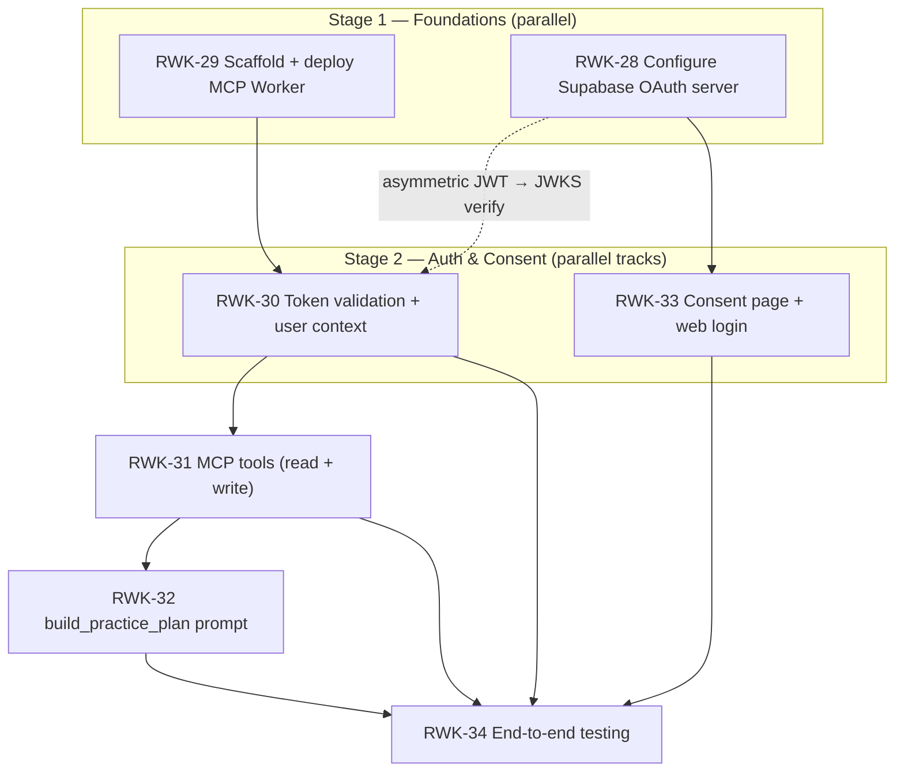

# RWK-4 — AI Session Creation (MCP Integration) Roadmap

> **Epic:** [RWK-4 — AI Session Creation](https://loganmartlew.atlassian.net/browse/RWK-4)
> **Status:** Design / not started
> **Last updated:** 2026-06-22

Let users generate Rangework practice plans by chatting with an LLM (Claude.ai, ChatGPT
web). The LLM connects to a Rangework **remote MCP server** over OAuth, then calls tools
that create real practice units and sessions in the user's Supabase account — subject to the
same Row-Level Security that the Android app relies on.

---

## 1. Goals & scope

**In scope**

- A publicly-reachable MCP server speaking the MCP **Streamable HTTP** transport, connectable
  from Claude.ai and ChatGPT web via their connector UIs (not pasted bearer tokens).
- OAuth 2.1 via **Supabase's built-in Authorization Server** (beta) — we are *not* building an
  auth server. Supabase handles discovery, dynamic client registration, consent brokering, and
  JWT issuance.
- Read tools (`get_user_clubs`, `list_units`, `list_sessions`) and write tools
  (`create_unit`, `create_session`) scoped to the authenticated user.
- An MCP **prompt** encoding golf coaching methodology so a client can run a guided planning
  conversation.
- A **client-side consent page** + lightweight web login on the existing static site.
- End-to-end validation on at least one target client.

**Out of scope (for now)**

- Editing/deleting existing units/sessions via MCP (create-only for v1).
- Reading/writing `range_sessions` (execution history).
- A general-purpose Rangework web app (only the consent + login shell is built here).

---

## 2. Stack decisions

| Decision | Choice | Rationale |
|---|---|---|
| MCP server language/SDK | **TypeScript + official `@modelcontextprotocol/sdk`** | Stays in the existing pnpm/Turbo workspace alongside `apps/site`; reuses `@supabase/supabase-js` for both JWKS validation and the per-request user client; first-class Streamable HTTP + OAuth resource-server support, which is the best-tested path for Claude.ai/ChatGPT web. |
| Transport | **Streamable HTTP (stateless)** | Required by Claude.ai/ChatGPT web (SSE transport is deprecated). Each tool call is independent (validate JWT → scoped client → query/RPC), so no session state to keep warm. |
| Hosting (MCP server) | **Cloudflare Workers** | Edge, cheap, fast cold starts, ideal for stateless Streamable HTTP. Same Cloudflare account already hosts the site. |
| Auth server | **Supabase OAuth 2.1 Authorization Server (beta)** | Handles OAuth endpoints, dynamic client registration, and JWT issuance. We implement only the *resource server* (token validation) and the *consent UI*. |
| Consent page hosting | **Static Astro page + client-side island on existing Cloudflare Pages site** | The Supabase OAuth consent methods (`getAuthorizationDetails` / `approveAuthorization` / `denyAuthorization`) all run in the browser against Supabase's servers. **No SSR needed** — the page is a UI shell. This removes the previously-feared Phase 0 SSR migration. |
| Write path | **Reuse existing `save_practice_unit` / `save_practice_session` RPCs** | They already do atomic multi-table writes under `auth.uid()` + RLS. The MCP write tools call them instead of reimplementing inserts — gives atomicity, validation reuse, and matches RWK-30's "never use the service role." |

---

## 3. Existing system (what we integrate with — do not redesign)

### Planning schema (all owner-scoped, RLS enabled)

- **`practice_units`** — `id`, `owner_id` (default `auth.uid()`), `title`, `notes`, `focus`,
  `default_club_reference` (FK → `clubs.code`). `tags` and `default_ball_count` were dropped.
- **`practice_unit_instructions`** — `practice_unit_id`, `sort_order` (1-based, unique per
  unit, `> 0`), `text`, `ball_count` (nullable). `club_reference` and `rep_count` were dropped.
- **`practice_sessions`** — `id`, `owner_id`, `name`, `notes`.
- **`practice_session_items`** — `practice_session_id`, `practice_unit_id`
  (FK → `practice_units`, **`on delete restrict`**), `sort_order`, `repeat_count`
  (NOT NULL, `> 0`), `club_reference` (FK → `clubs.code`), `notes`, `focus_cue`.
- **`clubs`** — public read-only catalog. PK is a **string code** (`driver`, `seven_iron`,
  `pitching_wedge`, …) with `display_name`, `category`, `sort_order`, `default_enabled`.
- **`user_enabled_clubs`** — `(user_id, club_code)`; the user's bag.
- **`user_preferences`** — unit/distance/speed system.

### Atomic write RPCs (reuse these)

- `save_practice_unit(p_unit_id uuid, p_title, p_notes, p_focus, p_default_club_reference,
  p_instructions jsonb)` — instructions as `[{order, text, ball_count}]`. `SECURITY INVOKER`,
  enforces `owner_id = auth.uid()`.
- `save_practice_session(p_session_id uuid, p_name, p_notes, p_items jsonb)` — items as
  `[{practice_unit_id, order, repeat_count, club_reference, notes, focus_cue}]`.

Both upsert by id and replace children, so the caller **generates the UUID** and can return it.

### Auth

Email + Google sign-in; `profiles` mirrors `auth.users`; everything scoped via `auth.uid()`,
which PostgREST derives from the `Authorization: Bearer <jwt>` header. RLS isolates users
automatically **provided each request's Supabase client carries the user's token.**

### Tool → data mapping

| Tool | Type | Backing | Notes |
|---|---|---|---|
| `get_user_clubs` | read | `select` on `user_enabled_clubs` ⋈ `clubs` | **Return `code` + `display_name` + `category`** so the LLM uses codes downstream. |
| `list_units` | read | `select` `practice_units` + instruction aggregate | Return id, title, instruction count, total ball count (define null-handling — see flag F5). |
| `list_sessions` | read | `select` `practice_sessions` + items ⋈ units | Return id, title, unit lineup, total ball count (`Σ repeat_count × instruction ball_count`). |
| `create_unit` | write | `save_practice_unit` RPC | Worker generates `uuid`, passes it, **returns it** (see flag F3). Validate club codes. |
| `create_session` | write | `save_practice_session` RPC | References unit ids from `create_unit`/`list_units`. Worker generates `uuid`, returns it. |

---

## 4. Architecture

```
  ┌─────────────────┐        OAuth 2.1 discovery + DCR        ┌──────────────────────┐
  │  Claude.ai /     │ ─────────────────────────────────────▶ │  Supabase Auth        │
  │  ChatGPT web     │                                         │  (OAuth 2.1 AS, beta) │
  │  (MCP client)    │ ◀──── access token (RS256/ES256 JWT) ── │  JWKS endpoint        │
  └────────┬─────────┘                                         └──────────┬───────────┘
           │ MCP Streamable HTTP                                          │ redirects user to
           │ (Authorization: Bearer <jwt>)                               │ ?authorization_id=…
           ▼                                                              ▼
  ┌──────────────────────┐   validate JWT vs JWKS     ┌──────────────────────────────┐
  │  Rangework MCP server │  ─────────────────────▶   │  Consent page (client-side)   │
  │  Cloudflare Worker    │                           │  Cloudflare Pages (static)    │
  │  - resource server    │   per-request Supabase    │  - reads authorization_id     │
  │  - tools + prompt     │   client w/ user token    │  - web login if no session    │
  └──────────┬───────────┘  ──────────────────────▶  │  - getAuthorizationDetails    │
             │ PostgREST / RPC (RLS via auth.uid())   │  - approve / deny             │
             ▼                                        └──────────────────────────────┘
  ┌──────────────────────┐
  │  Supabase Postgres    │  RLS-enforced; same data the Android app reads/writes
  │  practice_* / clubs   │
  └──────────────────────┘
```

**Consent flow (entirely client-side, per the chosen approach):**

1. Supabase redirects the user to `…/oauth/consent?authorization_id=abc123`.
2. Page checks for an active Supabase session in the browser.
3. **No session →** redirect to a client-side login (`supabase.auth.signInWithOAuth({ provider: 'google' })`), preserving `authorization_id`, then return to the consent page. *(This web login does not exist yet — it is new scope inside RWK-33.)*
4. `supabase.auth.oauth.getAuthorizationDetails(authorization_id)` → client name + scopes.
5. Render approve/deny UI.
6. `approveAuthorization` / `denyAuthorization` → redirect to the returned `redirect_url`.

---

## 5. Dependency graph



**Critical path:** RWK-29 → RWK-30 → RWK-31 → RWK-32 → RWK-34.
**Parallel web track:** RWK-28 → RWK-33 runs alongside the whole MCP track and only needs to
finish before RWK-34. RWK-28 also unblocks RWK-30's JWKS-based signature verification.

---

## 6. Stage plan

### Stage 1 — Foundations *(parallel)* — **starting point**

Two independent workstreams.

**RWK-29 — Scaffold + deploy MCP Worker** *(me)*
- Create `apps/mcp` workspace package (TypeScript, `@modelcontextprotocol/sdk`, `wrangler`).
- Implement a minimal Streamable HTTP MCP server with one `ping`/health tool.
- Wire Cloudflare Workers config; deploy to a public URL on the existing Cloudflare account.
- Verify connectability with MCP Inspector against both local dev and the deployed URL.
- Document chosen stack + local dev setup (README in `apps/mcp`).
- **Done when:** `ping` is callable via MCP Inspector against the public Worker URL; stack/setup documented.

**RWK-28 — Configure Supabase OAuth server** *(user — dashboard work; I provide a verification checklist/script)*
- Enable OAuth 2.1 server (Authentication → OAuth Server).
- Switch JWT signing to asymmetric (RS256 or ES256).
- Enable dynamic client registration.
- Set the authorization path to the consent page URL (e.g. `https://rangework.app/oauth/consent`).
- **Done when:** `…/.well-known/oauth-authorization-server/auth/v1` returns valid JSON **and**
  existing Android sign-in still works after the JWT-algorithm switch (see flag F8).

### Stage 2 — Auth & Consent *(two parallel tracks)*

**Track A — RWK-30: Token validation + user context** *(depends on RWK-29; needs RWK-28's asymmetric JWT for JWKS verify)*
- On each request, validate the bearer JWT against Supabase JWKS (signature, expiry, issuer).
- Extract `user_id` (`sub`) and build a per-request Supabase client carrying the user's token
  (`global.headers.Authorization = Bearer <jwt>`) so RLS applies.
- Return clean MCP auth errors (401 + `WWW-Authenticate` pointing at protected-resource metadata) on missing/invalid/expired tokens.
- **Done when:** a request with a valid user JWT resolves to the correct user; invalid/expired
  tokens are rejected. *Testable early with a JWT from a normal sign-in, before the consent flow exists.*

**Track B — RWK-33: Consent page + web login** *(depends on RWK-28; independent of the MCP track)*
- Add `/oauth/consent` to `apps/site` as a **static page with a client-side island**
  (vanilla TS or a small Preact/Solid island via `client:load`) using `@supabase/supabase-js`.
- Implement the client-side consent flow (section 4): read `authorization_id`, session check,
  `getAuthorizationDetails`, approve/deny, redirect.
- Build the **new client-side web login** (Google via `signInWithOAuth`) that preserves
  `authorization_id` and returns to consent. Add Supabase redirect-URL allowlist + Google
  OAuth web client config (see flag F10).
- Display client name + requested scopes in plain language; handle error states (missing/expired
  `authorization_id`, Supabase errors).
- **Done when:** an unauthenticated user can hit the consent URL, sign in with Google, see the
  client/scopes, approve or deny, and be redirected back correctly.

### Stage 3 — RWK-31: MCP tools *(depends on RWK-30)*
- Read tools: `get_user_clubs` (return codes), `list_units`, `list_sessions`.
- Write tools: `create_unit` (returns id) and `create_session`, both calling the existing
  `save_practice_*` RPCs; generate UUIDs in the Worker; validate club codes against the catalog.
- Invest in tool descriptions — they are the LLM-facing UX.
- **Done when:** all five tools work against a real account via MCP Inspector with the user
  context from RWK-30; created data appears correctly in the Android app.

### Stage 4 — RWK-32: `build_practice_plan` prompt *(depends on RWK-31)*
- Register an MCP prompt encoding coaching methodology: info to gather (handicap, miss
  patterns, clubs, range time, ball budget, tech available, short-game vs range), drill
  structuring, ball allocation, full-swing/short-game/putting balance, and explicit instruction
  to **use the write tools** to create units + session.
- Add a cross-client fallback (e.g. a `get_coaching_guide` tool) in case prompt support differs
  across clients (see flag F6).
- Test against realistic personas (beginner slicer, single-digit working on wedges).
- **Done when:** invoking the prompt drives a coherent planning conversation that ends in real
  `create_unit`/`create_session` calls.

### Stage 5 — RWK-34: End-to-end testing *(depends on all)*
- Connect from Claude.ai and/or ChatGPT web (developer mode): discovery → consent → approve →
  connected.
- Run the prompt; confirm `get_user_clubs` informs selection; confirm `create_unit` /
  `create_session` succeed and surface in the Android app.
- Auth isolation check (second user's data inaccessible); token expiry / re-auth behaviour.
- **Done when:** a full flow — connect, authenticate, generate a plan via conversation, see the
  units + session in the app — works without errors on at least one target client.

---

## 7. Flags, risks & decisions carried into the plan

| # | Item | Handling |
|---|---|---|
| F1 | RWK-33 originally implied an SSR website ("separate website Feature") that doesn't exist. | **Resolved:** consent page is client-side on the existing static Pages site. No SSR ticket needed. |
| F2 | No explicit MCP-server deploy ticket. | Folded into Stage 1 / RWK-29 (deploy to Workers so a public URL exists from day one). |
| F3 | `create_unit` must **return the new unit id** — sessions reference owned units (`on delete restrict` + RLS), so the LLM must create units, get ids, then create the session. | Baked into Stage 3 tool contracts. Not in RWK-31's text — add to the ticket if formalising. |
| F4 | Club fields are catalog **codes**, not free text; LLM will say "7-iron"/"PW". | `get_user_clubs` returns codes; tool descriptions instruct code use; write tools reject unknown codes with helpful errors. |
| F5 | "Total ball count" is often partial — `ball_count` is nullable, no unit-level default. | Define null handling in tool output (recommend: sum known counts, flag presence of uncounted instructions). |
| F6 | MCP **prompts** may not behave identically on Claude.ai vs ChatGPT web. | Add a tool-based fallback for the methodology (Stage 4). |
| F7 | ChatGPT connectors historically gate non-`search`/`fetch` tools outside developer mode. | RWK-34 uses ChatGPT **developer mode**; confirm write tools are callable there before treating ChatGPT as the success target. |
| F8 | Switching JWT signing to asymmetric (RWK-28) could affect existing Android sessions. | RWK-28 "done" criteria includes re-verifying mobile sign-in post-switch. Beta-feature risk. |
| F9 | No tool exposes `user_preferences` (yards vs meters) for distance language. | Minor — either add a read later or have the prompt ask the user. Not in v1 scope. |
| F10 | Web login is **new scope** inside RWK-33: needs Supabase redirect-URL allowlist to include the site origin and the Google OAuth web client configured (the app currently uses native Google sign-in only). | Called out in Stage 2 Track B. |
| F11 | Supabase OAuth 2.1 server is **beta**. | Accept as a known risk; pin behaviour during RWK-34; watch for API changes to `supabase.auth.oauth.*`. |

---

## 8. Open questions

- **Scopes:** what scope(s) does the MCP server request, and how are they phrased on the consent
  page? (Single broad "manage your practice data" vs. read/write split.)
- **Prompt vs tool delivery** of coaching methodology — decide after testing prompt support on
  both clients (F6).
- **`apps/mcp` placement** — confirm it belongs under `apps/*` in the pnpm workspace (consistent
  with `apps/site`, `apps/mobile`).
