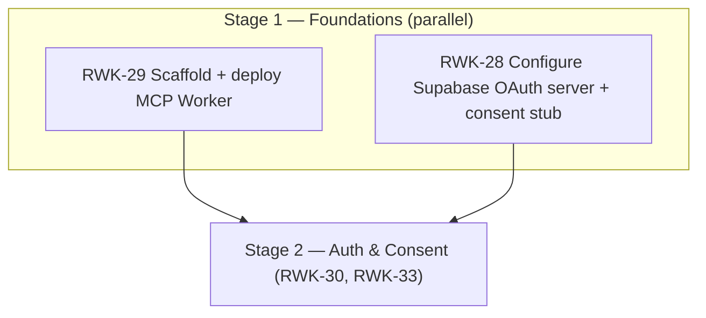

# Stage 1 — Foundations — Implementation Plan

> **Epic:** [RWK-4 — AI Session Creation](https://loganmartlew.atlassian.net/browse/RWK-4)
> **Stage 1 tickets:** [RWK-29 — Scaffold MCP server project](https://loganmartlew.atlassian.net/browse/RWK-29) · [RWK-28 — Configure Supabase OAuth 2.1 Server](https://loganmartlew.atlassian.net/browse/RWK-28)
> **Source documents:** `design-docs/RWK4-ai-integration/roadmap.md` · `design-docs/RWK4-ai-integration/stage1/requirements.md` · `design-docs/RWK4-ai-integration/stage1/requirements-questions.md` (answered)
> **Status:** Plan ready for implementation

---

## 1. Overview

Stage 1 establishes the foundational infrastructure for the AI Session Creation feature. Two independent workstreams run in parallel and must both complete before Stage 2 (token validation + consent page) can begin:

- **RWK-29** — Scaffold and deploy the MCP server (TypeScript, `@modelcontextprotocol/sdk`, Cloudflare Workers) with a `ping` health tool.
- **RWK-28** — Configure Supabase's OAuth 2.1 Authorization Server (dashboard work) and ship a consent stub page + verification checklist.

The two workstreams touch disjoint surfaces (a new `apps/mcp` package vs. the Supabase dashboard + a single static Astro page) and can proceed with zero coordination. They are verified independently at the Stage 1 exit demo.

### Resolved decisions (from `requirements-questions.md`)

| Decision                                   | Value                                                                                                                  |
| ------------------------------------------ | ---------------------------------------------------------------------------------------------------------------------- |
| Package directory                          | `apps/mcp`                                                                                                             |
| Package name                               | `@rangework/mcp`                                                                                                       |
| Leaf package                               | Yes — not consumed by any other workspace package                                                                      |
| Worker name                                | `rangework-mcp`                                                                                                        |
| Public URL                                 | `mcp.rangework.app` (custom domain on the `rangework.app` Cloudflare zone)                                             |
| Cloudflare account ID                      | Not committed — provided at deploy time via env / `wrangler login`                                                     |
| Stage 1 deploy                             | Manual `wrangler deploy` only — no CI/CD deploy workflow                                                               |
| CI secret preparation                      | `CLOUDFLARE_API_TOKEN` and `CLOUDFLARE_ACCOUNT_ID` added as GitHub Actions secrets (ready for future automation)       |
| Environment                                | Production only (no preview/staging in Stage 1)                                                                        |
| MCP SDK version                            | Latest stable at time of development                                                                                   |
| Node / TypeScript toolchain                | Match `apps/site` (Node `>=22.12.0`, ESM, `@types/node ^26`, ESLint flat config pattern)                               |
| Build tool                                 | Wrangler (esbuild) — no separate `tsup`/`tsc` build step                                                               |
| Type checking                              | `tsc --noEmit` via a `typecheck` script (not promoted to a Turbo task in Stage 1)                                      |
| Local dev                                  | `wrangler dev` (miniflare)                                                                                             |
| Local port                                 | Wrangler default (`8787`); overridable via `PORT`                                                                      |
| Inspector method                           | `npx @modelcontextprotocol/inspector` proxy pointed at the wrangler dev URL                                            |
| `ping` response                            | `{ status: "ok" }`                                                                                                     |
| `ping` auth                                | Unauthenticated in Stage 1; auth enforcement deferred to RWK-30                                                        |
| Tool name / transport path                 | Tool `ping`; endpoint path chosen during implementation and documented in `apps/mcp/README.md`                         |
| JWT algorithm                              | RS256 (most widely supported)                                                                                          |
| Dynamic client registration                | Fully open (no allowlist)                                                                                              |
| Consent URL                                | `https://rangework.app/oauth/consent` — stub page shipped in Stage 1                                                   |
| Verification deliverable                   | Markdown checklist at `design-docs/RWK4-ai-integration/stage1/rwk-28-verification.md`                                  |
| Stage 1 integration test (RWK-29 ↔ RWK-28) | Add it — the Worker can reach the Supabase JWKS URL (read-only fetch, no validation logic; validation is RWK-30 scope) |
| Shared types across stages                 | Each stage manages its own types                                                                                       |
| Repo memory note                           | Not created                                                                                                            |
| Stage 1 exit demo                          | Two independent verifications (MCP Inspector screenshot + `curl` of discovery endpoint)                                |

---

## 2. Dependency graph



Both workstreams unblock Stage 2. RWK-29 provides the Worker that RWK-30 wraps with token validation; RWK-28 provides the asymmetric JWT/JWKS endpoint that RWK-30 verifies against and the consent URL that RWK-33 replaces with a full page.

---

## 3. RWK-29 — MCP Server Scaffold

### 3.1 Goal

Create a TypeScript MCP server on Cloudflare Workers that exposes one unauthenticated `ping` tool over Streamable HTTP, deploy it to `mcp.rangework.app`, and verify connectability with MCP Inspector against both local dev and the deployed URL.

### 3.2 File structure

```
apps/mcp/
├── README.md                  # Stack rationale, prerequisites, dev/deploy/Inspector steps, public URL
├── package.json               # @rangework/mcp, ESM, Node >=22.12.0
├── tsconfig.json              # Match apps/site toolchain; Workers-compatible target/lib
├── wrangler.jsonc             # Worker name, main, compatibility flags; NO account_id
├── eslint.config.js           # Flat config matching apps/site pattern (minus Astro plugin)
├── vitest.config.ts           # Vitest config (workspace convention)
├── .gitignore                 # node_modules, .wrangler, dist, .dev.vars
├── .dev.vars.example          # Documented local-only env placeholder (no real secrets)
└── src/
    ├── index.ts               # Worker fetch handler → MCP Streamable HTTP transport
    ├── server.ts              # McpServer instance + ping tool registration (importable by tests)
    ├── tools/
    │   └── ping.ts            # ping tool definition + handler (pure, testable)
    └── tests/
        ├── ping.test.ts        # Unit test: tools/list contains ping; tools/call returns { status: "ok" }
        └── jwks-reachability.test.ts  # Integration test: Worker can fetch the Supabase JWKS URL (read-only)
```

### 3.3 Scope

#### 3.3.1 Package and toolchain

- `apps/mcp/package.json` with:
  - `"name": "@rangework/mcp"`, `"type": "module"`, `"engines": { "node": ">=22.12.0" }`
  - `scripts`: `dev` (`wrangler dev`), `typecheck` (`tsc --noEmit`), `lint` (`eslint .`), `test` (`vitest run`)
  - No `build` script — Wrangler bundles natively.
  - `dependencies`: `@modelcontextprotocol/sdk` (latest stable), `@supabase/supabase-js` (only if needed for the JWKS reachability test; otherwise plain `fetch` is enough — prefer plain `fetch` to keep Stage 1 dependency surface minimal).
  - `devDependencies`: `wrangler`, `typescript`, `vitest`, `@types/node` (match `apps/site` major), `@eslint/js`, `typescript-eslint`, `eslint`.
- `apps/mcp/tsconfig.json`:
  - `target`/`lib` compatible with the Workers runtime (e.g. `target: "es2022"`, `module: "esnext"`, `moduleResolution: "bundler"`, `types: ["@cloudflare/workers-types"]` or the Workers types via `wrangler` types generation).
  - `strict: true` to match `apps/site`'s strict posture.
- `apps/mcp/wrangler.jsonc`:
  - `"name": "rangework-mcp"`, `"main": "src/index.ts"`, `"compatibility_date"` set to the date of implementation.
  - `"compatibility_flags"` includes `nodejs_compat` if the SDK or JWKS fetch path requires Node-compatible APIs; otherwise omit.
  - **No `account_id` field** — provided at deploy time via env / `wrangler login`.
  - Custom domain `mcp.rangework.app` is configured as a one-time dashboard step during initial deploy (DNS CNAME on the `rangework.app` zone pointing at the Workers target). Document this in `apps/mcp/README.md`.
- `apps/mcp/eslint.config.js`: flat config matching `apps/site`'s pattern (recommended + typescript-eslint recommended), minus the Astro and Tailwind plugins which do not apply.

#### 3.3.2 MCP server and `ping` tool

- `src/index.ts` — the Workers `fetch` handler. Mounts the MCP Streamable HTTP transport at the chosen endpoint path (either `/` or `/mcp`; pick one during implementation and document it in `apps/mcp/README.md`). Handles `POST` requests per the MCP Streamable HTTP spec; returns appropriate HTTP status codes for non-MCP requests.
- `src/server.ts` — constructs the `McpServer` instance and registers the `ping` tool. Exported separately so unit tests can import the server and call `tools/list` / `tools/call` without spinning up the Workers runtime.
- `src/tools/ping.ts` — the `ping` tool definition:
  - Name: `ping`
  - Input arguments: none
  - Handler returns `{ status: "ok" }` (serialized as the MCP tool result content per the SDK's expected shape).
  - No `Authorization` header check — auth enforcement is explicitly deferred to RWK-30.

#### 3.3.3 JWKS reachability integration test

- `src/tests/jwks-reachability.test.ts` — a Vitest test that fetches the Supabase JWKS URL (sourced from the discovery endpoint, or directly from the configured Supabase project URL) and asserts the response is reachable and returns JSON. This is **not** token validation (RWK-30 scope) — it only confirms the Worker's runtime can reach the JWKS endpoint and that RWK-28's JWKS configuration is live. The Supabase project URL is provided via an env var or test config; do not hardcode project credentials.
- This satisfies the "Stage 1 integration test between RWK-29 and RWK-28" answer from the requirements questions.

#### 3.3.4 Local development workflow

- `pnpm --filter @rangework/mcp dev` runs `wrangler dev` (miniflare). Default port `8787`; overridable via `PORT`.
- Verification: run `npx @modelcontextprotocol/inspector` locally, point it at the wrangler dev URL, connect, call `tools/list` (expect `ping`), call `tools/call` with `ping` (expect `{ status: "ok" }`).
- `wrangler dev` hot-reloads on file changes.

#### 3.3.5 Turbo integration

- `apps/mcp/package.json` scripts: `dev`, `typecheck`, `lint`, `test` (no `build`).
- `turbo.json` is **not modified** in Stage 1. The existing `dev` (persistent, no cache), `test` (`dependsOn: ["^build"]`), and `lint` (`dependsOn: ["^build"]`) task entries already apply to any workspace package that defines the matching script, so `apps/mcp` is picked up automatically by `turbo run dev/test/lint`.
- `typecheck` is **not** promoted to a workspace-wide Turbo task in Stage 1 (per requirements §2.6). Run it manually via `pnpm --filter @rangework/mcp typecheck` or promote it in a later stage.
- No `build` task and no `dist/**` Turbo output — Wrangler handles bundling at deploy time and bypasses Turbo caching. This answers the open question in `requirements-questions.md` Q22: no Turbo build configuration is needed for `apps/mcp`.

#### 3.3.6 Testing

| Test                            | Scope                                                                | Automation                                  |
| ------------------------------- | -------------------------------------------------------------------- | ------------------------------------------- |
| Unit — `ping` tool              | `tools/list` returns `ping`; `tools/call` returns `{ status: "ok" }` | `vitest run`, picked up by `turbo run test` |
| Integration — JWKS reachability | Worker runtime can fetch the Supabase JWKS URL and receive JSON      | `vitest run`, picked up by `turbo run test` |
| MCP Inspector — local           | Connectability + `ping` callable against `wrangler dev`              | Manual (documented in `apps/mcp/README.md`) |
| MCP Inspector — deployed        | Connectability + `ping` callable against `mcp.rangework.app`         | Manual (Stage 1 acceptance gate)            |

#### 3.3.7 Deployment

- Stage 1 deploy is manual: `wrangler deploy` from `apps/mcp` (with `wrangler login` or `CLOUDFLARE_API_TOKEN` + `CLOUDFLARE_ACCOUNT_ID` env vars set locally).
- One-time dashboard step: add a DNS CNAME record for `mcp.rangework.app` on the `rangework.app` Cloudflare zone pointing at the Workers target. Verify with `dig mcp.rangework.app` before acceptance.
- No `.github/workflows/deploy-mcp.yml` in Stage 1. Add `CLOUDFLARE_API_TOKEN` and `CLOUDFLARE_ACCOUNT_ID` as GitHub Actions secrets now so future automation is unblocked.

#### 3.3.8 Documentation

`apps/mcp/README.md` must cover:

1. Stack rationale (link to `roadmap.md` §2).
2. Prerequisites: Node `>=22.12.0`, Cloudflare account, Wrangler.
3. Local dev command (`pnpm --filter @rangework/mcp dev` / `wrangler dev`).
4. MCP Inspector connection steps (the `npx @modelcontextprotocol/inspector` command and the local URL to point it at).
5. Deploy command (`wrangler deploy`).
6. Public URL (`mcp.rangework.app`) and the one-time custom domain / DNS CNAME step.
7. The chosen Streamable HTTP endpoint path (`/` or `/mcp`).
8. Note that `ping` is unauthenticated in Stage 1 and auth enforcement lands in RWK-30.

### 3.4 Risks and edge cases

| Risk / edge case                                                                      | Handling                                                                                                                                                      |
| ------------------------------------------------------------------------------------- | ------------------------------------------------------------------------------------------------------------------------------------------------------------- |
| `@modelcontextprotocol/sdk` Streamable HTTP API churn (pre-1.0 in some distributions) | Pin to latest stable at time of development; record the pinned version in `apps/mcp/README.md` so RWK-30/RWK-31 can reproduce.                                |
| Workers runtime vs Node differences                                                   | Use `wrangler dev` (miniflare) for local iteration so Workers-specific behavior surfaces early. Add `nodejs_compat` if the SDK requires it.                   |
| Custom domain DNS propagation delay                                                   | Document as a one-time dashboard step; verify with `dig` before acceptance.                                                                                   |
| Endpoint path choice (`/` vs `/mcp`)                                                  | Pick one during implementation, document it, and keep it stable — Claude.ai/ChatGPT web will ultimately connect to it and re-registering clients is friction. |
| `typecheck` not in Turbo graph                                                        | Acceptable for Stage 1; run manually. Promote in a later stage if type errors start slipping through CI.                                                      |
| JWKS reachability test needs the Supabase project URL                                 | Provide via env var or test config; do not hardcode the project ref or credentials in source.                                                                 |

### 3.5 Validation checkpoint

1. `pnpm install --filter @rangework/mcp` resolves and installs dependencies.
2. `pnpm --filter @rangework/mcp typecheck` passes.
3. `pnpm --filter @rangework/mcp lint` passes.
4. `pnpm --filter @rangework/mcp test` passes (ping unit test + JWKS reachability test).
5. `turbo run lint` and `turbo run test` include `apps/mcp` and pass.
6. `pnpm --filter @rangework/mcp dev` starts the MCP server locally without errors.
7. MCP Inspector connects to the local server; `ping` returns `{ status: "ok" }`.
8. `wrangler deploy` succeeds to `rangework-mcp`.
9. `dig mcp.rangework.app` resolves.
10. MCP Inspector connects to `mcp.rangework.app`; `ping` returns `{ status: "ok" }`.

### 3.6 Deliverables

1. `apps/mcp/` directory with complete project scaffold (`package.json`, `tsconfig.json`, `wrangler.jsonc`, ESLint config, Vitest config, source files, tests).
2. Working `ping` tool, callable via MCP Inspector locally and at `mcp.rangework.app`.
3. Unit test for the `ping` handler.
4. JWKS reachability integration test.
5. `apps/mcp/README.md` documenting stack, prerequisites, dev, Inspector, deploy, public URL, endpoint path.
6. `CLOUDFLARE_API_TOKEN` and `CLOUDFLARE_ACCOUNT_ID` added to GitHub Actions secrets.

---

## 4. RWK-28 — Supabase OAuth 2.1 Configuration

### 4.1 Goal

RWK-28 is **user-owned dashboard work**. The agent does not touch the Supabase dashboard. The agent's deliverables for RWK-28 are:

1. A consent stub page at `apps/site/src/pages/oauth/consent.astro` (code the agent writes).
2. A verification checklist at `design-docs/RWK4-ai-integration/stage1/rwk-28-verification.md` (instructions the user follows).

The user performs the Supabase dashboard configuration using the instructions in §4.3.1, then works through the verification checklist in §4.3.4 to confirm the discovery/JWKS/DCR endpoints are live and existing Android sign-in still works.

### 4.2 File structure

```
apps/site/src/pages/oauth/consent.astro   # Stub page (static, no Supabase client, no consent logic) — agent-written
design-docs/RWK4-ai-integration/stage1/rwk-28-verification.md   # Verification checklist (user-run) — agent-written
```

### 4.3 Scope

#### 4.3.1 Supabase dashboard configuration (user-performed)

> **The agent does not perform this step.** The following is the instruction set the agent documents in `design-docs/RWK4-ai-integration/stage1/rwk-28-verification.md` for the user to execute in the Supabase project dashboard (Authentication → OAuth Server). No SQL migration is required — the OAuth 2.1 server is a Supabase dashboard feature, not a Postgres schema change.

| Setting                     | Value                                 | Notes                                                                                                          |
| --------------------------- | ------------------------------------- | -------------------------------------------------------------------------------------------------------------- |
| OAuth 2.1 server            | **Enabled**                           | Beta feature — accept known risk (flag F11)                                                                    |
| JWT signing algorithm       | **RS256**                             | Most widely supported asymmetric algorithm                                                                     |
| Dynamic client registration | **Enabled (fully open)**              | No allowlist — lowest friction for RWK-34 testing; acceptable security posture with no active production users |
| Authorization path          | `https://rangework.app/oauth/consent` | Points at the stub page shipped in §4.3.2; RWK-33 replaces it with the full consent page                       |

The agent should ship the consent stub page (§4.3.2) **before** the user applies the authorization-path setting, so the consent URL is reachable when the dashboard config is saved.

#### 4.3.2 Consent stub page (agent-written)

- Route: `https://rangework.app/oauth/consent`
- File: `apps/site/src/pages/oauth/consent.astro`
- Content: a simple static page that displays a "coming soon" message acknowledging the OAuth flow. Use the existing `Layout.astro` and the site's design tokens / Tailwind classes (match the style of `apps/site/src/pages/delete-account.astro`).
- **No Supabase client, no consent logic** — RWK-33 replaces this entirely. The stub exists only to prevent 404s if any OAuth flow is attempted between Stage 1 and Stage 2.
- The `mcp.rangework.app` Worker subdomain is independent of the `rangework.app/oauth/consent` page path, so no routing collision occurs.

#### 4.3.3 JWT algorithm change impact (informational)

- Supabase manages token issuance and rotation at the dashboard level. Existing tokens are expected to continue working through Supabase's key rotation mechanism. The verification checklist (§4.3.4) must confirm this.
- No explicit rollback plan — there are no active production users. If issues arise, the user can revert the dashboard setting.

#### 4.3.4 Verification checklist (agent-written, user-run)

The agent writes a markdown checklist at `design-docs/RWK4-ai-integration/stage1/rwk-28-verification.md` containing the dashboard configuration instructions from §4.3.1 plus the verification steps below. The user works through it after applying the dashboard config.

1. **Discovery endpoint** — `https://<project-ref>.supabase.co/.well-known/oauth-authorization-server/auth/v1` returns valid JSON with `authorization_endpoint`, `token_endpoint`, `jwks_uri`, and `registration_endpoint` present.
2. **JWKS endpoint** — the `jwks_uri` from step 1 returns valid JWKS keys (RS256).
3. **Dynamic client registration** — POST to `registration_endpoint` with a valid client metadata payload succeeds and returns a `client_id`.
4. **Android sign-in (email)** — sign in to the Android app with email/password succeeds post-algorithm-switch.
5. **Android sign-in (Google)** — sign in to the Android app with Google succeeds post-algorithm-switch.
6. **Consent URL reachable** — `https://rangework.app/oauth/consent` returns 200 (stub page).
7. **Discovery response** — record the full discovery response JSON for reference by RWK-30.

> **Note on steps 4–5:** these can only be verified if valid Android app credentials exist (see `CLAUDE.md` secrets section for `~/.gradle/gradle.properties` requirements). If the Android app cannot be built/run during Stage 1, document which steps were skipped and note that RWK-34 will cover full end-to-end verification.

### 4.4 Risks and edge cases

| Risk / edge case                                       | Handling                                                                                                                     |
| ------------------------------------------------------ | ---------------------------------------------------------------------------------------------------------------------------- |
| Supabase OAuth 2.1 server is beta (F11)                | Pin behaviour during RWK-28; monitor Supabase changelog for API changes that could affect RWK-30/33.                         |
| RS256 key rotation invalidates existing Android tokens | User verifies Android sign-in (email + Google) as part of the checklist; reverts dashboard setting if broken.                |
| Open DCR on the production Supabase project            | Acceptable with no active users; note in the checklist that this should be revisited before production scale.                |
| Consent stub page 404s                                 | Agent ships the stub before the user applies the dashboard authorization-path config; user verifies step 6 of the checklist. |
| Android app cannot be built during Stage 1             | User documents skipped steps in the checklist; defers to RWK-34.                                                             |
| Dashboard config applied out of order                  | Checklist instructs the user to ship the consent stub first, then apply dashboard settings, then verify.                     |

### 4.5 Validation checkpoint (user-run, against the checklist)

1. Discovery endpoint returns valid JSON with all expected fields.
2. JWKS endpoint returns RS256 public keys.
3. Dynamic client registration accepts and returns a `client_id`.
4. `https://rangework.app/oauth/consent` returns 200.
5. Android sign-in verified (or explicitly noted as deferred).
6. Verification checklist completed and saved to `design-docs/RWK4-ai-integration/stage1/rwk-28-verification.md`.

### 4.6 Deliverables

**Agent-written:**

1. Consent stub page at `apps/site/src/pages/oauth/consent.astro`.
2. Verification checklist (with dashboard configuration instructions) at `design-docs/RWK4-ai-integration/stage1/rwk-28-verification.md`.

**User-performed (using the agent-written checklist):**

3. Supabase OAuth 2.1 server enabled and configured per §4.3.1.
4. Verification checklist steps executed and signed off.

---

## 5. Cross-cutting work

### 5.1 Documentation updates

The following files must be updated when Stage 1 completes (per requirements §4.2 and the requirements-questions answers to Q26/Q38):

| File                              | Change                                                                                                                                           |
| --------------------------------- | ------------------------------------------------------------------------------------------------------------------------------------------------ |
| `README.md`                       | Add `apps/mcp` to the monorepo layout section and the common commands section (document `pnpm --filter @rangework/mcp dev/test/lint/typecheck`). |
| `CLAUDE.md`                       | Add `apps/mcp` to the codebase map and build/validation section.                                                                                 |
| `.github/copilot-instructions.md` | Add `apps/mcp` to the codebase map.                                                                                                              |

### 5.2 CI secrets

Add `CLOUDFLARE_API_TOKEN` and `CLOUDFLARE_ACCOUNT_ID` as GitHub Actions secrets (ready for future deploy automation). No workflow file is added in Stage 1.

### 5.3 Scope boundary

| Item                        | In Stage 1                         | Deferred |
| --------------------------- | ---------------------------------- | -------- |
| Token validation            | No — RWK-30                        | ✓        |
| MCP read/write tools        | No — RWK-31                        | ✓        |
| Coaching prompt             | No — RWK-32                        | ✓        |
| Consent page logic          | No — RWK-33 (stub only in Stage 1) | ✓        |
| End-to-end testing          | No — RWK-34                        | ✓        |
| Shared types between stages | Each stage manages its own types   | ✓        |
| JWKS reachability test      | Yes — read-only fetch only         | —        |
| JWKS signature validation   | No — explicitly RWK-30 scope       | ✓        |

### 5.4 Stage 1 exit demo

The two workstreams are verified independently (per the requirements-questions answer to Q41):

- **RWK-29:** MCP Inspector session screenshot showing `ping` returning `{ status: "ok" }` against `mcp.rangework.app`.
- **RWK-28:** `curl` response showing the discovery endpoint JSON + consent stub page screenshot.

Both acceptance checklists (§3.5 and §4.5) signed off before Stage 2 begins.

---

## 6. Acceptance criteria summary

### RWK-29

- [ ] `apps/mcp` directory exists with `package.json`, `tsconfig.json`, `wrangler.jsonc`, ESLint config, Vitest config, and source files
- [ ] `pnpm install --filter @rangework/mcp` resolves and installs dependencies
- [ ] `pnpm --filter @rangework/mcp typecheck` passes
- [ ] `pnpm --filter @rangework/mcp dev` starts the MCP server locally without errors
- [ ] MCP Inspector connects to the local server and `ping` returns `{ status: "ok" }`
- [ ] `pnpm --filter @rangework/mcp test` passes (ping unit test + JWKS reachability test)
- [ ] `turbo run lint` includes and passes for `apps/mcp`
- [ ] `turbo run test` includes and passes for `apps/mcp`
- [ ] Manual `wrangler deploy` succeeds to `rangework-mcp`
- [ ] `dig mcp.rangework.app` resolves
- [ ] MCP Inspector connects to `mcp.rangework.app` and `ping` returns `{ status: "ok" }`
- [ ] `apps/mcp/README.md` documents stack, prerequisites, dev, Inspector, deploy, public URL, endpoint path
- [ ] `CLOUDFLARE_API_TOKEN` and `CLOUDFLARE_ACCOUNT_ID` added to GitHub Actions secrets

### RWK-28

**Agent-written:**

- [ ] Consent stub page at `apps/site/src/pages/oauth/consent.astro` returns 200 at `https://rangework.app/oauth/consent`
- [ ] Verification checklist (with dashboard configuration instructions) saved to `design-docs/RWK4-ai-integration/stage1/rwk-28-verification.md`

**User-performed (using the agent-written checklist):**

- [ ] Supabase OAuth 2.1 server enabled with RS256 and open DCR
- [ ] Authorization path set to `https://rangework.app/oauth/consent`
- [ ] Discovery endpoint returns valid JSON with all expected fields
- [ ] JWKS endpoint returns RS256 public keys
- [ ] Dynamic client registration accepts and returns a `client_id`
- [ ] Android sign-in verified (or explicitly noted as deferred)
- [ ] Verification checklist steps executed and signed off

### Cross-cutting

- [ ] `README.md` updated with `apps/mcp` entry
- [ ] `CLAUDE.md` codebase map and build/validation sections updated with `apps/mcp`
- [ ] `.github/copilot-instructions.md` codebase map updated with `apps/mcp`
