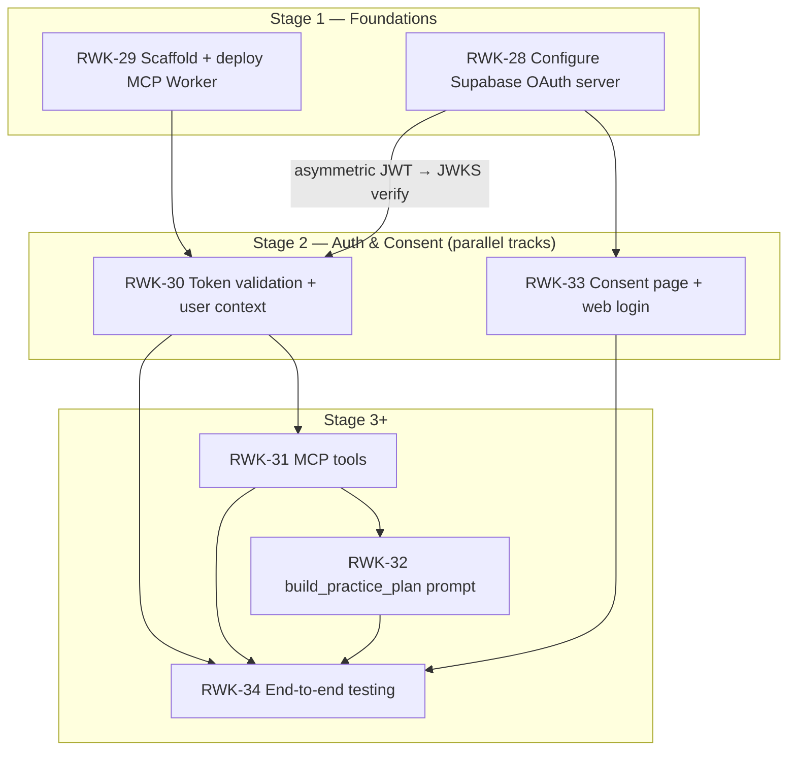

# Stage 2 — Auth & Consent — Implementation Plan

> **Epic:** [RWK-4 — AI Session Creation](https://loganmartlew.atlassian.net/browse/RWK-4)
> **Stage 2 tickets:** [RWK-30 — Token validation + user context](https://loganmartlew.atlassian.net/browse/RWK-30) · [RWK-33 — OAuth Consent Page](https://loganmartlew.atlassian.net/browse/RWK-33)
> **Source documents:** `design-docs/RWK4-ai-integration/roadmap.md` · `design-docs/RWK4-ai-integration/stage2/requirements.md` · `design-docs/RWK4-ai-integration/stage2/requirements-questions.md` (answered) · Stage 1 deliverables (`apps/mcp`, consent stub, RWK-28 verification, `discovery-response.json`)
> **Status:** Plan ready for implementation

---

## 1. Overview

Stage 2 adds authentication and consent to the Rangework MCP server. Two independent tracks run in parallel and must both complete before Stage 3 (RWK-31 tools) can begin:

- **Track A — RWK-30:** Wraps every MCP tool call with token validation (JWKS signature verification, expiry, issuer, claims) and constructs a per-request Supabase client scoped to the authenticated user. Every tool call that lands in Stage 3 will run through this auth layer automatically.
- **Track B — RWK-33:** Builds the full consent page at `/oauth/consent` on the existing static site, replacing the Stage 1 stub. Users land here during the OAuth flow to approve or deny an MCP client's access to their practice data.

Both tracks depend on Stage 1: RWK-30 needs the MCP Worker (`apps/mcp`) and the asymmetric JWKS endpoint from RWK-28; RWK-33 needs the consent URL path configured in RWK-28 and the site codebase. They are otherwise independent — RWK-33 does not block on RWK-30 and vice versa.

### Resolved decisions (from `requirements-questions.md`)

| #   | Question                                      | Decision                                                                                                                                                                                                |
| --- | --------------------------------------------- | ------------------------------------------------------------------------------------------------------------------------------------------------------------------------------------------------------- |
| A1  | JWKS endpoint: hardcode or discover?          | **B** — Discover from OAuth AS metadata. One-time startup fetch against the verified discovery URL.                                                                                                     |
| A2  | JWKS caching strategy                         | **B** — In-memory TTL cache with a 5-minute TTL. Refresh on `kid` miss if needed.                                                                                                                       |
| A3  | Clock skew tolerance                          | **30 seconds**, applied to both `exp` and `nbf`. Standard default.                                                                                                                                      |
| A4  | JWT algorithm (RS256 vs ES256)                | **ES256** — confirmed against the live JWKS endpoint (see §3.0). Configured via `JWT_ALGORITHM` env var, defaulting to `ES256`. Pinned to prevent algorithm-confusion attacks.                          |
| A5  | Issuer (`iss`) claim value                    | **C** — Configurable via `JWT_ISSUER` env var. Default to `{SUPABASE_URL}/auth/v1`.                                                                                                                     |
| A6  | Audience (`aud`) validation                   | **B** — Validate `aud === "authenticated"` for v1. **Verify early** against a real OAuth-issued token (see §3.0); if the OAuth AS emits a different value, make `JWT_AUDIENCE` configurable.            |
| A7  | Per-request Supabase client pattern           | `createClient(url, anonKey, { global: { headers: { Authorization: \`Bearer ${jwt}\` } }, auth: { persistSession: false } })`.                                                                           |
| A8  | Auth error response shape                     | **B** — `401` + `WWW-Authenticate` header referencing protected-resource metadata + JSON-RPC error object (RFC 9728).                                                                                   |
| A9  | Protected resource metadata endpoint owner    | **A** — RWK-30 adds `/.well-known/oauth-protected-resource` to the Worker. Small static JSON response.                                                                                                  |
| A10 | Test JWT before consent flow exists           | **C** — `supabase auth user` CLI command to get a test token. Document claim differences vs real OAuth-issued tokens. **First deliverable** — used to confirm `alg`, `iss`, `aud`, `role`, `sub` shape. |
| A11 | Auth failure logging                          | Log `kid`, `iss`, and error reason. Never log `sub` or the raw JWT.                                                                                                                                     |
| A12 | `user_id` claim source                        | Read from `sub` claim. Reject tokens where `role !== "authenticated"`.                                                                                                                                  |
| B1  | Consent page island framework                 | **A** — Vanilla TypeScript. The consent page has ~3 states (loading / consent / error); no framework runtime needed.                                                                                    |
| B2  | Consent page route & param name               | **A** — `/oauth/consent?authorization_id=` (matching roadmap §4 and the RWK-28 authorization path config).                                                                                              |
| B3  | Web login: redirect vs popup                  | Redirect (`signInWithOAuth` default). Pass `authorization_id` as a query param on `redirectTo`.                                                                                                         |
| B4  | Supabase redirect URL allowlist               | **C** — Both `supabase/config.toml` (dev: `http://localhost:4321`) and Supabase dashboard (prod: `https://rangework.app`).                                                                              |
| B5  | Google web client ID                          | **A** — Reuse the existing Google OAuth client. Add `rangework.app` and `localhost:4321` to authorized JavaScript origins & redirect URIs.                                                              |
| B6  | Cross-user session handling                   | **A** — Trust Supabase's `getAuthorizationDetails` to error for mismatched users. Surface the error. Add proactive sign-out only if testing shows it's needed.                                          |
| B7  | `getAuthorizationDetails` response shape      | **B** — Run a real authorization and log the full response before building the UI.                                                                                                                      |
| B8  | Scope display text                            | **`manage_practice_data`** — single broad scope. Displayed as "Manage your practice data" on the consent page.                                                                                          |
| B9  | Redirect after approve/deny                   | `window.location.replace(redirect_url)` from the Supabase response. Trust the returned URL.                                                                                                             |
| B10 | Error state copy                              | Missing `authorization_id`: "This link is invalid." Expired: "This authorization request has expired…" Network: "Something went wrong. Please try again." + retry.                                      |
| B11 | Post-approve destination                      | Follow the `redirect_url`. No Rangework success interstitial.                                                                                                                                           |
| B12 | Consent page styling                          | Standalone chrome-less shell. No Nav or Footer from the marketing site. Use `ui-tokens` colours/typography.                                                                                             |
| B13 | Accessibility & i18n                          | English-only v1. Semantic `<button>` elements, visible focus ring, `<ul>` with `aria-label` for scopes.                                                                                                 |
| B14 | CSRF / state parameter across Google redirect | **A** — Pass `authorization_id` as a query param on the `redirectTo` URL. Visible in referer headers, but scoped and predictable.                                                                       |
| B15 | `@supabase/supabase-js` dependency            | Add as `dependency` (ships browser-side code). Pin to same minor version as `apps/mobile`. `PUBLIC_SUPABASE_URL` / `PUBLIC_SUPABASE_ANON_KEY` via `.env`.                                               |
| C1  | Scope definition                              | **A** — Single scope: `manage_practice_data`. Read/write split deferred to v2.                                                                                                                          |
| C2  | URL coordination table                        | Record canonical URLs in `design-docs/RWK4-ai-integration/stage2/urls.md` (RWK-28 confirmed).                                                                                                           |
| C3  | Testing strategy                              | RWK-30: Vitest unit tests with forged/invalid JWTs + `test-token.ts` for real JWKS verification. RWK-33: manual flow test.                                                                              |
| C4  | Environment variable names                    | Worker: `SUPABASE_URL`, `SUPABASE_ANON_KEY`, `JWT_ISSUER`, `JWT_ALGORITHM`. Site: `PUBLIC_SUPABASE_URL`, `PUBLIC_SUPABASE_ANON_KEY`.                                                                    |
| C5  | Supabase beta version pinning                 | Pin `@supabase/supabase-js` to a specific minor in both `apps/site` and `apps/mcp`. Comment noting beta status.                                                                                         |

### Plan-level corrections to the requirements doc

The requirements doc was written before RWK-28 was verified live. The verified outputs (in `design-docs/RWK4-ai-integration/discovery-response.json` and `stage1/rwk-28-verification.md`) correct two facts the plan must follow:

1. **Discovery URL** — Requirements §3.4.1 says `{SUPABASE_URL}/auth/v1/.well-known/oauth-authorization-server`. The **verified live** endpoint is `{SUPABASE_URL}/.well-known/oauth-authorization-server/auth/v1` (note the path segment order). The plan uses the verified URL. The requirements doc URL is treated as a typo.
2. **JWT algorithm** — Requirements A4 says RS256. The **verified live** JWKS endpoint serves ES256 keys (per `rwk-28-verification.md` Step 4 and the discovery response's `id_token_signing_alg_values_supported: ["RS256", "HS256", "ES256"]`). The plan defaults `JWT_ALGORITHM` to **ES256**. The requirements doc A4 is treated as superseded by the verified RWK-28 output.

These corrections are called out again in §3.0 (the first implementation step confirms them against the live endpoints) so the plan stays self-correcting if the Supabase dashboard config changes again.

---

## 2. Dependency graph



**Critical path:** RWK-29 → RWK-30 → RWK-31 → RWK-32 → RWK-34.
**Parallel web track:** RWK-28 → RWK-33 runs alongside the MCP track and only needs to finish before RWK-34.

---

## 3. Track A — RWK-30: Token validation + user context

### 3.0 Pre-implementation verification (first deliverable)

Before writing validation logic, confirm the live endpoints match the plan's assumptions. This is the "verify early" answer to the `aud` claim risk (A6) and the algorithm/discovery-URL corrections in §1.

| Step | Action                                                                                                      | Expected                                                                                                      | On mismatch                                                                                                                                                                    |
| ---- | ----------------------------------------------------------------------------------------------------------- | ------------------------------------------------------------------------------------------------------------- | ------------------------------------------------------------------------------------------------------------------------------------------------------------------------------ |
| 1    | `curl {SUPABASE_URL}/.well-known/oauth-authorization-server/auth/v1`                                        | JSON with `jwks_uri`, `issuer`, `id_token_signing_alg_values_supported`                                       | If 404, fall back to `{SUPABASE_URL}/auth/v1/.well-known/oauth-authorization-server` and record which worked in `apps/mcp/README.md`.                                          |
| 2    | `curl <jwks_uri>`                                                                                           | JWKS with at least one key whose `alg` is `ES256`                                                             | If `alg` is `RS256`, set `JWT_ALGORITHM=RS256` in `.dev.vars` and update the plan's default. If mixed, pin to the algorithm used by the key matching the test token's `kid`.   |
| 3    | Run `test-token.ts` (§3.6.7) to fetch a real token via `supabase auth user` and decode its header + payload | `alg: ES256`, `iss: {SUPABASE_URL}/auth/v1`, `aud: "authenticated"`, `role: "authenticated"`, non-empty `sub` | If `aud` differs (e.g. a client_id), add a `JWT_AUDIENCE` env var (default `"authenticated"`) and document the observed value. If `iss` differs, set `JWT_ISSUER` accordingly. |
| 4    | Record the observed claim values in `apps/mcp/README.md` under "Verified token shape"                       | —                                                                                                             | —                                                                                                                                                                              |

This step is cheap, removes the biggest unknowns, and prevents writing validation logic against wrong assumptions. It is the gate for §3.4.2.

### 3.1 Goal

On every MCP tool call, validate the bearer JWT against Supabase's JWKS endpoint, extract the authenticated user's identity, and construct a per-request Supabase client scoped to that user so that RLS enforces data isolation. Invalid/missing/expired tokens are rejected with RFC 9728-compliant errors.

### 3.2 Architecture

```mermaid
sequenceDiagram
    participant Client as MCP Client<br/>(Claude.ai / ChatGPT)
    participant Worker as Rangework MCP Worker
    participant JWKS as Supabase JWKS<br/>Endpoint
    participant PG as Supabase Postgres<br/>(RLS enforced)

    Client->>Worker: POST /mcp (Authorization: Bearer &lt;jwt&gt;)
    Worker->>Worker: Extract JWT from Authorization header
    Worker->>JWKS: Fetch JWKS (cached in-memory, TTL 5 min)
    JWKS-->>Worker: ES256 public keys
    Worker->>Worker: Verify signature, exp, iss, aud, role
    alt Invalid token
        Worker-->>Client: 401 + WWW-Authenticate + JSON-RPC error
    else Valid token
        Worker->>Worker: Extract sub → user_id
        Worker->>Worker: Build scoped Supabase client<br/>(anon key + user's JWT as Authorization header)
        Worker->>PG: Scoped query (RLS applies)
        PG-->>Worker: User-scoped result
        Worker-->>Client: Tool response
    end
```

### 3.3 File structure

```
apps/mcp/
├── src/
│   ├── index.ts                          # Modified: import auth middleware, wire into handler, add /.well-known route
│   ├── server.ts                         # Modified: accept UserContext, propagate to tool handlers
│   ├── auth/
│   │   ├── authenticate.ts               # Bearer token extraction + JWKS verification → UserContext
│   │   ├── jwks.ts                       # JWKS fetcher + in-memory TTL cache + metadata discovery
│   │   ├── errors.ts                     # Auth error factory (401 + WWW-Authenticate + MCP JSON-RPC)
│   │   └── protected-resource.json       # Static /.well-known/oauth-protected-resource response
│   ├── context/
│   │   └── user-context.ts               # UserContext type + scoped client builder
│   ├── tools/
│   │   └── ping.ts                       # Modified: handler signature accepts UserContext (auth enforced at transport layer)
│   └── tests/
│       ├── ping.test.ts                  # Unchanged (or lightly updated if server signature changes)
│       ├── jwks-reachability.test.ts     # Modified: fetch jwks_uri from discovery endpoint (fixes Stage 1 path)
│       ├── authenticate.test.ts          # NEW: unit tests with forged/expired/invalid JWTs
│       └── jwks-cache.test.ts            # NEW: cache TTL + refresh-on-miss tests
├── scripts/
│   └── test-token.ts                     # NEW: fetch a token via `supabase auth user`, decode + verify against JWKS
├── .dev.vars.example                     # Updated: add SUPABASE_URL, SUPABASE_ANON_KEY, JWT_ISSUER, JWT_ALGORITHM
└── README.md                             # Updated: document env vars, auth architecture, verified token shape, manual testing
```

### 3.4 Requirements

#### 3.4.1 JWKS discovery and caching

| Requirement                      | Detail                                                                                                                                                                                                                                             |
| -------------------------------- | -------------------------------------------------------------------------------------------------------------------------------------------------------------------------------------------------------------------------------------------------- |
| JWKS source                      | Discover the JWKS URL from the OAuth AS metadata endpoint at `{SUPABASE_URL}/.well-known/oauth-authorization-server/auth/v1` (verified live URL — see §1 correction). Fetch metadata once at Worker startup (cold start) and cache the `jwks_uri`. |
| JWKS fetch                       | Fetch the JWKS from the `jwks_uri` returned by the metadata endpoint. Cache keys in-memory with a 5-minute TTL.                                                                                                                                    |
| Cache invalidation on `kid` miss | If a JWT presents a `kid` not present in the cached JWKS, re-fetch immediately. If the re-fetched JWKS still lacks the `kid`, reject the token.                                                                                                    |
| Fallback on metadata failure     | If the OAuth AS metadata endpoint is unreachable at startup, log the error and reject all authenticated requests (fail-closed). A cold-start retry on the next request is acceptable if the first fetch failed.                                    |
| Clock skew tolerance             | 30 seconds, applied to both `exp` and `nbf` claims.                                                                                                                                                                                                |

#### 3.4.2 Token validation

| Requirement        | Detail                                                                                                                                                                                                   |
| ------------------ | -------------------------------------------------------------------------------------------------------------------------------------------------------------------------------------------------------- |
| Location           | Bearer token from the `Authorization` header. Reject requests without this header.                                                                                                                       |
| Algorithm          | Validate that the JWT's `alg` header matches the configured `JWT_ALGORITHM` (default `ES256` — see §1 correction). Reject tokens using a different algorithm (prevents algorithm-confusion attacks).     |
| Signature          | Verify the JWT signature against the matching key from the JWKS (by `kid`). Reject on signature mismatch.                                                                                                |
| Expiry (`exp`)     | Reject if `exp` is in the past (with 30s clock skew tolerance).                                                                                                                                          |
| Not-before (`nbf`) | Reject if `nbf` is in the future (with 30s clock skew tolerance).                                                                                                                                        |
| Issuer (`iss`)     | Must match the configured `JWT_ISSUER` (default `{SUPABASE_URL}/auth/v1`). Reject on mismatch.                                                                                                           |
| Audience (`aud`)   | Must be `"authenticated"` (Supabase default). **Verify early** per §3.0 — if the OAuth AS emits a different value, make `JWT_AUDIENCE` configurable and document the observed value. Reject on mismatch. |
| Role               | Must be `"authenticated"`. Reject tokens with `role === "anon"` or missing role.                                                                                                                         |
| User ID (`sub`)    | Extract from `sub` claim. Must be a non-empty string. Reject if missing or empty.                                                                                                                        |
| Tool enforcement   | Auth enforcement is applied at the transport/middleware level, not per tool. RWK-31 tools are automatically protected. The `ping` tool becomes authenticated as a side effect.                           |

#### 3.4.3 Per-request user context

| Requirement                | Detail                                                                                                                                                                                 |
| -------------------------- | -------------------------------------------------------------------------------------------------------------------------------------------------------------------------------------- |
| User context type          | Define a `UserContext` type containing `userId: string` and `getClient(): SupabaseClient`.                                                                                             |
| Scoped client construction | `createClient(supabaseUrl, supabaseAnonKey, { global: { headers: { Authorization: \`Bearer ${jwt}\` } }, auth: { persistSession: false } })`. Anon key is still required by PostgREST. |
| Context propagation        | Pass `UserContext` to every tool handler. Tool handlers use `context.userId` for logging/auditing and `context.getClient()` for all database operations.                               |
| No service role            | Never use the Supabase service role key in tool handlers. All database access must go through the user-scoped client so RLS applies.                                                   |

#### 3.4.4 Auth error responses

| Requirement                 | Detail                                                                                                                                                                                                                                                       |
| --------------------------- | ------------------------------------------------------------------------------------------------------------------------------------------------------------------------------------------------------------------------------------------------------------ |
| Missing token               | HTTP `401` + `WWW-Authenticate: Bearer error="missing_token", resource_metadata="https://mcp.rangework.app/.well-known/oauth-protected-resource"` + MCP JSON-RPC error `{ code: -32001, message: "Authentication required" }`.                               |
| Invalid/expired token       | HTTP `401` + `WWW-Authenticate: Bearer error="invalid_token", error_description="<reason>", resource_metadata="https://mcp.rangework.app/.well-known/oauth-protected-resource"` + MCP JSON-RPC error `{ code: -32001, message: "<human-readable reason>" }`. |
| Protected resource metadata | Serve a static JSON response at `/.well-known/oauth-protected-resource` describing the auth server, scopes, and consent URL per RFC 9728.                                                                                                                    |

#### 3.4.5 Logging

| Requirement     | Detail                                                                                                                                                                                   |
| --------------- | ---------------------------------------------------------------------------------------------------------------------------------------------------------------------------------------- |
| Auth failures   | Log `kid`, `iss`, and error reason (e.g. "expired", "invalid signature", "token not found").                                                                                             |
| Never log       | The `sub` claim (user ID) or the raw JWT string.                                                                                                                                         |
| Successful auth | Log a non-identifying event (e.g. "authenticated request") without the user ID. Details available via `console.log` in local dev; production logging is best-effort (Workers `console`). |

#### 3.4.6 Testing

| Test                        | Scope                                                                  | Automation                       |
| --------------------------- | ---------------------------------------------------------------------- | -------------------------------- |
| Unit — JWT validation       | Forged, expired, wrong-algorithm, wrong-issuer, missing-sub tokens     | Vitest (mocked JWKS)             |
| Unit — JWKS cache           | TTL expiry, `kid` miss triggers re-fetch, metadata fetch failure       | Vitest (mocked fetch)            |
| Unit — error response shape | Confirm `401` + headers + JSON-RPC body match spec                     | Vitest (mocked JWKS)             |
| Manual — real JWKS verify   | `test-token.ts` script: fetch a token via `supabase auth user`, verify | Script documented in README      |
| Manual — Inspector          | MCP Inspector call against deployed Worker with valid/invalid tokens   | Documented in apps/mcp/README.md |

### 3.5 Env vars

| Variable            | Required | Default                  | Notes                                                                                      |
| ------------------- | -------- | ------------------------ | ------------------------------------------------------------------------------------------ |
| `SUPABASE_URL`      | Yes      | —                        | Supabase project URL.                                                                      |
| `SUPABASE_ANON_KEY` | Yes      | —                        | Supabase anon key (safe to expose).                                                        |
| `JWT_ISSUER`        | No       | `{SUPABASE_URL}/auth/v1` | Expected `iss` claim value.                                                                |
| `JWT_ALGORITHM`     | No       | `ES256`                  | Expected `alg` value. Must match JWKS.                                                     |
| `JWT_AUDIENCE`      | No       | `authenticated`          | Expected `aud` claim value. Added only if §3.0 finds the OAuth AS emits a different value. |

### 3.6 Implementation steps

#### 3.6.1 JWKS discovery + cache (`src/auth/jwks.ts`)

- `discoverJwksUri(supabaseUrl: string): Promise<string>` — fetches `{SUPABASE_URL}/.well-known/oauth-authorization-server/auth/v1`, parses `jwks_uri`, caches it module-level for the Worker isolate lifetime. On failure, throws a typed error that the auth middleware translates to a fail-closed 401.
- `JwksCache` class — holds `keys: Map<kid, JsonWebKey>`, `expiresAt: number`, and a `fetchJwks(jwksUri: string)` method. TTL 5 minutes (`Date.now() + 5 * 60 * 1000`). On `kid` miss, re-fetch once; if still missing, throw.
- Use the global `fetch` (Workers-compatible). No external HTTP library.
- Export a singleton `jwksCache` for use by `authenticate.ts`.

#### 3.6.2 Token validation (`src/auth/authenticate.ts`)

- `authenticate(request: Request, env: Env): Promise<UserContext>` — the main entry point.
- Steps:
  1. Extract `Authorization: Bearer <jwt>` header. Missing → `MissingTokenError`.
  2. Decode the JWT header (base64url) without verifying. Read `alg` and `kid`. Reject if `alg !== env.JWT_ALGORITHM` (algorithm-confusion guard).
  3. Resolve the JWKS key by `kid` (via `jwksCache`). Missing `kid` after refresh → `InvalidTokenError("unknown kid")`.
  4. Verify the signature using Web Crypto (`crypto.subtle.verify` with the ES256/RS256 key). Mismatch → `InvalidTokenError("invalid signature")`.
  5. Decode the payload. Check `exp` (with 30s skew), `nbf` (with 30s skew), `iss` (=== `env.JWT_ISSUER`), `aud` (=== `env.JWT_AUDIENCE` ?? `"authenticated"`), `role` (=== `"authenticated"`), `sub` (non-empty string).
  6. Build and return `UserContext` (§3.6.3).
- All auth errors extend a common `AuthError` base carrying `error_code` (`missing_token` | `invalid_token`), `error_description`, and a human-readable `message`. `errors.ts` maps these to the 401 response (§3.6.4).
- Logging: on any auth failure, `console.warn({ kid, iss, reason })`. Never log `sub` or the raw JWT.

#### 3.6.3 User context + scoped client (`src/context/user-context.ts`)

- `UserContext` type: `{ userId: string; getClient(): SupabaseClient }`.
- `buildUserContext(jwt: string, env: Env): UserContext` — constructs the scoped Supabase client via `createClient(env.SUPABASE_URL, env.SUPABASE_ANON_KEY, { global: { headers: { Authorization: \`Bearer ${jwt}\` } }, auth: { persistSession: false } })`. `userId`is the verified`sub`.
- Add `@supabase/supabase-js` to `apps/mcp/package.json` `dependencies`, pinned to the same minor as `apps/site` (C5). Add a comment noting the beta status of the OAuth server methods.

#### 3.6.4 Auth error responses (`src/auth/errors.ts`)

- `buildAuthErrorResponse(error: AuthError): Response` — returns a `Response` with status `401`, `WWW-Authenticate` header (`Bearer error="<code>", error_description="<desc>", resource_metadata="https://mcp.rangework.app/.well-known/oauth-protected-resource"`), and a JSON body matching the MCP JSON-RPC error shape `{ jsonrpc: "2.0", error: { code: -32001, message: "<reason>" }, id: null }`.
- `MissingTokenError` omits `error_description`.

#### 3.6.5 Protected resource metadata (`src/auth/protected-resource.json` + `src/index.ts`)

- Add a static JSON file at `src/auth/protected-resource.json` per RFC 9728:
  ```json
  {
    "resource": "https://mcp.rangework.app",
    "authorization_servers": ["https://<project-ref>.supabase.co/auth/v1"],
    "scopes_supported": ["manage_practice_data"],
    "consent_uri": "https://rangework.app/oauth/consent"
  }
  ```
  (The `authorization_servers` value uses the Supabase project URL; document the exact value in `apps/mcp/README.md` once confirmed.)
- In `src/index.ts`, add a route for `GET /.well-known/oauth-protected-resource` that serves this JSON with `content-type: application/json`.

#### 3.6.6 Wire auth middleware into the Worker (`src/index.ts`, `src/server.ts`)

- In `src/index.ts`, before forwarding a `POST /mcp` request to the MCP transport:
  1. Call `authenticate(request, env)`.
  2. On `AuthError`, return `buildAuthErrorResponse(error)`.
  3. On success, pass the `UserContext` into `createServer(userContext)` (or attach it to the transport context so tool handlers receive it).
- In `src/server.ts`, change `createServer()` to `createServer(userContext: UserContext)`. Tool registration closures capture `userContext` and pass it to handlers. The `ping` handler signature changes to accept `UserContext` (it does not use it, but the contract is uniform for RWK-31).
- The `/.well-known/oauth-protected-resource` and `/health` routes remain unauthenticated (they are not MCP tool calls).

#### 3.6.7 `test-token.ts` script (`apps/mcp/scripts/test-token.ts`)

- A standalone Node script (run via `pnpm --filter @rangework/mcp exec tsx scripts/test-token.ts` or similar) that:
  1. Reads `SUPABASE_URL` from `.dev.vars` or env.
  2. Shells out to `supabase auth user` (or reads a token from `process.env.TEST_JWT`) to obtain a real JWT.
  3. Decodes the header + payload and prints `alg`, `kid`, `iss`, `aud`, `role`, `sub` (masked), `exp`, `nbf`.
  4. Fetches the JWKS from the discovered `jwks_uri` and verifies the signature.
  5. Prints "VALID" or "INVALID: <reason>".
- This is the §3.0 verification tool **and** the A10 manual test deliverable. Documented in `apps/mcp/README.md`.
- Add `tsx` as a devDependency if not already present (check `apps/site` for an existing pattern first).

#### 3.6.8 Fix Stage 1 JWKS reachability test (`src/tests/jwks-reachability.test.ts`)

- Update the test to fetch the `jwks_uri` from the discovery endpoint (or hardcode the verified `/auth/v1/.well-known/jwks.json` path) instead of the legacy `/.well-known/jwks.json` path. Keep it as a reachability test only — no signature verification (that lives in `authenticate.test.ts`).
- Update the `alg` assertion to expect `ES256` (matching the verified JWKS), or assert that at least one key matches `process.env.JWT_ALGORITHM ?? 'ES256'` so the test stays correct if the algorithm is overridden.

#### 3.6.9 Unit tests (`src/tests/authenticate.test.ts`, `src/tests/jwks-cache.test.ts`)

- `authenticate.test.ts` — uses a mocked JWKS (forged ES256 key pair generated in-test via Web Crypto) and exercises:
  - Valid token → returns `UserContext` with correct `userId`.
  - Missing `Authorization` header → `MissingTokenError` → 401 with `missing_token`.
  - Expired `exp` → `InvalidTokenError("expired")` → 401 with `invalid_token`.
  - Wrong `alg` (e.g. `HS256`) → rejected.
  - Wrong `iss` → rejected.
  - `role: anon` → rejected.
  - Invalid signature → rejected.
  - Missing `sub` → rejected.
  - Error response shape: 401 status, `WWW-Authenticate` header present with `resource_metadata`, JSON-RPC body `{ code: -32001, ... }`.
- `jwks-cache.test.ts` — mocks `fetch` and exercises:
  - TTL expiry triggers re-fetch.
  - `kid` miss triggers re-fetch; missing `kid` post-refresh rejects.
  - Metadata fetch failure throws (fail-closed).
- Use `vi.spyOn(global, 'fetch')` for mocking. No real network calls in unit tests.

### 3.7 Deliverables

1. Auth middleware in `apps/mcp/src/auth/` (JWKS discovery, caching, verification, error responses).
2. `UserContext` type and scoped client builder in `apps/mcp/src/context/`.
3. Protected resource metadata endpoint at `/.well-known/oauth-protected-resource`.
4. Updated `apps/mcp/src/index.ts` to wire auth middleware into the request pipeline.
5. Updated `apps/mcp/src/server.ts` to accept and propagate `UserContext` to tool handlers.
6. Unit tests in `apps/mcp/src/tests/authenticate.test.ts` and `apps/mcp/src/tests/jwks-cache.test.ts`.
7. `test-token.ts` script for manual real-JWKS verification (and §3.0 pre-implementation check).
8. Updated `apps/mcp/README.md` documenting auth architecture, env vars, verified token shape, and manual testing steps.
9. Updated `.dev.vars.example` with `SUPABASE_URL`, `SUPABASE_ANON_KEY`, `JWT_ISSUER`, `JWT_ALGORITHM` (and `JWT_AUDIENCE` if §3.0 finds it necessary).
10. Fixed `jwks-reachability.test.ts` to use the discovery `jwks_uri`.

### 3.8 Validation checkpoint

1. §3.0 pre-implementation verification completed and recorded in `apps/mcp/README.md`.
2. `pnpm install --filter @rangework/mcp` resolves (including `@supabase/supabase-js`).
3. `pnpm --filter @rangework/mcp typecheck` passes.
4. `pnpm --filter @rangework/mcp lint` passes.
5. `pnpm --filter @rangework/mcp test` passes (ping + fixed JWKS reachability + authenticate + jwks-cache).
6. `turbo run lint` and `turbo run test` include `apps/mcp` and pass.
7. `pnpm --filter @rangework/mcp dev` starts; `GET /.well-known/oauth-protected-resource` returns the static JSON.
8. MCP Inspector against local Worker: `ping` with a valid token succeeds; `ping` with no/invalid token returns 401 + `WWW-Authenticate`.
9. `test-token.ts` successfully verifies a real Supabase JWT.
10. Log output (manual inspection) contains no `sub` or raw JWT values.

### 3.9 Acceptance criteria

- [ ] Valid user JWT → tool call succeeds with correct `UserContext.userId`
- [ ] Missing `Authorization` header → `401` + `WWW-Authenticate` + JSON-RPC error
- [ ] Expired JWT → `401` + `invalid_token` error with descriptive reason
- [ ] Wrong algorithm (e.g. `alg: HS256`) → rejected
- [ ] Wrong `iss` → rejected
- [ ] `role: anon` → rejected
- [ ] Invalid signature → rejected
- [ ] Protected resource metadata endpoint returns valid JSON per RFC 9728
- [ ] `vitest run` passes (all JWKS + auth tests)
- [ ] `test-token.ts` script successfully verifies a real Supabase JWT
- [ ] Log output reveals no `sub` or raw JWT values
- [ ] `JWT_ALGORITHM` defaults to `ES256` (or the value confirmed in §3.0)
- [ ] Discovery URL uses the verified `{SUPABASE_URL}/.well-known/oauth-authorization-server/auth/v1` path

---

## 4. Track B — RWK-33: Consent page + web login

### 4.1 Goal

Replace the Stage 1 consent stub at `apps/site/src/pages/oauth/consent.astro` with a fully functional consent page that:

- Reads `authorization_id` from the URL query string
- Checks for an active Supabase session in the browser
- Redirects unauthenticated users to Google sign-in, preserving the `authorization_id`
- Displays the requesting client's name and requested scopes in plain language
- Lets the user approve or deny the authorization request
- Handles error states (missing/expired `authorization_id`, network errors) gracefully

### 4.2 Consent flow

```
User clicks "Connect" on Claude.ai/ChatGPT web
    │
    ▼
Supabase redirects user to /oauth/consent?authorization_id=abc123
    │
    ▼
Consent page loads
    │
    ├── No Supabase session?
    │       ▼
    │   Redirect to Google sign-in
    │   (supabase.auth.signInWithOAuth with
    │    redirectTo back to /oauth/consent,
    │    preserving authorization_id in query)
    │       ▼
    │   Google sign-in complete → redirect back
    │   to /oauth/consent?authorization_id=abc123
    │
    ▼
Supabase session exists (either fresh or restored)
    │
    ▼
supabase.auth.oauth.getAuthorizationDetails(authorization_id)
    │
    ├── Error (expired/missing/invalid)?
    │       ▼
    │   Show error state (B10 copy)
    │
    ▼
Show client name + scope ("Manage your practice data")
    │
    ├── User clicks "Approve"
    │       ▼
    │   supabase.auth.oauth.approveAuthorization(authorization_id)
    │       ▼
    │   window.location.replace(redirect_url)  →  back to MCP client
    │
    └── User clicks "Deny"
            ▼
        supabase.auth.oauth.denyAuthorization(authorization_id)
            ▼
        window.location.replace(redirect_url)  →  back to MCP client
```

### 4.3 File structure

```
apps/site/
├── src/
│   ├── pages/
│   │   └── oauth/
│   │       └── consent.astro                    # REPLACE stub: imports island, renders chrome-less shell
│   ├── components/
│   │   └── oauth/
│   │       ├── consent-island.ts                 # Vanilla TS island: session check, auth details, approve/deny
│   │       ├── consent-styles.css                # Inline styles or CSS module for the chrome-less shell
│   │       └── types.ts                          # ConsentPageState enum, AuthorizationDetails type
│   └── lib/
│       └── supabase-client.ts                    # Shared client init (PUBLIC_SUPABASE_URL + PUBLIC_SUPABASE_ANON_KEY)
├── .env.example                                  # NEW: add PUBLIC_SUPABASE_URL, PUBLIC_SUPABASE_ANON_KEY
└── package.json                                  # Updated: add @supabase/supabase-js dependency
```

### 4.4 Implementation steps

#### 4.4.1 Supabase client setup (`src/lib/supabase-client.ts`)

- Add `@supabase/supabase-js` to `apps/site/package.json` `dependencies`, pinned to the same minor version `apps/mobile` uses (C5). Add a comment noting the beta status of the OAuth server methods.
- `src/lib/supabase-client.ts` — exports a lazily-initialised `getSupabaseClient()` that reads `import.meta.env.PUBLIC_SUPABASE_URL` and `import.meta.env.PUBLIC_SUPABASE_ANON_KEY` (Astro `PUBLIC_` convention). Browser-only — guard with `typeof window !== 'undefined'` if needed to avoid SSR evaluation.
- Create `apps/site/.env.example` with `PUBLIC_SUPABASE_URL` and `PUBLIC_SUPABASE_ANON_KEY` placeholders.

#### 4.4.2 Types (`src/components/oauth/types.ts`)

- `ConsentPageState` enum: `Loading`, `Consent`, `Error`.
- `AuthorizationDetails` type — **placeholder** per B7: `{ clientName: string; scopes: string }`. Adjust after §4.4.5 logs a real response.
- `ConsentError` type: `{ kind: 'missing' | 'expired' | 'network' | 'signin'; message: string }`.

#### 4.4.3 Consent page shell (`src/pages/oauth/consent.astro`)

- **Replace** the Stage 1 stub entirely.
- **Chrome-less shell** — do **not** use `Layout.astro` (which renders `Nav` and the theme init script). Render a minimal HTML document with:
  - `<html lang="en">`, `<head>` with meta + title + the theme init script (copy the inline script from `Layout.astro` so dark mode still works on the consent page).
  - `<body>` with a single centred card container (`<main id="consent-root">`).
  - Rangework wordmark at the top of the card (reuse `/rangework-mark.svg`).
  - A `<script type="module" src="...">` or inline `<script>` that imports and mounts `consent-island.ts`.
- Import `consent-styles.css` (or inline the styles) — use `ui-tokens` colour/typography tokens via the existing Tailwind theme (`@rangework/ui-tokens/tailwind-theme.css`) so the page matches the brand without the full-site layout chrome.
- No `Nav`, no `Footer`, no `YardageRail`.

#### 4.4.4 Consent island (`src/components/oauth/consent-island.ts`)

Vanilla TypeScript (B1). Entry: `document.addEventListener('DOMContentLoaded', mountConsentIsland)`.

State machine: `loading` → `consent` | `error`.

- **`loading`** — show a spinner / "Checking authorization…" while checking session and calling `getAuthorizationDetails`.
- **Session check** — `supabase.auth.getSession()`. If no session, redirect to `signInWithOAuth({ provider: 'google', options: { redirectTo: window.location.origin + '/oauth/consent?authorization_id=' + authorizationId } })` (B3, B14). The redirect chain is Supabase-controlled.
- **`authorization_id` source** — `new URLSearchParams(window.location.search).get('authorization_id')`. Missing → `error` state with "This link is invalid." (B10).
- **Auth details** — `supabase.auth.oauth.getAuthorizationDetails(authorization_id)`. On error, distinguish expired vs network via the Supabase error object and show the matching B10 copy. On success, transition to `consent` and render client name + scope list.
- **`consent`** — render client name (from `getAuthorizationDetails`), scope description ("Manage your practice data"), and two `<button>` elements: "Approve" (primary) and "Deny" (secondary/outline). Scope list as `<ul aria-label="Requested permissions">`.
- **Approve handler** — `supabase.auth.oauth.approveAuthorization(authorization_id)` → `window.location.replace(redirect_url)` on success (B9, B11). On error, show "Something went wrong" + retry.
- **Deny handler** — `supabase.auth.oauth.denyAuthorization(authorization_id)` → `window.location.replace(redirect_url)` on success. On error, show "Something went wrong" + retry.
- **No success interstitial** — trust the `redirect_url` (B11).
- **Cross-user session** — trust Supabase to error from `getAuthorizationDetails` (B6). Surface the error; no proactive sign-out unless testing shows it's needed.

#### 4.4.5 Verify `getAuthorizationDetails` response shape (B7)

Before finalising the `AuthorizationDetails` type and the consent UI contract, run a real OAuth authorization and `console.log` the full response. This is a manual step documented in the plan:

1. Register a test MCP client via the DCR endpoint (per `rwk-28-verification.md` Step 5).
2. Initiate an authorization request that redirects to `/oauth/consent?authorization_id=...`.
3. With the consent island in `loading` state logging the raw response, capture the shape.
4. Update `types.ts` and the consent rendering to match the observed fields.

If the response differs from the placeholder `{ clientName, scopes }`, adjust the type and the UI copy accordingly. Record the observed shape in a comment in `types.ts`.

#### 4.4.6 Styles (`src/components/oauth/consent-styles.css`)

- Centred card on a subtle background (use `--color-background` / `--color-surface` from the Tailwind theme).
- Rangework wordmark at top.
- Approve button: primary filled (match `pillButtonClass` styling from `src/lib/ui.ts` — green `--color-primary` background, `--color-onprimary` text).
- Deny button: secondary/outline (transparent background, `--color-primary` border/text).
- Error states: same card layout, red-tinted message (use `--color-error` if available, else a hardcoded red-tinted token), retry button for transient errors.
- Visible focus ring on buttons (reuse `focusRingClass` pattern).
- No Nav/Footer chrome.

#### 4.4.7 Supabase + Google OAuth configuration

| Change                                        | Where                  | Owner | Detail                                                                                   |
| --------------------------------------------- | ---------------------- | ----- | ---------------------------------------------------------------------------------------- |
| Add `http://localhost:4321/**` to redirects   | `supabase/config.toml` | Agent | Add to `[auth]` `additional_redirect_urls` (dev).                                        |
| Add `https://rangework.app/**` to redirects   | Supabase dashboard     | User  | Production allowlist entry.                                                              |
| Add Google `localhost:4321` + `rangework.app` | Google Cloud Console   | User  | Add to the existing Google OAuth client's authorized JavaScript origins & redirect URIs. |

The agent updates `supabase/config.toml`; the user performs the dashboard and Google Cloud Console steps using instructions documented in `apps/site/README.md` (or a short section in the plan).

### 4.5 Error handling matrix

| Condition                                   | User-facing message                                                                                                       | Retry?                                    |
| ------------------------------------------- | ------------------------------------------------------------------------------------------------------------------------- | ----------------------------------------- |
| No `authorization_id` in URL                | "This link is invalid. Please try connecting again from your app."                                                        | No                                        |
| Expired `authorization_id`                  | "This authorization request has expired. Please reconnect from your app."                                                 | No                                        |
| Supabase/network error during details fetch | "Something went wrong. Please try again."                                                                                 | Yes — "Try again" button re-mounts island |
| User denies                                 | (Redirected back to MCP client — no error on consent page)                                                                | N/A                                       |
| Cross-user session (Supabase enforces)      | Surface the error from `getAuthorizationDetails`. Likely same as "expired" or "invalid" depending on Supabase's response. | No                                        |
| No Supabase session after Google redirect   | Surface the sign-in error from Supabase. Generic "Could not sign in. Please try again."                                   | Yes — "Try again" restarts sign-in flow   |

### 4.6 Testing

| Test type              | Scope                                                                                                              | Automation                |
| ---------------------- | ------------------------------------------------------------------------------------------------------------------ | ------------------------- |
| Manual — consent flow  | Full flow: unauthenticated → sign in → see client details → approve → redirected back                              | Manual (documented steps) |
| Manual — denial flow   | Unauthenticated → sign in → see client details → deny → redirected back                                            | Manual                    |
| Manual — expired       | Use an expired `authorization_id` → see error message                                                              | Manual                    |
| Manual — missing param | Navigate to `/oauth/consent` without `authorization_id` → see "This link is invalid."                              | Manual                    |
| Manual — network error | Disconnect network → see "Something went wrong" + retry button → click retry → flow recovers (or shows same error) | Manual                    |

> No component unit tests in v1 per C3. The consent page's logic is primarily sequential async state transitions that are effectively tested by manual flow.

### 4.7 Deliverables

1. Fully functional consent page at `apps/site/src/pages/oauth/consent.astro` (replaces Stage 1 stub).
2. Client-side island at `apps/site/src/components/oauth/consent-island.ts`.
3. Consent page styles at `apps/site/src/components/oauth/consent-styles.css`.
4. Types file at `apps/site/src/components/oauth/types.ts`.
5. Shared Supabase client at `apps/site/src/lib/supabase-client.ts`.
6. Updated `apps/site/package.json` with `@supabase/supabase-js` dependency (pinned, with beta-status comment).
7. New `apps/site/.env.example` with `PUBLIC_SUPABASE_URL` and `PUBLIC_SUPABASE_ANON_KEY`.
8. Google OAuth web client configured in Google Cloud Console (user-performed, documented in plan).
9. Supabase redirect allowlist updated in `supabase/config.toml` (dev) and dashboard (prod — user-performed).

### 4.8 Validation checkpoint

1. `pnpm install --filter @rangework/site` resolves (including `@supabase/supabase-js`).
2. `pnpm --filter @rangework/site build` succeeds (no SSR Supabase client errors).
3. `pnpm --filter @rangework/site lint` passes.
4. `turbo run lint` includes and passes for `apps/site`.
5. Local `pnpm --filter @rangework/site dev` serves `/oauth/consent` with no console errors (before Supabase config).
6. §4.4.5 manual verification of `getAuthorizationDetails` response shape completed and `types.ts` updated.
7. Manual consent flow (unauthenticated → sign in → approve → redirected) succeeds against a real Supabase OAuth authorization.
8. Manual denial flow succeeds.
9. Missing `authorization_id` → "This link is invalid." error.
10. Expired `authorization_id` → "This authorization request has expired." error.
11. Network error → "Something went wrong." + retry button.
12. Page has no Nav or Footer chrome.
13. `supabase/config.toml` includes `http://localhost:4321/**` in `additional_redirect_urls`.

### 4.9 Acceptance criteria

- [ ] Unauthenticated user hitting `/oauth/consent?authorization_id=abc123` is redirected to Google sign-in
- [ ] After sign-in, the user is returned to `/oauth/consent?authorization_id=abc123`
- [ ] The consent page displays the requesting client's name and "Manage your practice data" scope
- [ ] Clicking "Approve" calls `approveAuthorization` and redirects to the returned URL
- [ ] Clicking "Deny" calls `denyAuthorization` and redirects to the returned URL
- [ ] Missing `authorization_id` → error state with "This link is invalid."
- [ ] Expired `authorization_id` → error state with "This authorization request has expired."
- [ ] Network error → error state with "Something went wrong" + retry button
- [ ] Page has no Nav or Footer chrome (chrome-less shell)
- [ ] Site still builds with `astro build` (no server-side Supabase client issues)
- [ ] `supabase/config.toml` includes `http://localhost:4321/**` in `additional_redirect_urls`

---

## 5. Cross-cutting work

### 5.1 Stage 2 scope boundary

| Item                                      | In Stage 2                 | Deferred      |
| ----------------------------------------- | -------------------------- | ------------- |
| MCP read/write tools                      | No — RWK-31                | ✓             |
| Coaching prompt                           | No — RWK-32                | ✓             |
| End-to-end testing                        | No — RWK-34                | ✓             |
| Read/write scope split                    | Deferred to v2             | ✓             |
| Consent page i18n                         | English-only v1            | ✓             |
| Tool-layer auth tests (beyond middleware) | No — middleware covers all | —             |
| Consent page unit tests                   | Manual-only v1             | ✓ (if needed) |

### 5.2 Documentation updates

| File                                             | Change                                                                                                                                             |
| ------------------------------------------------ | -------------------------------------------------------------------------------------------------------------------------------------------------- |
| `apps/mcp/README.md`                             | Document auth architecture, env vars, verified token shape (from §3.0), manual testing steps (test-token.ts, MCP Inspector).                       |
| `apps/mcp/.dev.vars.example`                     | Add `SUPABASE_URL`, `SUPABASE_ANON_KEY`, `JWT_ISSUER`, `JWT_ALGORITHM` (and `JWT_AUDIENCE` if needed).                                             |
| `apps/site/.env.example`                         | NEW: `PUBLIC_SUPABASE_URL`, `PUBLIC_SUPABASE_ANON_KEY`.                                                                                            |
| `apps/site/package.json`                         | Add `@supabase/supabase-js` with version-pin comment.                                                                                              |
| `apps/mcp/package.json`                          | Add `@supabase/supabase-js` with version-pin comment.                                                                                              |
| `supabase/config.toml`                           | Add `http://localhost:4321/**` to `additional_redirect_urls` for dev.                                                                              |
| `CLAUDE.md` / `.github/copilot-instructions.md`  | Update codebase maps for `apps/mcp/src/auth/`, `apps/mcp/src/context/`, `apps/site/src/components/oauth/`, `apps/site/src/lib/supabase-client.ts`. |
| `design-docs/RWK4-ai-integration/stage2/urls.md` | NEW: URL coordination table (MCP server URL, `/.well-known/oauth-protected-resource` URL, Supabase AS URL, consent page URL).                      |

### 5.3 URL coordination table (`design-docs/RWK4-ai-integration/stage2/urls.md`)

Record the canonical URLs once RWK-28 is confirmed (per C2). All three tickets (RWK-28/30/33) reference it.

| Name                        | URL                                                                                |
| --------------------------- | ---------------------------------------------------------------------------------- |
| MCP server                  | `https://mcp.rangework.app/mcp`                                                    |
| Protected resource metadata | `https://mcp.rangework.app/.well-known/oauth-protected-resource`                   |
| Supabase OAuth AS metadata  | `https://<project-ref>.supabase.co/.well-known/oauth-authorization-server/auth/v1` |
| Supabase JWKS               | `https://<project-ref>.supabase.co/auth/v1/.well-known/jwks.json`                  |
| Consent page (prod)         | `https://rangework.app/oauth/consent`                                              |
| Consent page (dev)          | `http://localhost:4321/oauth/consent`                                              |

### 5.4 Supabase configuration changes

| Change                                        | Where                  | Owner |
| --------------------------------------------- | ---------------------- | ----- |
| Add `http://localhost:4321/**` to redirects   | `supabase/config.toml` | Agent |
| Add `https://rangework.app/**` to redirects   | Supabase dashboard     | User  |
| Add Google `localhost:4321` + `rangework.app` | Google Cloud Console   | User  |
| Reuse existing Google OAuth client            | Google Cloud Console   | User  |

### 5.5 Risks

| Risk                                                                            | Impact                                                | Mitigation                                                                                       |
| ------------------------------------------------------------------------------- | ----------------------------------------------------- | ------------------------------------------------------------------------------------------------ |
| Supabase OAuth 2.1 server is beta (F11) — API changes to `auth.oauth.*` methods | Consent page or auth middleware may need updates      | Pin `@supabase/supabase-js` minor version; subscribe to Supabase changelog.                      |
| `getAuthorizationDetails` response shape differs from expectations (B7)         | Consent island contract wrong; needs rewrite          | Run a real authorization and log the response before finalising the component contract (§4.4.5). |
| `aud` claim on OAuth-issued tokens differs from `"authenticated"` (A6)          | Valid tokens rejected                                 | §3.0 verifies early; `JWT_AUDIENCE` env var added if needed.                                     |
| JWT algorithm mismatch (requirements said RS256, JWKS serves ES256)             | Validation fails                                      | §3.0 verifies the live `alg`; `JWT_ALGORITHM` defaults to `ES256` (corrected in §1).             |
| Discovery URL path order differs from requirements doc                          | JWKS discovery fails                                  | §1 correction: use the verified `{SUPABASE_URL}/.well-known/oauth-authorization-server/auth/v1`. |
| Google OAuth web client config not yet set up                                   | Web login redirect fails; consent flow broken         | Document exact Google Cloud Console steps in plan; user performs setup.                          |
| Existing Google OAuth client's authorized origins may not allow new web origins | Redirect URIs rejected by Google                      | User adds origins in Google Cloud Console — explicitly called out in RWK-33 acceptance criteria. |
| Astro builds may fail if `@supabase/supabase-js` is imported at module level    | Deploy fails                                          | Ensure Supabase client is imported only in the client-side island or guarded by `typeof window`. |
| Workers cold start with JWKS discovery fetch adds latency to first request      | First tool call after idle timeout may be slow (1-2s) | Acceptable; cache primes after first fetch. Document in README as known characteristic.          |

---

## 6. Implementation order

The two tracks are independent and can be worked in parallel. Within each track, the recommended order is:

### Track A — RWK-30

1. **§3.0 pre-implementation verification** (run `test-token.ts` skeleton against live endpoints; confirm `alg`, `iss`, `aud`).
2. **§3.6.1** JWKS discovery + cache (`jwks.ts`).
3. **§3.6.3** User context + scoped client (`user-context.ts`); add `@supabase/supabase-js` dep.
4. **§3.6.2** Token validation (`authenticate.ts`).
5. **§3.6.4** Auth error responses (`errors.ts`).
6. **§3.6.5** Protected resource metadata endpoint.
7. **§3.6.6** Wire middleware into `index.ts` + `server.ts`.
8. **§3.6.9** Unit tests (`authenticate.test.ts`, `jwks-cache.test.ts`).
9. **§3.6.8** Fix Stage 1 JWKS reachability test.
10. **§3.6.7** Complete `test-token.ts` script.
11. **§5.2** Update `apps/mcp/README.md`, `.dev.vars.example`, `package.json` comment.
12. **§3.8** Validation checkpoint.

### Track B — RWK-33

1. **§4.4.1** Supabase client setup; add `@supabase/supabase-js` dep; `.env.example`.
2. **§4.4.2** Types (placeholder shape).
3. **§4.4.3** Consent page shell (replace stub).
4. **§4.4.4** Consent island (loading/consent/error states).
5. **§4.4.6** Styles.
6. **§4.4.5** Verify `getAuthorizationDetails` response shape; update `types.ts` + UI.
7. **§4.4.7** Update `supabase/config.toml`; document Google Cloud Console steps for user.
8. **§5.2** Documentation updates.
9. **§4.8** Validation checkpoint (manual flow tests).

### Cross-cutting (after both tracks)

1. **§5.3** URL coordination table.
2. **§5.2** `CLAUDE.md` / `.github/copilot-instructions.md` codebase map updates.
3. Stage 2 exit demo: RWK-30 (MCP Inspector with valid/invalid tokens) + RWK-33 (manual consent flow).

---

## 7. Acceptance criteria summary

### RWK-30

- [ ] JWKS discovery fetches metadata from the verified OAuth AS endpoint; JWKS cached with 5-min TTL
- [ ] `kid` miss triggers JWKS re-fetch; missing `kid` post-refresh rejects the token
- [ ] Valid user JWT → `UserContext.userId` extracted correctly; scoped client built
- [ ] Missing `Authorization` → `401` + `WWW-Authenticate` + JSON-RPC error
- [ ] Expired JWT → `401` + `invalid_token` error
- [ ] Wrong algorithm → rejected with descriptive error
- [ ] Wrong `iss` → rejected
- [ ] `role: anon` → rejected
- [ ] Invalid signature → rejected
- [ ] Protected resource metadata endpoint returns valid JSON
- [ ] Log output contains `kid`, `iss`, error reason; never `sub` or raw JWT
- [ ] `vitest run` passes (auth + JWKS cache tests + fixed reachability test)
- [ ] `test-token.ts` works against real Supabase JWKS
- [ ] Worker env vars: `SUPABASE_URL`, `SUPABASE_ANON_KEY`, `JWT_ISSUER`, `JWT_ALGORITHM` (default `ES256`)
- [ ] §3.0 pre-implementation verification recorded in `apps/mcp/README.md`

### RWK-33

- [ ] Unauthenticated user redirected to Google sign-in; `authorization_id` preserved across redirect
- [ ] Consent page displays client name + "Manage your practice data" scope
- [ ] Approve → `approveAuthorization` called → redirected to `redirect_url`
- [ ] Deny → `denyAuthorization` called → redirected to `redirect_url`
- [ ] Missing `authorization_id` → "This link is invalid." error
- [ ] Expired `authorization_id` → "This authorization request has expired." error
- [ ] Network error → "Something went wrong." + retry button
- [ ] Chrome-less shell (no Nav, no Footer)
- [ ] `astro build` succeeds
- [ ] `supabase/config.toml` updated with `http://localhost:4321/**`
- [ ] Google OAuth web client configured with `localhost:4321` and `rangework.app`

### Cross-cutting

- [ ] `apps/mcp/README.md` updated with auth docs, env vars, verified token shape
- [ ] `apps/site/.env.example` created with `PUBLIC_SUPABASE_URL`, `PUBLIC_SUPABASE_ANON_KEY`
- [ ] `@supabase/supabase-js` pinned in both `apps/site/package.json` and `apps/mcp/package.json`
- [ ] URL coordination table recorded in `design-docs/RWK4-ai-integration/stage2/urls.md`
- [ ] `CLAUDE.md` and `.github/copilot-instructions.md` codebase maps updated
