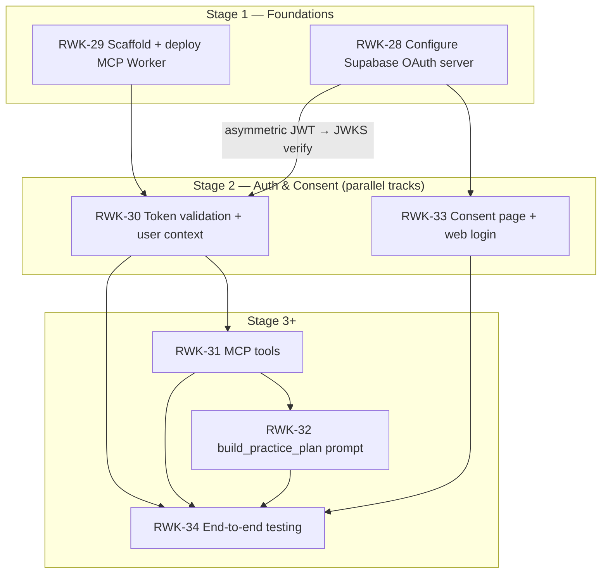

# Stage 2 — Auth & Consent — Requirements

> **Epic:** [RWK-4 — AI Session Creation](https://loganmartlew.atlassian.net/browse/RWK-4)
> **Stage 2 tickets:** [RWK-30 — Token validation + user context](https://loganmartlew.atlassian.net/browse/RWK-30) · [RWK-33 — OAuth Consent Page](https://loganmartlew.atlassian.net/browse/RWK-33)
> **Source documents:** `design-docs/RWK4-ai-integration/roadmap.md` · Jira tickets RWK-30, RWK-33 · `design-docs/RWK4-ai-integration/stage2/requirements-questions.md` (answered below) · Stage 1 deliverables (`apps/mcp`, consent stub, RWK-28 verification)
> **Status:** Requirements defined, ready for implementation planning

---

## 1. Overview

Stage 2 adds authentication and consent to the Rangework MCP server. Two independent tracks run in parallel:

- **Track A — RWK-30:** Wraps every MCP tool call with token validation (JWKS signature verification, expiry, issuer, claims) and constructs a per-request Supabase client scoped to the authenticated user. Every tool call that lands in Stage 3 will run through this auth layer automatically.
- **Track B — RWK-33:** Builds the full consent page at `/oauth/consent` on the existing static site, replacing the Stage 1 stub. Users land here during the OAuth flow to approve or deny an MCP client's access to their practice data.

Both tracks depend on Stage 1: RWK-30 needs the MCP Worker (`apps/mcp`) and the asymmetric JWKS endpoint from RWK-28; RWK-33 needs the consent URL path configured in RWK-28 and the site codebase. They are otherwise independent—RWK-33 does not block on RWK-30 and vice versa. Both must complete before Stage 3 (RWK-31 tools) can begin.

### Resolved decisions (from `requirements-questions.md`)

| #   | Question                                      | Decision                                                                                                                                                                                                  |
| --- | --------------------------------------------- | --------------------------------------------------------------------------------------------------------------------------------------------------------------------------------------------------------- |
| A1  | JWKS endpoint: hardcode or discover?          | **B** — Discover from OAuth AS metadata. One-time startup fetch against `{SUPABASE_URL}/auth/v1/.well-known/oauth-authorization-server`. Note: this introduces a runtime dependency on RWK-28 being live. |
| A2  | JWKS caching strategy                         | **B** — In-memory TTL cache with a 5-minute TTL. Refresh on `kid` miss if needed.                                                                                                                         |
| A3  | Clock skew tolerance                          | **30 seconds**, applied to both `exp` and `nbf`. Standard default.                                                                                                                                        |
| A4  | JWT algorithm (RS256 vs ES256)                | **RS256**, configured via `JWT_ALGORITHM` env var. Pinned to prevent algorithm-confusion attacks.                                                                                                         |
| A5  | Issuer (`iss`) claim value                    | **C** — Configurable via `JWT_ISSUER` env var. Default to `{SUPABASE_URL}/auth/v1`.                                                                                                                       |
| A6  | Audience (`aud`) validation                   | **B** — Validate `aud === "authenticated"`. Revisit if the OAuth AS emits a different value post-RWK-28.                                                                                                  |
| A7  | Per-request Supabase client pattern           | **Resolved** — `createClient(url, anonKey, { global: { headers: { Authorization: `Bearer ${jwt}` } }, auth: { persistSession: false } })`.                                                                |
| A8  | Auth error response shape                     | **B** — `401` + `WWW-Authenticate` header referencing protected-resource metadata + JSON-RPC error object (RFC 9728).                                                                                     |
| A9  | Protected resource metadata endpoint owner    | **A** — RWK-30 adds `/.well-known/oauth-protected-resource` to the Worker. Small static JSON response.                                                                                                    |
| A10 | Test JWT before consent flow exists           | **C** — `supabase auth user` CLI command to get a test token. Document claim differences vs real OAuth-issued tokens.                                                                                     |
| A11 | Auth failure logging                          | **Resolved** — Log `kid`, `iss`, and error reason. Never log `sub` or the raw JWT.                                                                                                                        |
| A12 | `user_id` claim source                        | **Resolved** — Read from `sub` claim. Reject tokens where `role !== "authenticated"`.                                                                                                                     |
| B1  | Consent page island framework                 | **A** — Vanilla TypeScript. The consent page has ~3 states (loading / consent / error); no framework runtime needed.                                                                                      |
| B2  | Consent page route & param name               | **A** — `/oauth/consent?authorization_id=` (matching roadmap §4 and the RWK-28 authorization path config).                                                                                                |
| B3  | Web login: redirect vs popup                  | **Resolved** — Redirect (`signInWithOAuth` default). Pass `authorization_id` as a query param on `redirectTo`.                                                                                            |
| B4  | Supabase redirect URL allowlist               | **C** — Both `supabase/config.toml` (dev: `http://localhost:4321`) and Supabase dashboard (prod: `https://rangework.app`).                                                                                |
| B5  | Google web client ID                          | **A** — Reuse the existing Google OAuth client. Add `rangework.app` and `localhost:4321` to authorized JavaScript origins & redirect URIs.                                                                |
| B6  | Cross-user session handling                   | **A** — Trust Supabase's `getAuthorizationDetails` to error for mismatched users. Surface the error. Add proactive sign-out only if testing shows it's needed.                                            |
| B7  | `getAuthorizationDetails` response shape      | **B** — Run a real authorization and log the full response before building the UI.                                                                                                                        |
| B8  | Scope display text                            | **`manage_practice_data`** — single broad scope. Displayed as "Manage your practice data" on the consent page.                                                                                            |
| B9  | Redirect after approve/deny                   | **Resolved** — `window.location.replace(redirect_url)` from the Supabase response. Trust the returned URL.                                                                                                |
| B10 | Error state copy                              | **Resolved** — Missing `authorization_id`: "This link is invalid." Expired: "This authorization request has expired…" Network: "Something went wrong. Please try again." + retry.                         |
| B11 | Post-approve destination                      | **Resolved** — Follow the `redirect_url`. No Rangework success interstitial.                                                                                                                              |
| B12 | Consent page styling                          | **Resolved** — Standalone chrome-less shell. No Nav or Footer from the marketing site. Use `ui-tokens` colours/typography.                                                                                |
| B13 | Accessibility & i18n                          | **Resolved** — English-only v1. Semantic `<button>` elements, visible focus ring, `<ul>` with `aria-label` for scopes.                                                                                    |
| B14 | CSRF / state parameter across Google redirect | **A** — Pass `authorization_id` as a query param on the `redirectTo` URL. Visible in referer headers, but scoped and predictable.                                                                         |
| B15 | `@supabase/supabase-js` dependency            | **Resolved** — Add as `dependency` (ships browser-side code). Pin to same minor version as `apps/mobile`. `PUBLIC_SUPABASE_URL` / `PUBLIC_SUPABASE_ANON_KEY` via `.env`.                                  |
| C1  | Scope definition                              | **A** — Single scope: `manage_practice_data`. Read/write split deferred to v2.                                                                                                                            |
| C2  | URL coordination table                        | **Resolved** — Record canonical URLs in `design-docs/RWK4-ai-integration/urls.md` once RWK-28 is done.                                                                                                    |
| C3  | Testing strategy                              | **Resolved** — RWK-30: Vitest unit tests with forged/invalid JWTs + `test-token.ts` for real JWKS verification. RWK-33: manual flow test.                                                                 |
| C4  | Environment variable names                    | **Resolved** — Worker: `SUPABASE_URL`, `SUPABASE_ANON_KEY`, `JWT_ISSUER`, `JWT_ALGORITHM`. Site: `PUBLIC_SUPABASE_URL`, `PUBLIC_SUPABASE_ANON_KEY`.                                                       |
| C5  | Supabase beta version pinning                 | **Resolved** — Pin `@supabase/supabase-js` to a specific minor in both `apps/site` and `apps/mcp`. Comment noting beta status.                                                                            |

---

## 2. Dependency graph



---

## 3. Track A — RWK-30: Token validation + user context

### 3.1 Goal

On every MCP tool call, validate the bearer JWT against Supabase's JWKS endpoint, extract the authenticated user's identity, and construct a per-request Supabase client scoped to that user so that RLS enforces data isolation. Invalid/missing/expired tokens are rejected with RFC 9728-compliant errors.

### 3.2 Architecture

```mermaid
sequenceDiagram
    participant Client as MCP Client<br/>(Claude.ai / ChatGPT)
    participant Worker as Rangework MCP Worker
    participant JWKS as Supabase JWKS<br/>Endpoint
    participant PG as Supabase Postgres<br/>(RLS enforced)

    Client->>Worker: POST /mcp (Authorization: Bearer &lt;jwt&gt;)
    Worker->>Worker: Extract JWT from Authorization header
    Worker->>JWKS: Fetch JWKS (cached in-memory, TTL 5 min)
    JWKS-->>Worker: RS256 public keys
    Worker->>Worker: Verify signature, exp, iss, aud, role
    alt Invalid token
        Worker-->>Client: 401 + WWW-Authenticate + JSON-RPC error
    else Valid token
        Worker->>Worker: Extract sub → user_id
        Worker->>Worker: Build scoped Supabase client<br/>(anon key + user's JWT as Authorization header)
        Worker->>PG: Scoped query (RLS applies)
        PG-->>Worker: User-scoped result
        Worker-->>Client: Tool response
    end
```

### 3.3 File structure

```
apps/mcp/
├── src/
│   ├── index.ts                          # Modified: import auth middleware, wire into handler
│   ├── server.ts                         # Modified: add auth middleware registration
│   ├── auth/
│   │   ├── authenticate.ts               # Bearer token extraction + JWKS verification → user context
│   │   ├── jwks.ts                       # JWKS fetcher + in-memory TTL cache
│   │   ├── errors.ts                     # Auth error factory (401 + WWW-Authenticate + MCP JSON-RPC)
│   │   └── protected-resource.json       # Static /.well-known/oauth-protected-resource response
│   ├── context/
│   │   └── user-context.ts               # UserContext type + scoped client builder
│   ├── tools/
│   │   └── ping.ts                       # Unchanged (auth enforcement applied at transport layer)
│   └── tests/
│       ├── ping.test.ts                  # Unchanged
│       ├── jwks-reachability.test.ts     # Unchanged
│       ├── authenticate.test.ts          # NEW: unit tests with forged/expired/invalid JWTs
│       └── jwks-cache.test.ts            # NEW: cache TTL + refresh-on-miss tests
├── .dev.vars.example                     # Updated: add SUPABASE_URL, SUPABASE_ANON_KEY, JWT_ISSUER, JWT_ALGORITHM
└── README.md                             # Updated: document env vars and auth architecture
```

### 3.4 Requirements

#### 3.4.1 JWKS discovery and caching

| Requirement                      | Detail                                                                                                                                                                                                          |
| -------------------------------- | --------------------------------------------------------------------------------------------------------------------------------------------------------------------------------------------------------------- |
| JWKS source                      | Discover the JWKS URL from the OAuth AS metadata endpoint at `{SUPABASE_URL}/auth/v1/.well-known/oauth-authorization-server`. Fetch metadata once at Worker startup (cold start) and cache the JWKS URL.        |
| JWKS fetch                       | Fetch the JWKS from the `jwks_uri` returned by the metadata endpoint. Cache keys in-memory with a 5-minute TTL.                                                                                                 |
| Cache invalidation on `kid` miss | If a JWT presents a `kid` not present in the cached JWKS, re-fetch immediately. If the re-fetched JWKS still lacks the `kid`, reject the token.                                                                 |
| Fallback on metadata failure     | If the OAuth AS metadata endpoint is unreachable at startup, log the error and reject all authenticated requests (fail-closed). A cold-start retry on the next request is acceptable if the first fetch failed. |
| Clock skew tolerance             | 30 seconds, applied to both `exp` and `nbf` claims.                                                                                                                                                             |

#### 3.4.2 Token validation

| Requirement        | Detail                                                                                                                                                                         |
| ------------------ | ------------------------------------------------------------------------------------------------------------------------------------------------------------------------------ |
| Location           | Bearer token from the `Authorization` header. Reject requests without this header.                                                                                             |
| Algorithm          | Validate that the JWT's `alg` header matches the configured `JWT_ALGORITHM` (RS256). Reject tokens using a different algorithm (prevents algorithm-confusion attacks).         |
| Signature          | Verify the JWT signature against the matching key from the JWKS (by `kid`). Reject on signature mismatch.                                                                      |
| Expiry (`exp`)     | Reject if `exp` is in the past (with 30s clock skew tolerance).                                                                                                                |
| Not-before (`nbf`) | Reject if `nbf` is in the future (with 30s clock skew tolerance).                                                                                                              |
| Issuer (`iss`)     | Must match the configured `JWT_ISSUER` (default `{SUPABASE_URL}/auth/v1`). Reject on mismatch.                                                                                 |
| Audience (`aud`)   | Must be `"authenticated"` (Supabase default). Reject on mismatch.                                                                                                              |
| Role               | Must be `"authenticated"`. Reject tokens with `role === "anon"` or missing role.                                                                                               |
| User ID (`sub`)    | Extract from `sub` claim. Must be a non-empty string. Reject if missing or empty.                                                                                              |
| Tool enforcement   | Auth enforcement is applied at the transport/middleware level, not per tool. RWK-31 tools are automatically protected. The `ping` tool becomes authenticated as a side effect. |

#### 3.4.3 Per-request user context

| Requirement                | Detail                                                                                                                                                                                 |
| -------------------------- | -------------------------------------------------------------------------------------------------------------------------------------------------------------------------------------- |
| User context type          | Define a `UserContext` type containing `userId: string` and `getClient(): SupabaseClient`.                                                                                             |
| Scoped client construction | `createClient(supabaseUrl, supabaseAnonKey, { global: { headers: { Authorization: \`Bearer ${jwt}\` } }, auth: { persistSession: false } })`. Anon key is still required by PostgREST. |
| Context propagation        | Pass `UserContext` to every tool handler. Tool handlers use `context.userId` for logging/auditing and `context.getClient()` for all database operations.                               |
| No service role            | Never use the Supabase service role key in tool handlers. All database access must go through the user-scoped client so RLS applies.                                                   |

#### 3.4.4 Auth error responses

| Requirement                 | Detail                                                                                                                                                                                                                                                       |
| --------------------------- | ------------------------------------------------------------------------------------------------------------------------------------------------------------------------------------------------------------------------------------------------------------ |
| Missing token               | HTTP `401` + `WWW-Authenticate: Bearer error="missing_token", resource_metadata="https://mcp.rangework.app/.well-known/oauth-protected-resource"` + MCP JSON-RPC error `{ code: -32001, message: "Authentication required" }`.                               |
| Invalid/expired token       | HTTP `401` + `WWW-Authenticate: Bearer error="invalid_token", error_description="<reason>", resource_metadata="https://mcp.rangework.app/.well-known/oauth-protected-resource"` + MCP JSON-RPC error `{ code: -32001, message: "<human-readable reason>" }`. |
| Protected resource metadata | Serve a static JSON response at `/.well-known/oauth-protected-resource` describing the auth server, scopes, and consent URL per RFC 9728.                                                                                                                    |

#### 3.4.5 Logging

| Requirement     | Detail                                                                                                                                                                                   |
| --------------- | ---------------------------------------------------------------------------------------------------------------------------------------------------------------------------------------- |
| Auth failures   | Log `kid`, `iss`, and error reason (e.g. "expired", "invalid signature", "token not found").                                                                                             |
| Never log       | The `sub` claim (user ID) or the raw JWT string.                                                                                                                                         |
| Successful auth | Log a non-identifying event (e.g. "authenticated request") without the user ID. Details available via `console.log` in local dev; production logging is best-effort (Workers `console`). |

#### 3.4.6 Testing

| Test                        | Scope                                                                  | Automation                       |
| --------------------------- | ---------------------------------------------------------------------- | -------------------------------- |
| Unit — JWT validation       | Forged, expired, wrong-algorithm, wrong-issuer, missing-sub tokens     | Vitest (mocked JWKS)             |
| Unit — JWKS cache           | TTL expiry, `kid` miss triggers re-fetch, metadata fetch failure       | Vitest (mocked fetch)            |
| Unit — error response shape | Confirm `401` + headers + JSON-RPC body match spec                     | Vitest (mocked JWKS)             |
| Manual — real JWKS verify   | `test-token.ts` script: fetch a token via `supabase auth user`, verify | Script documented in README      |
| Manual — Inspector          | MCP Inspector call against deployed Worker with valid/invalid tokens   | Documented in apps/mcp/README.md |

### 3.5 Env vars

| Variable            | Required | Default                  | Notes                                  |
| ------------------- | -------- | ------------------------ | -------------------------------------- |
| `SUPABASE_URL`      | Yes      | —                        | Supabase project URL.                  |
| `SUPABASE_ANON_KEY` | Yes      | —                        | Supabase anon key (safe to expose).    |
| `JWT_ISSUER`        | No       | `{SUPABASE_URL}/auth/v1` | Expected `iss` claim value.            |
| `JWT_ALGORITHM`     | No       | `RS256`                  | Expected `alg` value. Must match JWKS. |

### 3.6 Deliverables

1. Auth middleware in `apps/mcp/src/auth/` (JWKS discovery, caching, verification, error responses).
2. `UserContext` type and scoped client builder in `apps/mcp/src/context/`.
3. Protected resource metadata endpoint at `/.well-known/oauth-protected-resource`.
4. Updated `apps/mcp/src/index.ts` to wire auth middleware into the request pipeline.
5. Updated `apps/mcp/src/server.ts` to accept and propagate `UserContext` to tool handlers.
6. Unit tests in `apps/mcp/src/tests/authenticate.test.ts` and `apps/mcp/src/tests/jwks-cache.test.ts`.
7. `test-token.ts` script for manual real-JWKS verification.
8. Updated `apps/mcp/README.md` documenting auth architecture, env vars, and manual testing steps.
9. Updated `.dev.vars.example` with all four env vars.

### 3.7 Acceptance criteria

- [ ] Valid user JWT → tool call succeeds with correct `UserContext.userId`
- [ ] Missing `Authorization` header → `401` + `WWW-Authenticate` + JSON-RPC error
- [ ] Expired JWT → `401` + `invalid_token` error with descriptive reason
- [ ] Wrong algorithm (e.g. `alg: HS256`) → rejected
- [ ] Wrong `iss` → rejected
- [ ] `role: anon` → rejected
- [ ] Invalid signature → rejected
- [ ] Protected resource metadata endpoint returns valid JSON per RFC 9728
- [ ] `vitest run` passes (all JWKS + auth tests)
- [ ] `test-token.ts` script successfully verifies a real Supabase JWT
- [ ] Log output reveals no `sub` or raw JWT values

---

## 4. Track B — RWK-33: Consent page + web login

### 4.1 Goal

Replace the Stage 1 consent stub with a fully functional consent page at `/oauth/consent` that:

- Reads `authorization_id` from the URL query string
- Checks for an active Supabase session in the browser
- Redirects unauthenticated users to Google sign-in, preserving the `authorization_id`
- Displays the requesting client's name and requested scopes in plain language
- Lets the user approve or deny the authorization request
- Handles error states (missing/expired `authorization_id`, network errors) gracefully

### 4.2 Consent flow

```
User clicks "Connect" on Claude.ai/ChatGPT web
    │
    ▼
Supabase redirects user to /oauth/consent?authorization_id=abc123
    │
    ▼
Consent page loads
    │
    ├── No Supabase session?
    │       ▼
    │   Redirect to Google sign-in
    │   (supabase.auth.signInWithOAuth with
    │    redirectTo back to /oauth/consent,
    │    preserving authorization_id in query)
    │       ▼
    │   Google sign-in complete → redirect back
    │   to /oauth/consent?authorization_id=abc123
    │
    ▼
Supabase session exists (either fresh or restored)
    │
    ▼
supabase.auth.oauth.getAuthorizationDetails(authorization_id)
    │
    ├── Error (expired/missing/invalid)?
    │       ▼
    │   Show error state (B10 copy)
    │
    ▼
Show client name + scope ("Manage your practice data")
    │
    ├── User clicks "Approve"
    │       ▼
    │   supabase.auth.oauth.approveAuthorization(authorization_id)
    │       ▼
    │   window.location.replace(redirect_url)  →  back to MCP client
    │
    └── User clicks "Deny"
            ▼
        supabase.auth.oauth.denyAuthorization(authorization_id)
            ▼
        window.location.replace(redirect_url)  →  back to MCP client
```

### 4.3 File structure

```
apps/site/
├── src/
│   ├── pages/
│   │   └── oauth/
│   │       └── consent.astro                    # REPLACE stub: imports island, renders chrome-less shell
│   ├── components/
│   │   └── oauth/
│   │       ├── consent-island.ts                 # Vanilla TS island: session check, auth details, approve/deny
│   │       ├── consent-styles.css                # Inline styles or CSS module for the chrome-less shell
│   │       └── types.ts                          # ConsentPageState enum, AuthorizationDetails type
│   └── lib/
│       └── supabase-client.ts                    # Shared client init (PUBLIC_SUPABASE_URL + PUBLIC_SUPABASE_ANON_KEY)
├── .env.example                                  # Updated: add PUBLIC_SUPABASE_URL, PUBLIC_SUPABASE_ANON_KEY
└── package.json                                  # Updated: add @supabase/supabase-js dependency
```

### 4.4 Astro page requirements

#### 4.4.1 Route and layout

| Requirement       | Detail                                                                                                                          |
| ----------------- | ------------------------------------------------------------------------------------------------------------------------------- |
| Route             | `/oauth/consent` — matches the RWK-28 authorization path config.                                                                |
| Layout            | **Chrome-less shell.** No site Nav, Footer, or marketing chrome. Full-viewport centred card with the Rangework wordmark only.   |
| Static generation | Statically rendered at build time (Astro default for pages with no `getStaticPaths`). The client-side island handles all logic. |
| Stub replacement  | Replace the existing `apps/site/src/pages/oauth/consent.astro` (the Stage 1 stub).                                              |

#### 4.4.2 Client-side island (`consent-island.ts`)

Built with **vanilla TypeScript** — no Preact, Solid, or other island framework. The consent page has only three states and does not justify a framework runtime.

| Requirement               | Detail                                                                                                                                                                                                                                                                                                     |
| ------------------------- | ---------------------------------------------------------------------------------------------------------------------------------------------------------------------------------------------------------------------------------------------------------------------------------------------------------- |
| Entry                     | `document.addEventListener('DOMContentLoaded', mountConsentIsland)`.                                                                                                                                                                                                                                       |
| State machine             | Three states: `loading`, `consent`, `error`.                                                                                                                                                                                                                                                               |
| `loading` state           | Show a spinner or "Checking authorization…" while checking session and calling `getAuthorizationDetails`.                                                                                                                                                                                                  |
| `consent` state           | Show client name (from `getAuthorizationDetails`), scope description ("Manage your practice data"), and two buttons: "Approve" and "Deny".                                                                                                                                                                 |
| `error` state             | Check `authorization_id` existence first (missing → "This link is invalid."). Distinguish expired vs network errors via the Supabase error object. Expired → "This authorization request has expired. Please reconnect from your app." Network → "Something went wrong. Please try again." + retry button. |
| Session check             | `supabase.auth.getSession()`. If no session, redirect to `signInWithOAuth({ provider: 'google' })` with `redirectTo` set to the current page URL (preserving `authorization_id`).                                                                                                                          |
| Approve handler           | `supabase.auth.oauth.approveAuthorization(authorization_id)` → `window.location.replace(redirect_url)` on success.                                                                                                                                                                                         |
| Deny handler              | `supabase.auth.oauth.denyAuthorization(authorization_id)` → `window.location.replace(redirect_url)` on success.                                                                                                                                                                                            |
| No success interstitial   | Trust the `redirect_url` returned by Supabase. The MCP client's callback handles everything after approval/denial.                                                                                                                                                                                         |
| `authorization_id` source | `new URLSearchParams(window.location.search).get('authorization_id')`.                                                                                                                                                                                                                                     |

### 4.5 Styling guidelines

| Requirement     | Detail                                                                                                                                                                            |
| --------------- | --------------------------------------------------------------------------------------------------------------------------------------------------------------------------------- |
| Visual identity | Rangework brand colours (use `ui-tokens` tokens where possible; otherwise hardcode to match).                                                                                     |
| Card layout     | Centred card on a subtle background. Rangework wordmark at top. Client name + scope description in the card body. Approve/Deny buttons at bottom.                                 |
| Buttons         | "Approve" — primary filled button (matches site's primary action style). "Deny" — secondary/outline button. Sufficient contrast.                                                  |
| Error states    | Use the same card layout, but with an error icon (if available) or bold red-tinted message instead of the consent details. Retry button for transient errors.                     |
| No Nav/Footer   | This is a chrome-less shell. The user should focus entirely on the consent decision.                                                                                              |
| Accessible      | Semantic `<button>` elements (not `<div>`), visible focus ring (browser default or custom), `<ul>` with `aria-label="Requested permissions"` for the scope list. English-only v1. |

### 4.6 Web login — new scope

| Requirement                     | Detail                                                                                                                                                                                                                |
| ------------------------------- | --------------------------------------------------------------------------------------------------------------------------------------------------------------------------------------------------------------------- |
| Sign-in method                  | Google via `supabase.auth.signInWithOAuth({ provider: 'google' })`.                                                                                                                                                   |
| `authorization_id` preservation | Pass as a query param on the `redirectTo` URL: `redirectTo: window.location.origin + '/oauth/consent?authorization_id=' + authorizationId`. The redirect chain is Supabase-controlled.                                |
| Supabase redirect allowlist     | Add `http://localhost:4321/**` to `supabase/config.toml` (`additional_redirect_urls`). Add `https://rangework.app/**` in the Supabase dashboard for production.                                                       |
| Google OAuth client             | Reuse the existing project's Google OAuth client. Add `http://localhost:4321` and `https://rangework.app` to the client's **Authorized JavaScript origins** and **Authorized redirect URIs** in Google Cloud Console. |

### 4.7 `getAuthorizationDetails` response shape (B7)

Run a real OAuth authorization and `console.log` the full response before finalising the consent-island component contract. Expected fields (based on Supabase SDK source):

| Field        | Type     | Description                                   |
| ------------ | -------- | --------------------------------------------- |
| `clientName` | `string` | Human-readable name of the requesting client. |
| `scopes`     | `string` | Space-separated scope strings requested.      |

If the actual response differs, adjust the `types.ts` and `consent-island.ts` implementation accordingly. The requirements-questions answer (B7) recommends building with placeholder fields first and adjusting once a real response is observed.

### 4.8 Error handling matrix

| Condition                                   | User-facing message                                                                                                       | Retry?                                    |
| ------------------------------------------- | ------------------------------------------------------------------------------------------------------------------------- | ----------------------------------------- |
| No `authorization_id` in URL                | "This link is invalid. Please try connecting again from your app."                                                        | No                                        |
| Expired `authorization_id`                  | "This authorization request has expired. Please reconnect from your app."                                                 | No                                        |
| Supabase/network error during details fetch | "Something went wrong. Please try again."                                                                                 | Yes — "Try again" button re-mounts island |
| User denies                                 | (Redirected back to MCP client — no error on consent page)                                                                | N/A                                       |
| Cross-user session (Supabase enforces)      | Surface the error from `getAuthorizationDetails`. Likely same as "expired" or "invalid" depending on Supabase's response. | No                                        |
| No Supabase session after Google redirect   | Surface the sign-in error from Supabase. Generic "Could not sign in. Please try again."                                   | Yes — "Try again" restarts sign-in flow   |

### 4.9 Supabase client setup

| Requirement         | Detail                                                                                                                                        |
| ------------------- | --------------------------------------------------------------------------------------------------------------------------------------------- |
| Package             | `@supabase/supabase-js` — added to `apps/site/package.json` as a `dependency`. Pin to the same minor version `apps/mobile` uses.              |
| Version pin comment | Add a comment in `package.json` noting the beta status of the OAuth server methods.                                                           |
| Env vars            | `PUBLIC_SUPABASE_URL` and `PUBLIC_SUPABASE_ANON_KEY` (Astro `PUBLIC_` convention), injected at build time via `.env`.                         |
| Client creation     | Shared across the site in `src/lib/supabase-client.ts`. Initialised once and reused.                                                          |
| Browser-only        | The Supabase client (and the consent island) load only in the browser. Astro's static rendering does not execute `supabase-js` on the server. |

### 4.10 Testing

| Test type              | Scope                                                                                                              | Automation                |
| ---------------------- | ------------------------------------------------------------------------------------------------------------------ | ------------------------- |
| Manual — consent flow  | Full flow: unauthenticated → sign in → see client details → approve → redirected back                              | Manual (documented steps) |
| Manual — denial flow   | Unauthenticated → sign in → see client details → deny → redirected back                                            | Manual                    |
| Manual — expired       | Use an expired `authorization_id` → see error message                                                              | Manual                    |
| Manual — missing param | Navigate to `/oauth/consent` without `authorization_id` → see "This link is invalid."                              | Manual                    |
| Manual — network error | Disconnect network → see "Something went wrong" + retry button → click retry → flow recovers (or shows same error) | Manual                    |

> No component unit tests in v1 per C3. The consent page's logic is primarily sequential async state transitions that are effectively tested by manual flow.

### 4.11 Deliverables

1. Fully functional consent page at `apps/site/src/pages/oauth/consent.astro` (replaces Stage 1 stub).
2. Client-side island at `apps/site/src/components/oauth/consent-island.ts`.
3. Consent page styles at `apps/site/src/components/oauth/consent-styles.css`.
4. Types file at `apps/site/src/components/oauth/types.ts`.
5. Shared Supabase client at `apps/site/src/lib/supabase-client.ts`.
6. Updated `apps/site/package.json` with `@supabase/supabase-js` dependency.
7. Updated `apps/site/.env.example` with `PUBLIC_SUPABASE_URL` and `PUBLIC_SUPABASE_ANON_KEY`.
8. Google OAuth web client configured in Google Cloud Console (user-performed, documented).
9. Supabase redirect allowlist updated in `supabase/config.toml` (dev) and dashboard (prod — user-performed).

### 4.12 Acceptance criteria

- [ ] Unauthenticated user hitting `/oauth/consent?authorization_id=abc123` is redirected to Google sign-in
- [ ] After sign-in, the user is returned to `/oauth/consent?authorization_id=abc123`
- [ ] The consent page displays the requesting client's name and "Manage your practice data" scope
- [ ] Clicking "Approve" calls `approveAuthorization` and redirects to the returned URL
- [ ] Clicking "Deny" calls `denyAuthorization` and redirects to the returned URL
- [ ] Missing `authorization_id` → error state with "This link is invalid."
- [ ] Expired `authorization_id` → error state with "This authorization request has expired."
- [ ] Network error → error state with "Something went wrong" + retry button
- [ ] Page has no Nav or Footer chrome (chrome-less shell)
- [ ] Site still builds with `astro build` (no server-side Supabase client issues)
- [ ] `supabase/config.toml` includes `http://localhost:4321/**` in `additional_redirect_urls`

---

## 5. Cross-cutting requirements

### 5.1 Stage 2 scope boundary

| Item                                      | In Stage 2                 | Deferred      |
| ----------------------------------------- | -------------------------- | ------------- |
| MCP read/write tools                      | No — RWK-31                | ✓             |
| Coaching prompt                           | No — RWK-32                | ✓             |
| End-to-end testing                        | No — RWK-34                | ✓             |
| Read/write scope split                    | Deferred to v2             | ✓             |
| Consent page i18n                         | English-only v1            | ✓             |
| Tool-layer auth tests (beyond middleware) | No — middleware covers all | —             |
| Consent page unit tests                   | Manual-only v1             | ✓ (if needed) |

### 5.2 Documentation updates

| File                                  | Change                                                                                       |
| ------------------------------------- | -------------------------------------------------------------------------------------------- |
| `apps/mcp/README.md`                  | Document auth architecture, env vars, manual testing steps (test-token.ts, MCP Inspector).   |
| `.dev.vars.example`                   | Add `SUPABASE_URL`, `SUPABASE_ANON_KEY`, `JWT_ISSUER`, `JWT_ALGORITHM`.                      |
| `apps/site/.env.example`              | Add `PUBLIC_SUPABASE_URL`, `PUBLIC_SUPABASE_ANON_KEY`.                                       |
| `apps/site/package.json`              | Add `@supabase/supabase-js` with version-pin comment.                                        |
| `supabase/config.toml`                | Add `http://localhost:4321/**` to `additional_redirect_urls` for dev.                        |
| `CLAUDE.md` / copilot-instructions.md | Update codebase maps if `apps/mcp/src/auth/` or `apps/site/src/components/oauth/` are added. |
| URL coordination table                | Record canonical URLs in `design-docs/RWK4-ai-integration/urls.md` once RWK-28 is confirmed. |

### 5.3 Supabase configuration changes

| Change                                        | Where                  | Owner |
| --------------------------------------------- | ---------------------- | ----- |
| Add `http://localhost:4321/**` to redirects   | `supabase/config.toml` | Agent |
| Add `https://rangework.app/**` to redirects   | Supabase dashboard     | User  |
| Add Google `localhost:4321` + `rangework.app` | Google Cloud Console   | User  |
| Reuse existing Google OAuth client            | Google Cloud Console   | User  |

### 5.4 Risks

| Risk                                                                            | Impact                                                | Mitigation                                                                                        |
| ------------------------------------------------------------------------------- | ----------------------------------------------------- | ------------------------------------------------------------------------------------------------- |
| Supabase OAuth 2.1 server is beta (F11) — API changes to `auth.oauth.*` methods | Consent page or auth middleware may need updates      | Pin `@supabase/supabase-js` minor version; subscribe to Supabase changelog.                       |
| `getAuthorizationDetails` response shape differs from expectations (B7)         | Consent island contract wrong; needs rewrite          | Run a real authorization and log the response before finalising the component contract (B7).      |
| RWK-28 not yet fully verified — JWKS endpoint may not be live                   | RWK-30 cannot validate tokens                         | Test early against real JWKS; fall back to hardcoded JWKS URL as escape hatch if discovery fails. |
| Google OAuth web client config not yet set up                                   | Web login redirect fails; consent flow broken         | Document exact Google Cloud Console steps in implementation plan; user performs setup.            |
| Existing Google OAuth client's authorized origins may not allow new web origins | Redirect URIs rejected by Google                      | User adds origins in Google Cloud Console — explicitly called out in RWK-33 acceptance criteria.  |
| Astro builds may fail if `@supabase/supabase-js` is imported at module level    | Deploy fails                                          | Ensure Supabase client is imported only in the client-side island or guarded by `typeof window`.  |
| Workers cold start with JWKS discovery fetch adds latency to first request      | First tool call after idle timeout may be slow (1-2s) | Acceptable; cache primes after first fetch. Document in README as known characteristic.           |

---

## 6. Acceptance criteria summary

### RWK-30

- [ ] JWKS discovery fetches metadata from OAuth AS endpoint; JWKS cached with 5-min TTL
- [ ] `kid` miss triggers JWKS re-fetch; missing `kid` post-refresh rejects the token
- [ ] Valid user JWT → `UserContext.userId` extracted correctly; scoped client built
- [ ] Missing `Authorization` → `401` + `WWW-Authenticate` + JSON-RPC error
- [ ] Expired JWT → `401` + `invalid_token` error
- [ ] Wrong algorithm → rejected with descriptive error
- [ ] Wrong `iss` → rejected
- [ ] `role: anon` → rejected
- [ ] Invalid signature → rejected
- [ ] Protected resource metadata endpoint returns valid JSON
- [ ] Log output contains `kid`, `iss`, error reason; never `sub` or raw JWT
- [ ] `vitest run` passes (auth + JWKS cache tests)
- [ ] `test-token.ts` works against real Supabase JWKS
- [ ] Worker env vars: `SUPABASE_URL`, `SUPABASE_ANON_KEY`, `JWT_ISSUER`, `JWT_ALGORITHM`

### RWK-33

- [ ] Unauthenticated user redirected to Google sign-in; `authorization_id` preserved across redirect
- [ ] Consent page displays client name + "Manage your practice data" scope
- [ ] Approve → `approveAuthorization` called → redirected to `redirect_url`
- [ ] Deny → `denyAuthorization` called → redirected to `redirect_url`
- [ ] Missing `authorization_id` → "This link is invalid." error
- [ ] Expired `authorization_id` → "This authorization request has expired." error
- [ ] Network error → "Something went wrong." + retry button
- [ ] Chrome-less shell (no Nav, no Footer)
- [ ] `astro build` succeeds
- [ ] `supabase/config.toml` updated with `http://localhost:4321/**`
- [ ] Google OAuth web client configured with `localhost:4321` and `rangework.app`

### Cross-cutting

- [ ] `apps/mcp/README.md` updated with auth docs and env vars
- [ ] `apps/site/.env.example` updated with `PUBLIC_SUPABASE_URL`, `PUBLIC_SUPABASE_ANON_KEY`
- [ ] `@supabase/supabase-js` pinned in `apps/site/package.json`
- [ ] URL coordination table recorded in `design-docs/RWK4-ai-integration/urls.md`
