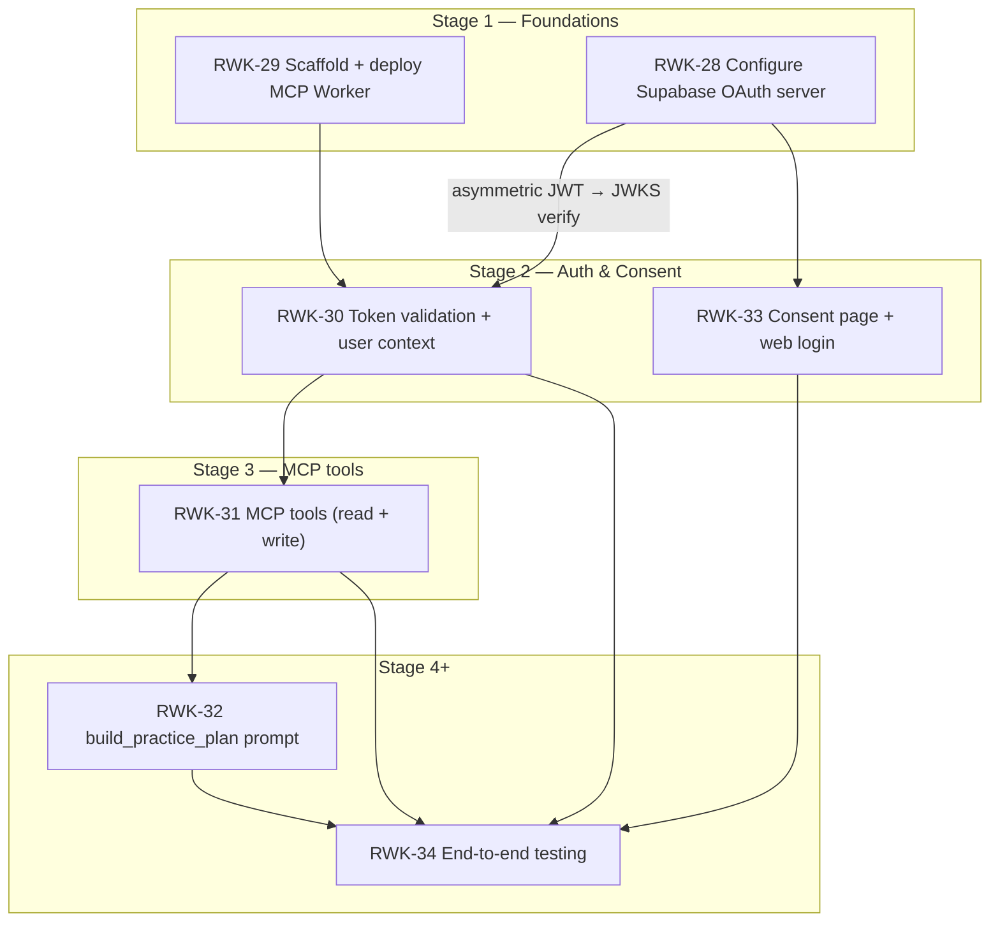

# Stage 3 — MCP Tools — Implementation Plan

> **Epic:** [RWK-4 — AI Session Creation](https://loganmartlew.atlassian.net/browse/RWK-4)
> **Stage 3 ticket:** [RWK-31 — MCP tools (read + write)](https://loganmartlew.atlassian.net/browse/RWK-31)
> **Source documents:** `design-docs/RWK4-ai-integration/roadmap.md` · `design-docs/RWK4-ai-integration/stage3/requirements.md` · `design-docs/RWK4-ai-integration/stage3/requirements-questions.md` (answered) · Stage 2 deliverables (RWK-30 auth middleware, `UserContext`)
> **Status:** Plan ready for implementation

---

## 1. Overview

Stage 3 adds five MCP tools that give an LLM read and write access to a user's Rangework practice data. All tools run through the Stage 2 auth middleware — every database query is made with the user's scoped Supabase client (`UserContext.supabaseClient`), never the service role.

Three **read tools** (`get_user_clubs`, `list_units`, `list_sessions`) let the LLM understand the user's bag and existing practice library. Two **write tools** (`create_unit`, `create_session`) materialise a generated plan into real Rangework data by calling the existing `save_practice_unit` and `save_practice_session` RPCs.

This is a single-ticket stage (RWK-31) with no parallel tracks. It depends entirely on RWK-30's auth middleware being in place and producing a valid `UserContext` on each request.

### Resolved decisions (from `requirements-questions.md`)

Full table of 37 resolved decisions is recorded in `requirements.md` §1. Key decisions that shape this plan:

| Key decision | Value |
|---|---|
| `list_units` includes full `instructions` array (U1) | Eliminates need for a `get_unit` detail tool |
| Ball count null handling (U4, S2) | `total_ball_count: null` when any instruction lacks `ball_count`; `has_uncounted_instructions` / `has_uncounted_items` boolean flag |
| No result cap on any tool (U5, S5, X4) | Return all records; monitor payload size in Stage 5 |
| Club code validation against full catalog, not user bag (CU5, CS4) | Matches FK constraint behaviour |
| Max 10 instructions per unit (CU8) | Hard cap with validation error |
| Unit ownership pre-check in `create_session` (CS3) | Pre-fetch user's unit ids before calling RPC |
| Structured error shape (X2) | `{ code, message, data? }` with `isError: true` on the MCP content block |
| snake_case throughout (X8) | Matches PostgREST wire format |
| `order` (not `sort_order`) in tool I/O (X9) | Matches RPC JSONB key |
| No timestamps in output (X10) | LLM doesn't need `created_at` / `updated_at` |
| Testing: Vitest + MCP Inspector manual gate (X6) | Unit tests for validation; manual gate per tool against a real account |

### Plan-level notes on the current codebase

The Stage 2 implementation differs from the Stage 2 plan's file structure in a few ways that this plan accounts for:

1. **`UserContext` lives at `src/auth/userContext.ts`** (not `src/context/user-context.ts`). It exposes `{ userId: string; supabaseClient: SupabaseClient }` — the client is a direct property, not behind a `getClient()` method.
2. **`createServer(_userContext?: UserContext)`** currently accepts the context as an optional parameter but does not forward it to tool handlers. Stage 3 must wire this through.
3. **Token validation uses `jose`** (`createRemoteJWKSet` + `jwtVerify`) in `src/auth/validateToken.ts`. Auth middleware runs in `src/index.ts` before `createServer()`.
4. **`zod` is already a dependency** — available for input validation without adding new packages.
5. **The `ping` tool registers via `registerPingTool(server)`** — new tools follow the same `register*Tool(server, userContext)` pattern.

---

## 2. Dependency graph



**Critical dependency:** RWK-30's auth middleware must be in place. Every tool call routes through the middleware and receives a `UserContext` with `userId` and a scoped `supabaseClient`. RWK-33 (consent page) is parallel to Stage 3 and only needs to finish before Stage 5.

---

## 3. File structure

```
apps/mcp/
├── src/
│   ├── index.ts                          # Unchanged
│   ├── server.ts                         # MODIFIED: register five new tools, wire UserContext through
│   ├── auth/
│   │   ├── userContext.ts                # Unchanged (Stage 2 deliverable)
│   │   └── validateToken.ts             # Unchanged (Stage 2 deliverable)
│   ├── tools/
│   │   ├── ping.ts                       # Unchanged
│   │   ├── get-user-clubs.ts             # NEW
│   │   ├── list-units.ts                 # NEW
│   │   ├── list-sessions.ts              # NEW
│   │   ├── create-unit.ts                # NEW
│   │   └── create-session.ts             # NEW
│   ├── validation/
│   │   ├── club-codes.ts                 # NEW: catalog lookup + validation helper
│   │   └── tool-errors.ts               # NEW: structured error factory (X2)
│   └── tests/
│       ├── ping.test.ts                  # Unchanged
│       ├── auth.test.ts                  # Unchanged (Stage 2)
│       ├── jwks-reachability.test.ts     # Unchanged (Stage 1)
│       ├── get-user-clubs.test.ts        # NEW
│       ├── list-units.test.ts            # NEW
│       ├── list-sessions.test.ts         # NEW
│       ├── create-unit.test.ts           # NEW
│       ├── create-session.test.ts        # NEW
│       ├── club-codes.test.ts            # NEW
│       └── tool-errors.test.ts           # NEW
└── README.md                             # UPDATED: document all five tools, retry/idempotency
```

---

## 4. Wiring: `UserContext` propagation

### 4.1 Problem

`createServer(_userContext?: UserContext)` currently ignores the context — only `registerPingTool(server)` is called, and ping doesn't use it. The five new tools all need the user's `supabaseClient` to query Supabase under RLS.

### 4.2 Approach

Change `createServer` to require `UserContext` and pass it to each tool registration function:

```ts
// server.ts (modified)
export function createServer(userContext: UserContext): McpServer {
  const server = new McpServer(/* ... */);

  registerPingTool(server);
  registerGetUserClubsTool(server, userContext);
  registerListUnitsTool(server, userContext);
  registerListSessionsTool(server, userContext);
  registerCreateUnitTool(server, userContext);
  registerCreateSessionTool(server, userContext);

  return server;
}
```

Each tool registration function follows the pattern:

```ts
export function registerGetUserClubsTool(server: McpServer, ctx: UserContext): void {
  server.registerTool('get_user_clubs', { /* schema */ }, async () => {
    // use ctx.supabaseClient for all queries
  });
}
```

The `ping` tool registration remains unchanged (`registerPingTool(server)` — no context needed).

The `index.ts` fetch handler already calls `createServer(userContext)` with a validated context, so no changes are needed there. The parameter becomes required instead of optional, which is correct — auth middleware ensures it's always present for `/mcp` POST requests.

### 4.3 Test impact

The existing `ping.test.ts` creates a server via `createServer()` with no arguments. After the signature change, tests that call `createServer` must provide a mock `UserContext`. Add a test helper:

```ts
// A minimal mock UserContext for tests that don't exercise Supabase queries.
function mockUserContext(): UserContext {
  return {
    userId: 'test-user-id',
    supabaseClient: {} as SupabaseClient,
  };
}
```

Update `ping.test.ts` to pass `mockUserContext()` to `createServer()`.

---

## 5. Shared validation helpers

### 5.1 Structured error factory (`src/validation/tool-errors.ts`)

All tool errors use the MCP `isError: true` flag and include a structured JSON body (X2):

```ts
interface ToolError {
  code: string;
  message: string;
  data?: {
    field?: string;
    valid_codes?: string[];
    invalid_unit_ids?: string[];
  };
}
```

Export a `toolError(code, message, data?)` factory that returns the MCP `CallToolResult` shape:

```ts
export function toolError(code: string, message: string, data?: ToolError['data']): CallToolResult {
  const body: ToolError = { code, message };
  if (data) body.data = data;
  return {
    content: [{ type: 'text', text: JSON.stringify(body) }],
    isError: true,
  };
}
```

Error codes used across tools:

| Code | Used by |
|---|---|
| `VALIDATION_ERROR` | `create_unit`, `create_session` (field-level validation failures) |
| `UNKNOWN_CLUB_CODE` | `create_unit`, `create_session` (bad club reference) |
| `UNIT_NOT_FOUND` | `create_session` (unit not owned by user or doesn't exist) |
| `DATABASE_ERROR` | `create_unit`, `create_session` (unexpected RPC failure) |

### 5.2 Club code validation (`src/validation/club-codes.ts`)

Shared by `create_unit` (validates `default_club_reference`) and `create_session` (validates item-level `club_reference`).

```ts
export async function fetchAllClubCodes(supabaseClient: SupabaseClient): Promise<string[]>
export async function validateClubCode(code: string, allCodes: string[]): void | never
```

- `fetchAllClubCodes` — `SELECT code FROM clubs ORDER BY sort_order ASC`. Returns the full catalog code list. Called once per tool invocation that needs club validation (not cached across requests — caching is a Stage 4+ optimisation per requirements §9.7).
- `validateClubCode` — checks if `code` is in the fetched list; throws a structured error with the user's enabled club codes as a convenience hint if not found.

To include the user's enabled codes in the error `data.valid_codes` (as a convenience hint for the LLM), the write tools fetch both the full catalog and the user's bag in parallel. The catalog validates; the bag provides the hint.

---

## 6. Tool: `get_user_clubs`

### 6.1 Implementation (`src/tools/get-user-clubs.ts`)

**Registration:** `registerGetUserClubsTool(server: McpServer, ctx: UserContext): void`

**Tool name:** `get_user_clubs`

**Input schema:** No parameters (empty Zod schema).

**Handler logic:**

1. Query `user_enabled_clubs` joined to `clubs`:
   ```ts
   const { data, error } = await ctx.supabaseClient
     .from('user_enabled_clubs')
     .select('club_code, clubs(code, display_name, category, sort_order)')
     .order('clubs(sort_order)', { ascending: true });
   ```
   If the Supabase client's join syntax doesn't support ordering by the joined table inline, use a two-step approach: fetch `user_enabled_clubs` for the user, then fetch matching `clubs` rows ordered by `sort_order`.
2. Map to output shape: `{ clubs: [{ code, display_name, category }] }`.
3. Return as `CallToolResult` with `content: [{ type: 'text', text: JSON.stringify(result) }]`.

**Empty bag:** Returns `{ clubs: [] }`. Not an error.

**Tool description:**
> Returns the clubs currently enabled in the user's bag. Call this at the start of a planning session to learn which clubs are available. Use the `code` field (not `display_name`) in all subsequent tool calls that accept a club reference.

### 6.2 Tests (`src/tests/get-user-clubs.test.ts`)

| Test case | Assertion |
|---|---|
| User has clubs | Output contains `clubs` array with `code`, `display_name`, `category`; no `sort_order` in output |
| Empty bag | Returns `{ clubs: [] }` |
| Output order | Clubs ordered by `sort_order ASC` (driver before putter) |

Mock `ctx.supabaseClient` with a fake `.from().select().order()` chain returning canned data.

---

## 7. Tool: `list_units`

### 7.1 Implementation (`src/tools/list-units.ts`)

**Registration:** `registerListUnitsTool(server: McpServer, ctx: UserContext): void`

**Tool name:** `list_units`

**Input schema:** No parameters.

**Handler logic:**

1. Fetch all `practice_units` for the user, ordered `updated_at DESC`:
   ```ts
   const { data: units } = await ctx.supabaseClient
     .from('practice_units')
     .select('id, title, notes, focus, default_club_reference')
     .order('updated_at', { ascending: false });
   ```
2. Fetch all `practice_unit_instructions` for those unit ids, ordered by `practice_unit_id, sort_order`:
   ```ts
   const unitIds = units.map(u => u.id);
   const { data: instructions } = await ctx.supabaseClient
     .from('practice_unit_instructions')
     .select('practice_unit_id, sort_order, text, ball_count')
     .in('practice_unit_id', unitIds)
     .order('sort_order', { ascending: true });
   ```
3. Group instructions by `practice_unit_id` in-memory.
4. For each unit, compute:
   - `instruction_count` = `instructions.length`
   - `has_uncounted_instructions` = `instructions.some(i => i.ball_count == null)`
   - `total_ball_count` = `has_uncounted_instructions ? null : instructions.reduce((sum, i) => sum + i.ball_count!, 0)`
   - `instructions` array mapped to `{ order: i.sort_order, text: i.text, ball_count: i.ball_count }`
5. Return `{ units: [...] }`.

**Empty state:** Returns `{ units: [] }`.

**Edge case — no unit ids:** If the user has no units, skip the instructions fetch entirely (avoid `IN ()` with an empty array).

**Tool description:**
> Returns all of the user's practice units, including full instruction text, ball counts, club assignment, and coaching notes. Call this before creating new units to avoid duplication and to find units that can be reused in a new session. If `has_uncounted_instructions` is true, some instructions have no ball count — treat `total_ball_count` as a partial estimate.

### 7.2 Tests (`src/tests/list-units.test.ts`)

| Test case | Assertion |
|---|---|
| All instructions have `ball_count` | `total_ball_count` = sum; `has_uncounted_instructions` = `false` |
| Some instructions have null `ball_count` | `total_ball_count` = `null`; `has_uncounted_instructions` = `true` |
| All instructions have null `ball_count` | `total_ball_count` = `null`; `has_uncounted_instructions` = `true` |
| Instructions joined to correct unit | Instructions grouped by `practice_unit_id` |
| No units | Returns `{ units: [] }` |
| Output fields | Each unit has `id`, `title`, `notes`, `focus`, `default_club_reference`, `instruction_count`, `total_ball_count`, `has_uncounted_instructions`, `instructions` |
| No `created_at`/`updated_at` in output | Timestamps omitted (X10) |
| Instruction `order` field | Uses `order` key (mapped from `sort_order`), not `sort_order` (X9) |

---

## 8. Tool: `list_sessions`

### 8.1 Implementation (`src/tools/list-sessions.ts`)

**Registration:** `registerListSessionsTool(server: McpServer, ctx: UserContext): void`

**Tool name:** `list_sessions`

**Input schema:** No parameters.

**Handler logic:**

1. Fetch all `practice_sessions` for the user, ordered `updated_at DESC`:
   ```ts
   const { data: sessions } = await ctx.supabaseClient
     .from('practice_sessions')
     .select('id, name, notes')
     .order('updated_at', { ascending: false });
   ```
2. Fetch all `practice_session_items` for those session ids:
   ```ts
   const sessionIds = sessions.map(s => s.id);
   const { data: items } = await ctx.supabaseClient
     .from('practice_session_items')
     .select('practice_session_id, practice_unit_id, sort_order, repeat_count, club_reference, notes, focus_cue')
     .in('practice_session_id', sessionIds)
     .order('sort_order', { ascending: true });
   ```
3. Collect all unique `practice_unit_id` values from items. Fetch matching `practice_units` to get `title` and instruction ball counts:
   ```ts
   const unitIds = [...new Set(items.map(i => i.practice_unit_id))];
   const { data: units } = await ctx.supabaseClient
     .from('practice_units')
     .select('id, title')
     .in('id', unitIds);
   ```
4. For each referenced unit, also fetch its `practice_unit_instructions` to compute per-unit ball count totals (needed for the session-level `total_ball_count`). This can be batched in a single query:
   ```ts
   const { data: unitInstructions } = await ctx.supabaseClient
     .from('practice_unit_instructions')
     .select('practice_unit_id, ball_count')
     .in('practice_unit_id', unitIds);
   ```
5. Compute per-unit totals in-memory:
   - For each unit: `unitHasUncounted = instructions.some(i => i.ball_count == null)`
   - For each unit: `unitBallTotal = unitHasUncounted ? null : sum(ball_counts)`
6. For each session, compute:
   - `has_uncounted_items` = any referenced unit has uncounted instructions
   - `total_ball_count` = `has_uncounted_items ? null : items.reduce((sum, item) => sum + item.repeat_count * unitBallTotal, 0)`
   - Map items to output shape with `unit_title` from the units lookup, using `order` (mapped from `sort_order`).
7. Return `{ sessions: [...] }`.

**Empty state:** Returns `{ sessions: [] }`.

**Edge case — empty arrays:** Skip downstream fetches when session or item lists are empty.

**Tool description:**
> Returns all of the user's practice sessions, including their item lineup, club overrides, repeat counts, and coaching notes. Call this to understand how the user's existing sessions are structured before creating a new one. If `has_uncounted_items` is true, one or more units in the session have no ball count on some instructions — treat the total as a partial estimate.

### 8.2 Tests (`src/tests/list-sessions.test.ts`)

| Test case | Assertion |
|---|---|
| All units fully counted | `total_ball_count` = computed sum; `has_uncounted_items` = `false` |
| One unit has uncounted instructions | `total_ball_count` = `null`; `has_uncounted_items` = `true` |
| Unit title join | Each item has `unit_title` from the units lookup |
| Item fields | `order`, `unit_id`, `unit_title`, `repeat_count`, `club_reference`, `notes`, `focus_cue` |
| No sessions | Returns `{ sessions: [] }` |
| No timestamps in output | `created_at`/`updated_at` omitted |

---

## 9. Tool: `create_unit`

### 9.1 Implementation (`src/tools/create-unit.ts`)

**Registration:** `registerCreateUnitTool(server: McpServer, ctx: UserContext): void`

**Tool name:** `create_unit`

**Input schema (Zod):**

```ts
const CreateUnitInput = z.object({
  title: z.string(),
  instructions: z.array(z.object({
    order: z.number().int().positive(),
    text: z.string(),
    ball_count: z.number().int().positive().optional(),
  })).min(1).max(10),
  notes: z.string().optional(),
  focus: z.string().optional(),
  default_club_reference: z.string().optional(),
});
```

**Handler logic:**

1. Parse and validate input with Zod. On parse failure, return `toolError('VALIDATION_ERROR', ...)`.
2. Trim `title` — reject if empty after trim.
3. Trim each `instructions[].text` — reject if any are empty after trim.
4. Check for duplicate `order` values in `instructions` — reject if found.
5. If `default_club_reference` is provided:
   a. Fetch the full club catalog (`fetchAllClubCodes`).
   b. Validate the code exists in the catalog.
   c. On failure, also fetch the user's enabled clubs for the `valid_codes` hint in the error `data`.
6. Generate `unit_id` with `crypto.randomUUID()`.
7. Build the instructions JSONB array: `[{ order, text, ball_count }]` (omit `ball_count` key entirely if not provided — the RPC uses `inst->>'ball_count' is null` to detect this).
8. Call the RPC:
   ```ts
   const { error } = await ctx.supabaseClient.rpc('save_practice_unit', {
     p_unit_id: unitId,
     p_title: title,
     p_notes: notes ?? null,
     p_focus: focus ?? null,
     p_default_club_reference: defaultClubReference ?? null,
     p_instructions: instructionsJsonb,
   });
   ```
9. On RPC error, map to structured error:
   - FK violation on `default_club_reference` → `UNKNOWN_CLUB_CODE`
   - Other → `DATABASE_ERROR`
10. On success, return `{ unit_id: unitId }`.

**Output schema:** `{ unit_id: string }` (UUID).

**Tool description:**
> Creates a new practice unit (a single drill) in the user's account. A unit has a title, one to ten step-by-step instructions (each with optional ball count), optional coaching focus, and an optional default club. Returns the new unit's id — save this to use in `create_session`. Club references must use the `code` field from `get_user_clubs`, not the display name.

**Parameter descriptions:**
- `title`: Short name for the drill (e.g. "Gate drill", "Draw shot tracer").
- `instructions`: Ordered list of steps. Each step needs `order` (starting at 1), `text`, and an optional `ball_count`.
- `focus`: Optional single-sentence coaching cue or swing thought (e.g. "Keep the club face square through impact").
- `notes`: Optional context or reminders for the user (e.g. "Use an alignment stick").
- `default_club_reference`: Optional default club for this drill. Use the `code` from `get_user_clubs`.

### 9.2 Error mapping

| Condition | `code` | `message` | `data` |
|---|---|---|---|
| `title` empty after trim | `VALIDATION_ERROR` | "title must not be empty" | `{ field: "title" }` |
| `instructions` empty | `VALIDATION_ERROR` | "at least one instruction is required" | `{ field: "instructions" }` |
| `instructions` > 10 | `VALIDATION_ERROR` | "a unit may have at most 10 instructions" | `{ field: "instructions" }` |
| Duplicate `order` values | `VALIDATION_ERROR` | "instruction order values must be unique" | `{ field: "instructions" }` |
| `instructions[n].text` empty after trim | `VALIDATION_ERROR` | "instruction text must not be empty" | `{ field: "instructions[n].text" }` |
| `ball_count` ≤ 0 | `VALIDATION_ERROR` | "ball_count must be a positive integer" | `{ field: "instructions[n].ball_count" }` |
| `order` ≤ 0 | `VALIDATION_ERROR` | "order must be a positive integer" | `{ field: "instructions[n].order" }` |
| Unknown `default_club_reference` | `UNKNOWN_CLUB_CODE` | "Unknown club code: \<code\>" | `{ field: "default_club_reference", valid_codes: [...] }` |
| RPC FK violation (club code) | `UNKNOWN_CLUB_CODE` | "Unknown club code: \<code\>" | `{ field: "default_club_reference", valid_codes: [...] }` |
| Other RPC error | `DATABASE_ERROR` | "Failed to create unit. Please try again." | — |

### 9.3 Tests (`src/tests/create-unit.test.ts`)

| Test case | Assertion |
|---|---|
| Valid input | Returns `{ unit_id }` (UUID string); RPC called with correct args |
| Empty `title` | Returns `VALIDATION_ERROR` with `field: "title"` |
| Empty `instructions` array | Returns `VALIDATION_ERROR` with `field: "instructions"` |
| More than 10 instructions | Returns `VALIDATION_ERROR` with `field: "instructions"` |
| Duplicate `order` values | Returns `VALIDATION_ERROR` |
| Empty instruction `text` after trim | Returns `VALIDATION_ERROR` |
| `ball_count` = 0 | Returns `VALIDATION_ERROR` |
| Unknown `default_club_reference` | Returns `UNKNOWN_CLUB_CODE` with `valid_codes` array |
| RPC failure | Returns `DATABASE_ERROR` |
| UUID generated per call | Two calls produce different `unit_id` values |
| Optional fields omitted | RPC called with `null` for `notes`, `focus`, `default_club_reference` |
| `ball_count` omitted from instruction JSONB | JSONB entry has no `ball_count` key (not `ball_count: null`) |

---

## 10. Tool: `create_session`

### 10.1 Implementation (`src/tools/create-session.ts`)

**Registration:** `registerCreateSessionTool(server: McpServer, ctx: UserContext): void`

**Tool name:** `create_session`

**Input schema (Zod):**

```ts
const CreateSessionInput = z.object({
  name: z.string(),
  items: z.array(z.object({
    practice_unit_id: z.string().uuid(),
    order: z.number().int().positive(),
    repeat_count: z.number().int().positive(),
    club_reference: z.string().optional(),
    notes: z.string().optional(),
    focus_cue: z.string().optional(),
  })).min(1),
  notes: z.string().optional(),
});
```

**Handler logic:**

1. Parse and validate input with Zod. On parse failure, return `toolError('VALIDATION_ERROR', ...)`.
2. Trim `name` — reject if empty after trim.
3. Check for duplicate `order` values in `items` — reject if found.
4. Pre-fetch the user's unit ids:
   ```ts
   const { data: ownedUnits } = await ctx.supabaseClient
     .from('practice_units')
     .select('id')
   ```
   RLS automatically scopes to `owner_id = auth.uid()`.
5. Validate every `practice_unit_id` in `items` against the fetched set. Collect all invalid ids and return a single `UNIT_NOT_FOUND` error listing them.
6. Collect all `club_reference` values from items. If any are provided:
   a. Fetch the full club catalog.
   b. Validate each code. On failure, return `UNKNOWN_CLUB_CODE` with the invalid code and `valid_codes` hint.
7. Generate `session_id` with `crypto.randomUUID()`.
8. Build the items JSONB array: `[{ practice_unit_id, order, repeat_count, club_reference, notes, focus_cue }]` (omit optional keys if not provided).
9. Call the RPC:
   ```ts
   const { error } = await ctx.supabaseClient.rpc('save_practice_session', {
     p_session_id: sessionId,
     p_name: name,
     p_notes: notes ?? null,
     p_items: itemsJsonb,
   });
   ```
10. On RPC error, map to structured error.
11. On success, return `{ session_id: sessionId }`.

**Output schema:** `{ session_id: string }` (UUID).

**Tool description:**
> Creates a new practice session in the user's account. A session is an ordered list of practice units with optional per-item club overrides, coaching cues, and repeat counts. Call `list_units` or `create_unit` first to get unit ids. Returns the new session's id. Each item's `practice_unit_id` must be a unit that belongs to this user.

**Parameter descriptions:**
- `name`: Short name for the session (e.g. "Pre-round warm-up", "Wedge Wednesday").
- `items`: Ordered list of practice units. Each item needs `practice_unit_id`, `order` (starting at 1), `repeat_count`, and optionally a `club_reference`, `notes`, and `focus_cue`.
- `notes`: Optional session-level notes (e.g. "Tournament prep — focus on short game").
- `items[].practice_unit_id`: The `id` of a practice unit returned by `list_units` or `create_unit`.
- `items[].repeat_count`: How many times to run this unit in the session (e.g. 2 = two rounds of this drill).
- `items[].club_reference`: Optional club override for this item. Overrides the unit's default club. Use a `code` from `get_user_clubs`.
- `items[].focus_cue`: Optional per-item coaching cue (e.g. "Hinge earlier").
- `items[].notes`: Optional per-item reminder (e.g. "Use the 50y stake").

### 10.2 Error mapping

| Condition | `code` | `message` | `data` |
|---|---|---|---|
| `name` empty after trim | `VALIDATION_ERROR` | "name must not be empty" | `{ field: "name" }` |
| `items` empty | `VALIDATION_ERROR` | "at least one item is required" | `{ field: "items" }` |
| Duplicate `order` values | `VALIDATION_ERROR` | "item order values must be unique" | `{ field: "items" }` |
| `repeat_count` ≤ 0 | `VALIDATION_ERROR` | "repeat_count must be a positive integer" | `{ field: "items[n].repeat_count" }` |
| Unknown `practice_unit_id` | `UNIT_NOT_FOUND` | "unit \<id\> not found or does not belong to you" | `{ invalid_unit_ids: [...] }` |
| Unknown `club_reference` | `UNKNOWN_CLUB_CODE` | "Unknown club code: \<code\>" | `{ field: "items[n].club_reference", valid_codes: [...] }` |
| RPC RLS violation | `UNIT_NOT_FOUND` | "one or more units could not be accessed" | `{ invalid_unit_ids: [...] }` |
| Other RPC error | `DATABASE_ERROR` | "Failed to create session. Please try again." | — |

### 10.3 Tests (`src/tests/create-session.test.ts`)

| Test case | Assertion |
|---|---|
| Valid input | Returns `{ session_id }` (UUID); RPC called with correct args |
| Empty `name` | Returns `VALIDATION_ERROR` with `field: "name"` |
| Empty `items` array | Returns `VALIDATION_ERROR` with `field: "items"` |
| Duplicate `order` values | Returns `VALIDATION_ERROR` |
| Unknown `practice_unit_id` (not owned) | Returns `UNIT_NOT_FOUND` with `invalid_unit_ids` |
| Multiple unknown unit ids | All invalid ids listed in `invalid_unit_ids` |
| Unknown `club_reference` | Returns `UNKNOWN_CLUB_CODE` with `valid_codes` |
| RPC failure | Returns `DATABASE_ERROR` |
| Optional item fields omitted | JSONB entries omit `club_reference`, `notes`, `focus_cue` keys |
| UUID generated per call | Two calls produce different `session_id` values |

---

## 11. Testing

### 11.1 Automated (Vitest)

| Test file | Coverage |
|---|---|
| `tool-errors.test.ts` | `toolError()` produces correct `{ code, message, data }` shape; `isError: true` on result |
| `club-codes.test.ts` | `fetchAllClubCodes` returns codes from mock Supabase; `validateClubCode` passes for valid code, throws structured error for unknown code |
| `get-user-clubs.test.ts` | Output shape, `sort_order ASC`, empty bag returns `[]` |
| `list-units.test.ts` | Ball count null handling (all counted, some null, all null); instructions joined correctly; empty state |
| `list-sessions.test.ts` | Ball count null handling; unit title join; empty state |
| `create-unit.test.ts` | Required field validation; max 10 instructions; duplicate `order`; unknown club code; structured error shape; JSONB shape |
| `create-session.test.ts` | Required field validation; unit ownership pre-check; unknown club code; structured error shape; JSONB shape |

All tests run with mocked Supabase clients — no live Supabase connection required.

**Mocking pattern:** Each tool test mocks the Supabase client's query builder chain. Since tools receive the client via `UserContext`, tests construct a mock `UserContext` with a fake client that returns canned data or errors.

### 11.2 Manual (MCP Inspector)

The stage is done when all five tools pass a manual gate in MCP Inspector using a real Rangework account:

| Gate | Pass condition |
|---|---|
| `get_user_clubs` with clubs enabled | Returns the user's bag ordered by `sort_order`, codes + display names |
| `get_user_clubs` with empty bag | Returns `{ clubs: [] }` |
| `list_units` with existing units | Returns full unit list with instructions, ball counts, and null-handling flags |
| `list_units` with no units | Returns `{ units: [] }` |
| `list_sessions` with existing sessions | Returns sessions with item lineups, unit titles, ball count totals |
| `list_sessions` with no sessions | Returns `{ sessions: [] }` |
| `create_unit` valid input | Unit appears in the Android app; returned `unit_id` is a valid UUID |
| `create_unit` with unknown club code | Returns `UNKNOWN_CLUB_CODE` error with `valid_codes` hint |
| `create_unit` with > 10 instructions | Returns `VALIDATION_ERROR` |
| `create_session` referencing created unit | Session appears in the Android app; returned `session_id` is a valid UUID |
| `create_session` referencing another user's unit | Returns `UNIT_NOT_FOUND` error |
| `create_session` with unknown club code | Returns `UNKNOWN_CLUB_CODE` error with `valid_codes` hint |
| All tools — no auth token | Returns `401` (handled by auth middleware, not tool layer) |

### 11.3 Tool description validation (X1)

Before finalising each tool's description and parameter annotations, run at least one test conversation in MCP Inspector in which the LLM must:

1. Call the tool with correct arguments from a natural-language prompt.
2. Handle an invalid argument and retry using the error message.

Adjust descriptions until both cases pass. Record the final validated descriptions in `design-docs/RWK4-ai-integration/stage3/contracts.md`.

---

## 12. Implementation order

Steps are listed in dependency order. Within a step, independent files can be worked in parallel.

1. **Shared helpers first** — `src/validation/tool-errors.ts` + `src/validation/club-codes.ts` + their tests. These are consumed by all five tools and should be solid before tool work begins.

2. **Wire `UserContext` through `server.ts`** — change `createServer` parameter from optional to required; update `ping.test.ts` to pass a mock context. Verify existing tests still pass.

3. **Read tools (in order):**
   a. `get-user-clubs.ts` + test — simplest tool; validates the Supabase client wiring pattern.
   b. `list-units.ts` + test — establishes the two-query + in-memory join pattern.
   c. `list-sessions.ts` + test — reuses the join pattern with the additional unit title lookup.

4. **Write tools (in order):**
   a. `create-unit.ts` + test — establishes the Zod validation → club code check → RPC call → error mapping pattern.
   b. `create-session.ts` + test — adds the unit ownership pre-check on top of the same pattern.

5. **Register all tools in `server.ts`** — add the five `register*Tool` imports and calls. (This can be done incrementally as each tool is implemented, or all at once at the end.)

6. **Run full test suite** — `pnpm --filter @rangework/mcp test` must pass.

7. **Deploy** — `wrangler deploy` to push the updated Worker.

8. **MCP Inspector manual gate** — run through all 13 gate checks (§11.2) against the deployed Worker with a real account.

9. **Tool description validation** — test conversations per §11.3; iterate on descriptions.

10. **Documentation:**
    a. Update `apps/mcp/README.md` — document all five tools, input/output shapes, retry/idempotency behaviour.
    b. Create `design-docs/RWK4-ai-integration/stage3/contracts.md` — record final tool schemas.
    c. Update `CLAUDE.md` codebase map — add `apps/mcp/src/tools/` entries for the five new tools and `apps/mcp/src/validation/`.

---

## 13. Deliverables

1. Five tool handlers in `apps/mcp/src/tools/`: `get-user-clubs.ts`, `list-units.ts`, `list-sessions.ts`, `create-unit.ts`, `create-session.ts`.
2. Shared validation helpers in `apps/mcp/src/validation/`: `club-codes.ts`, `tool-errors.ts`.
3. Updated `apps/mcp/src/server.ts` — register all five tools; `UserContext` parameter required.
4. Seven Vitest test files: one per tool + two for shared helpers.
5. Updated `apps/mcp/src/tests/ping.test.ts` — passes mock `UserContext` to `createServer`.
6. Finalised tool descriptions validated with MCP Inspector test conversations.
7. `apps/mcp/README.md` updated — documents all five tools, input/output shapes, and retry/idempotency behaviour.
8. `design-docs/RWK4-ai-integration/stage3/contracts.md` — final tool schemas recorded.

---

## 14. Validation checkpoint

1. `pnpm --filter @rangework/mcp test` passes (all existing + new tests).
2. `pnpm --filter @rangework/mcp typecheck` passes.
3. `pnpm --filter @rangework/mcp lint` passes.
4. `turbo run test` and `turbo run lint` include and pass for `apps/mcp`.
5. `wrangler deploy` succeeds.
6. All 13 MCP Inspector manual gates (§11.2) pass against a real account.
7. Created data from `create_unit` and `create_session` is visible in the Android app with correct content.
8. Tool description validation (§11.3) completed — each tool's description produces correct tool selection and argument population.
9. `apps/mcp/README.md` updated.
10. `design-docs/RWK4-ai-integration/stage3/contracts.md` created.

---

## 15. Risks

| Risk | Impact | Mitigation |
|---|---|---|
| `save_practice_unit` / `save_practice_session` RPC signatures differ from roadmap §3 | Tool calls fail or produce wrong data | Verified against `supabase/migrations/20260616200000_atomic_planning_save_rpcs.sql` — signatures match the plan. Re-verify before implementing if new migrations land. |
| Supabase PostgREST `.rpc()` requires exact parameter names (`p_unit_id`, not `unit_id`) | RPC call silently fails or errors | Use the exact `p_` prefixed parameter names from the migration. Test with MCP Inspector early. |
| `on delete restrict` on `practice_session_items.practice_unit_id` | No impact in Stage 3 (create-only) | Document in MCP README for v2 (edit/delete tools). |
| LLM picks wrong club codes without calling `get_user_clubs` first | `create_unit` returns `UNKNOWN_CLUB_CODE` errors | Tool descriptions instruct the LLM to call `get_user_clubs` first; error includes `valid_codes` hint. |
| Large accounts with many units produce large `list_units` payloads | Context window pressure on the MCP client | No cap in v1 (X4). Monitor during Stage 5; add a `get_unit` detail tool in v2 if needed. |
| `crypto.randomUUID()` availability in Cloudflare Workers | UUID generation fails | Already confirmed available in Workers runtime (Web Crypto API) during Stage 1. |
| Supabase join syntax for `user_enabled_clubs` → `clubs` may not support `order` on the joined table | `get_user_clubs` query fails or returns unsorted | Fall back to two-step fetch (get user's club codes, then fetch clubs in catalog order). |
| Zod validation errors may not produce user-friendly messages by default | LLM sees cryptic error strings | Catch `ZodError` and map to the project's `toolError` shape with field-level detail. |
| JSONB `ball_count` key presence vs null | RPC may interpret `"ball_count": null` differently from absent key | Explicitly omit the key when `ball_count` is not provided (use a `cleanUndefined` utility or manual object construction). Verify with MCP Inspector. |

---

## 16. Scope boundary

| Item | In Stage 3 | Deferred |
|---|---|---|
| Read tools (clubs, units, sessions) | ✓ | — |
| Write tools (create unit, session) | ✓ | — |
| Edit/delete tools | No | Out of scope for v1 |
| `get_unit` detail tool | No | Resolved by U1 (full instructions in `list_units`) |
| `get_session` detail tool | No | Resolved by U1 analogue |
| `user_preferences` read tool | No | Stage 4 prompt handles distance unit |
| Club catalog caching in Worker | No | Stage 4+ optimisation |
| `build_practice_plan` prompt | No | Stage 4 (RWK-32) |
| End-to-end client testing | No | Stage 5 (RWK-34) |
| Read/write scope split | No | Deferred to v2 |

---

## 17. Acceptance criteria

### Read tools

- [ ] `get_user_clubs` returns `{ clubs: [...] }` with `code`, `display_name`, `category`; ordered by `sort_order ASC`
- [ ] `get_user_clubs` returns `{ clubs: [] }` when the user has no enabled clubs
- [ ] `list_units` returns all user units with full `instructions` array, `total_ball_count`, `has_uncounted_instructions`
- [ ] `list_units`: `total_ball_count` is `null` and `has_uncounted_instructions` is `true` when any instruction has no `ball_count`
- [ ] `list_units` returns `{ units: [] }` when the user has no units
- [ ] `list_sessions` returns all sessions with item lineups (including `unit_title`, `club_reference`, `notes`, `focus_cue`), `total_ball_count`, `has_uncounted_items`
- [ ] `list_sessions` returns `{ sessions: [] }` when the user has no sessions

### Write tools

- [ ] `create_unit` with valid input returns `{ unit_id }` and the unit appears in the Android app
- [ ] `create_unit` with empty `title` returns `VALIDATION_ERROR` with `field: "title"`
- [ ] `create_unit` with empty `instructions` returns `VALIDATION_ERROR` with `field: "instructions"`
- [ ] `create_unit` with > 10 instructions returns `VALIDATION_ERROR`
- [ ] `create_unit` with an unknown `default_club_reference` returns `UNKNOWN_CLUB_CODE` with `valid_codes`
- [ ] `create_session` with valid input returns `{ session_id }` and the session appears in the Android app
- [ ] `create_session` with empty `name` returns `VALIDATION_ERROR` with `field: "name"`
- [ ] `create_session` with empty `items` returns `VALIDATION_ERROR` with `field: "items"`
- [ ] `create_session` referencing a unit not owned by the user returns `UNIT_NOT_FOUND`
- [ ] `create_session` with an unknown `club_reference` on an item returns `UNKNOWN_CLUB_CODE` with `valid_codes`

### Cross-cutting

- [ ] All tool errors use the `{ code, message, data? }` structured shape with `isError: true`
- [ ] No tool uses the service role key
- [ ] `vitest run` passes (all new tool + helper tests)
- [ ] `pnpm --filter @rangework/mcp typecheck` passes
- [ ] `pnpm --filter @rangework/mcp lint` passes
- [ ] All five tools pass the MCP Inspector manual gate (§11.2) against a real account
- [ ] Created data from `create_unit` and `create_session` is visible in the Android app with correct content
- [ ] Tool descriptions produce correct tool selection and argument population in a test conversation
- [ ] `apps/mcp/README.md` documents all five tools, input/output shapes, and retry behaviour
- [ ] `design-docs/RWK4-ai-integration/stage3/contracts.md` created with final tool schemas
- [ ] `CLAUDE.md` codebase map updated with new `apps/mcp/src/tools/` and `apps/mcp/src/validation/` entries
