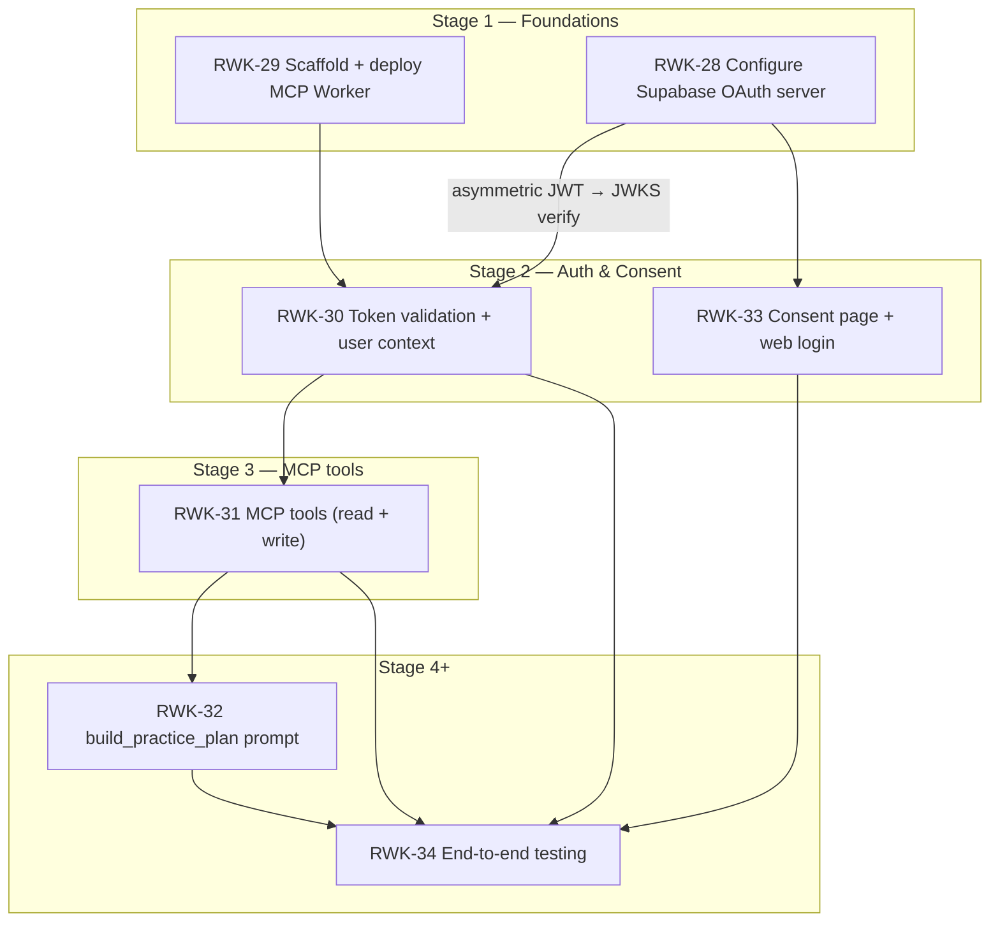

# Stage 3 — MCP Tools — Requirements

> **Epic:** [RWK-4 — AI Session Creation](https://loganmartlew.atlassian.net/browse/RWK-4)
> **Stage 3 ticket:** [RWK-31 — MCP tools (read + write)](https://loganmartlew.atlassian.net/browse/RWK-31)
> **Source documents:** `design-docs/RWK4-ai-integration/roadmap.md` · `design-docs/RWK4-ai-integration/stage3/requirements-questions.md` · Stage 2 deliverables (RWK-30 auth middleware, RWK-33 consent page)
> **Status:** Requirements defined, ready for implementation planning

---

## 1. Overview

Stage 3 adds the five MCP tools that give an LLM access to a user's Rangework practice data. All five tools run through the Stage 2 auth middleware and operate under RLS — every database query is made with the user's scoped Supabase client, never the service role.

Three **read tools** let the LLM understand the user's bag and existing practice library before generating content:

- `get_user_clubs` — the user's enabled club bag (codes + display names)
- `list_units` — all practice units with full instructions
- `list_sessions` — all practice sessions with item lineup

Two **write tools** let the LLM materialise a generated plan into real Rangework data:

- `create_unit` — creates a practice unit via the existing `save_practice_unit` RPC
- `create_session` — creates a practice session via the existing `save_practice_session` RPC

Tool descriptions are **first-class deliverables** (roadmap §3, X1): each tool's description and parameter descriptions must be written and validated with a test conversation in MCP Inspector before being finalised.

### Resolved decisions (from `requirements-questions.md`)

| #   | Question                                         | Decision                                                                                                               |
| --- | ------------------------------------------------ | ---------------------------------------------------------------------------------------------------------------------- |
| G1  | `get_user_clubs` output schema                   | `{ code, display_name, category }` — no `sort_order`.                                                                 |
| G2  | Category value format                            | Raw enum string (`"IRON"`, `"WOOD"`, `"WEDGE"`, etc.).                                                                |
| G3  | `get_user_clubs` result ordering                 | `clubs.sort_order ASC`. Natural bag progression (driver → putter).                                                     |
| G4  | Empty bag behaviour                              | Return `[]`. LLM instructs the user to enable clubs in the app.                                                        |
| G5  | Expose `default_enabled` field?                  | No. Catalog metadata; not user state.                                                                                  |
| U1  | `list_units`: summary only vs full instructions  | **B** — include the full `instructions` array. LLM can reason about and adapt existing drills.                         |
| U2  | `list_units` fields beyond the minimum           | **B** — add `notes`, `focus`, `default_club_reference` for coaching context.                                           |
| U3  | Instruction count definition                     | `COUNT(*)` of `practice_unit_instructions` rows, including those with null `ball_count`.                               |
| U4  | Ball count null handling                         | **A** — `total_ball_count: number \| null` (null if any instruction has no `ball_count`) + `has_uncounted_instructions: boolean`. |
| U5  | `list_units` result cap                          | **A** — no cap; return all units.                                                                                      |
| U6  | `list_units` ordering                            | `updated_at DESC`. Matches `SupabasePracticeUnitRepository.listPracticeUnits()`.                                        |
| U7  | `list_units` empty state                         | Return `[]`. LLM offers to create units via `create_unit`.                                                             |
| S1  | `list_sessions` item schema                      | **B** — include `club_reference`, `notes`, `focus_cue` alongside `unit_id`, `unit_title`, `repeat_count`, `sort_order`. |
| S2  | `list_sessions` ball count null handling         | **B** — sum known counts; include `has_uncounted_items: boolean` flag.                                                 |
| S3  | `list_sessions` unit title join strategy         | Two selects (sessions, then referenced units by id) joined in-memory in the Worker.                                    |
| S4  | Session-level fields                             | **B** — add `notes` alongside `id`, `name`, `items`, `total_ball_count`.                                               |
| S5  | `list_sessions` cap, ordering, empty state       | No cap. `updated_at DESC`. Empty → `[]`.                                                                               |
| CU1 | `create_unit` required vs optional fields        | **A** — required: `title`, `instructions` (≥ 1). Optional: `notes`, `focus`, `default_club_reference`.                |
| CU2 | Instruction element schema                       | `{ order: number (>0, unique), text: string (non-empty), ball_count?: number (>0 or omit) }`.                          |
| CU3 | UUID generation                                  | `crypto.randomUUID()` (Web Crypto API, available in Cloudflare Workers).                                               |
| CU4 | `create_unit` return value                       | **A** — `{ unit_id: string }` only.                                                                                    |
| CU5 | `create_unit` club code validation scope         | **A** — full `clubs` catalog (matches FK constraint behaviour).                                                        |
| CU6 | Club field on instructions                       | None. `club_reference` was dropped from `practice_unit_instructions`. Tool schema must not accept per-instruction club. |
| CU7 | Empty instructions array                         | **B** — reject with validation error. At least 1 instruction required.                                                 |
| CU8 | Max instructions per unit                        | Hard cap at **10**. Return a validation error above this.                                                              |
| CU9 | RPC error mapping                                | **C** — map common DB errors to clean messages with structured `data` (e.g. `{ valid_codes: [...] }`).                 |
| CU10| Idempotency on retry                             | Accept duplicates in v1. Worker generates a new UUID per call; document this in the MCP README.                        |
| CS1 | `create_session` required vs optional fields     | Required: `name`, `items` (≥ 1). Optional: `notes`.                                                                   |
| CS2 | `create_session` item element schema             | `{ practice_unit_id: string (UUID), order: number (>0, unique), repeat_count: number (>0), club_reference?: string, notes?: string, focus_cue?: string }`. |
| CS3 | Unit ownership pre-check in `create_session`     | **B** — pre-fetch the user's unit ids and validate before calling the RPC. Returns "unit \<id\> not found or not yours". |
| CS4 | Item-level club code validation scope            | **A** — full catalog (consistent with CU5).                                                                            |
| CS5 | Empty items array                                | **B** — reject; at least 1 item required (consistent with CU7).                                                        |
| CS6 | `create_session` return value                    | `{ session_id: string }` only. Consistent with CU4 and flag F3.                                                        |
| CS7 | `create_session` error mapping                   | Same approach as CU9. Structured `data` where helpful (e.g. `{ invalid_unit_ids: [...] }`, `{ valid_codes: [...] }`).  |
| X1  | Tool descriptions                                | **B** — Logan writes first drafts; validated with a test conversation in MCP Inspector per tool.                        |
| X2  | Error response shape                             | **B** — structured: `{ code: string, message: string, data?: { field?: string, valid_codes?: string[] } }`.            |
| X3  | `user_preferences` exposure                      | Not in Stage 3. Stage 4 prompt will ask the user for distance unit (yards/meters) at conversation start.               |
| X4  | Result size / truncation                         | No cap on `list_units`, `list_sessions`, or `get_user_clubs`.                                                           |
| X5  | Write tool idempotency                           | Accept duplicates on retry in v1. Document in MCP README.                                                               |
| X6  | Testing strategy                                 | **B** — Vitest unit tests for validation logic + error mapping; MCP Inspector manual gate per tool.                     |
| X7  | `get_unit` / `get_session` detail tool gap       | Resolved by U1. Full instructions in `list_units` eliminates the need for a separate `get_unit` tool in v1.            |
| X8  | JSON key naming                                  | snake_case throughout all input and output. Matches PostgREST wire format.                                              |
| X9  | `order` vs `sort_order` key                      | Use `order` in tool input/output. Matches the RPC's JSONB key.                                                         |
| X10 | Timestamp fields                                 | Omit `created_at` and `updated_at` from all tool output.                                                               |
| X11 | Record Stage 3 contracts                         | Final tool schemas recorded in `design-docs/RWK4-ai-integration/stage3/contracts.md` once implementation is done.      |

---

## 2. Dependency graph



**Critical dependency:** Stage 3 depends entirely on RWK-30's auth middleware. Every tool call routes through the middleware and receives a `UserContext` (with `userId` and a scoped Supabase client). RWK-33 is parallel to Stage 3 and only needs to finish before Stage 5.

---

## 3. File structure

```
apps/mcp/
├── src/
│   ├── index.ts                          # Unchanged (tool registration wired via server.ts)
│   ├── server.ts                         # Modified: register the five new tools
│   ├── auth/                             # Unchanged (Stage 2 deliverable)
│   ├── context/
│   │   └── user-context.ts               # Unchanged (Stage 2 deliverable)
│   ├── tools/
│   │   ├── ping.ts                       # Unchanged
│   │   ├── get-user-clubs.ts             # NEW
│   │   ├── list-units.ts                 # NEW
│   │   ├── list-sessions.ts              # NEW
│   │   ├── create-unit.ts                # NEW
│   │   └── create-session.ts             # NEW
│   ├── validation/
│   │   ├── club-codes.ts                 # NEW: catalog lookup + validation helpers shared across tools
│   │   └── tool-errors.ts               # NEW: structured error factory (X2)
│   └── tests/
│       ├── ping.test.ts                  # Unchanged
│       ├── authenticate.test.ts          # Unchanged (Stage 2)
│       ├── jwks-cache.test.ts            # Unchanged (Stage 2)
│       ├── get-user-clubs.test.ts        # NEW: unit tests for output shape and empty state
│       ├── list-units.test.ts            # NEW: unit tests for ball count null handling
│       ├── list-sessions.test.ts         # NEW: unit tests for ball count null handling
│       ├── create-unit.test.ts           # NEW: validation, club code checks, error mapping
│       └── create-session.test.ts        # NEW: validation, unit ownership pre-check, error mapping
└── README.md                             # Updated: document all five tools and tool description policy
```

---

## 4. Tool: `get_user_clubs`

### 4.1 Purpose

Returns the clubs currently enabled in the user's bag. The LLM calls this at the start of a planning conversation so it can refer to clubs by their catalog codes in subsequent `create_unit` and `create_session` calls, and so it can make appropriate suggestions (e.g. not suggesting the driver for short-game practice).

### 4.2 Input schema

No input parameters.

### 4.3 Output schema

```ts
{
  clubs: Array<{
    code: string          // catalog primary key, e.g. "seven_iron"
    display_name: string  // human-readable, e.g. "7 Iron"
    category: string      // raw enum: "IRON" | "WOOD" | "WEDGE" | "PUTTER" | "HYBRID" | etc.
  }>
}
```

### 4.4 Data source

```sql
SELECT c.code, c.display_name, c.category
FROM user_enabled_clubs uec
JOIN clubs c ON c.code = uec.club_code
WHERE uec.user_id = auth.uid()
ORDER BY c.sort_order ASC;
```

RLS enforces `user_id = auth.uid()`. The query runs through the user-scoped Supabase client.

### 4.5 Behaviour

| Condition          | Behaviour                                                         |
| ------------------ | ----------------------------------------------------------------- |
| Clubs in bag       | Return the clubs array ordered by `clubs.sort_order ASC`.         |
| Empty bag          | Return `{ clubs: [] }`. Not an error. LLM tells the user to enable clubs via the Manage Clubs screen in the app. |
| Auth failure       | Handled upstream by auth middleware — never reaches the tool.     |

### 4.6 Tool description (first draft — validate with MCP Inspector)

**Tool description:**
> Returns the clubs currently enabled in the user's bag. Call this at the start of a planning session to learn which clubs are available. Use the `code` field (not `display_name`) in all subsequent tool calls that accept a club reference.

**Parameter descriptions:** No parameters.

---

## 5. Tool: `list_units`

### 5.1 Purpose

Returns all of the user's practice units, including full instruction text. The LLM calls this to understand what drills already exist before creating new ones, enabling it to reuse, adapt, or reference existing units when building a session.

### 5.2 Input schema

No input parameters.

### 5.3 Output schema

```ts
{
  units: Array<{
    id: string                          // UUID
    title: string
    notes: string | null
    focus: string | null
    default_club_reference: string | null   // catalog code
    instruction_count: number               // COUNT(*) including uncounted instructions
    total_ball_count: number | null         // null if any instruction has no ball_count
    has_uncounted_instructions: boolean
    instructions: Array<{
      order: number                         // 1-based, unique within unit
      text: string
      ball_count: number | null
    }>
  }>
}
```

### 5.4 Data source

Two queries joined in-memory:

1. Fetch all `practice_units` for the user (`owner_id = auth.uid()`), ordered `updated_at DESC`.
2. Fetch all `practice_unit_instructions` for those unit ids, ordered by `(practice_unit_id, sort_order)`.

Join instructions onto units in the Worker. Compute `instruction_count`, `total_ball_count`, and `has_uncounted_instructions` from the joined data.

**Ball count computation:**
- `instruction_count` = number of instructions (including those with null `ball_count`)
- `has_uncounted_instructions` = `instructions.some(i => i.ball_count == null)`
- `total_ball_count` = `has_uncounted_instructions ? null : instructions.reduce((sum, i) => sum + i.ball_count, 0)`

### 5.5 Behaviour

| Condition      | Behaviour                                                                           |
| -------------- | ----------------------------------------------------------------------------------- |
| Units exist    | Return all units, ordered `updated_at DESC`. No cap.                                |
| No units       | Return `{ units: [] }`. Not an error.                                               |
| Partial counts | `total_ball_count` is null; `has_uncounted_instructions` is `true`. LLM should hedge ("approximately X balls"). |

### 5.6 Tool description (first draft — validate with MCP Inspector)

**Tool description:**
> Returns all of the user's practice units, including full instruction text, ball counts, club assignment, and coaching notes. Call this before creating new units to avoid duplication and to find units that can be reused in a new session. If `has_uncounted_instructions` is true, some instructions have no ball count — treat `total_ball_count` as a partial estimate.

**Parameter descriptions:** No parameters.

---

## 6. Tool: `list_sessions`

### 6.1 Purpose

Returns all of the user's practice sessions with their item lineups. The LLM calls this to understand what sessions already exist — their structure, ball budgets, and coaching context — before creating new ones.

### 6.2 Input schema

No input parameters.

### 6.3 Output schema

```ts
{
  sessions: Array<{
    id: string                      // UUID
    name: string
    notes: string | null
    total_ball_count: number        // Σ (repeat_count × unit total_ball_count) — see §6.4
    has_uncounted_items: boolean
    items: Array<{
      order: number                 // 1-based, unique within session
      unit_id: string               // UUID
      unit_title: string            // joined from practice_units
      repeat_count: number          // NOT NULL, > 0
      club_reference: string | null // catalog code override for this item
      notes: string | null
      focus_cue: string | null
    }>
  }>
}
```

### 6.4 Data source

Three fetches joined in-memory:

1. Fetch all `practice_sessions` for the user (`owner_id = auth.uid()`), ordered `updated_at DESC`.
2. Fetch all `practice_session_items` for those session ids.
3. Fetch `practice_units` matching the unit ids referenced in the items (to get `title` and instruction ball counts for the total).

Compute session totals in the Worker:

- `has_uncounted_items` = any referenced unit has `has_uncounted_instructions = true`
- `total_ball_count` = `has_uncounted_items ? null : items.reduce((sum, item) => sum + item.repeat_count × unit.total_ball_count, 0)`

**Note:** `total_ball_count` on the session is `null` if any referenced unit has uncounted instructions, since the per-unit total is itself `null` in that case.

### 6.5 Behaviour

| Condition       | Behaviour                                                                              |
| --------------- | -------------------------------------------------------------------------------------- |
| Sessions exist  | Return all sessions, ordered `updated_at DESC`. No cap.                                |
| No sessions     | Return `{ sessions: [] }`. Not an error.                                               |
| Uncounted units | `has_uncounted_items: true`, `total_ball_count: null`. LLM hedges on the ball budget.  |

### 6.6 Tool description (first draft — validate with MCP Inspector)

**Tool description:**
> Returns all of the user's practice sessions, including their item lineup, club overrides, repeat counts, and coaching notes. Call this to understand how the user's existing sessions are structured before creating a new one. If `has_uncounted_items` is true, one or more units in the session have no ball count on some instructions — treat the total as a partial estimate.

**Parameter descriptions:** No parameters.

---

## 7. Tool: `create_unit`

### 7.1 Purpose

Creates a new practice unit in the user's account by calling the existing `save_practice_unit` RPC. Returns the new unit's id so the LLM can reference it immediately in `create_session`.

### 7.2 Input schema

```ts
{
  title: string                          // Required. Non-empty.
  instructions: Array<{                  // Required. 1–10 items.
    order: number                        // Required. > 0, unique within the array.
    text: string                         // Required. Non-empty.
    ball_count?: number                  // Optional. > 0 if provided.
  }>
  notes?: string                         // Optional.
  focus?: string                         // Optional. Coaching intent or swing thought.
  default_club_reference?: string        // Optional. Must exist in the clubs catalog.
}
```

### 7.3 Output schema

```ts
{ unit_id: string }   // UUID of the newly created unit
```

### 7.4 Data path

1. Validate all inputs (see §7.5).
2. Generate `unit_id` with `crypto.randomUUID()`.
3. Call `save_practice_unit(unit_id, title, notes, focus, default_club_reference, instructions_jsonb)`.
   - `instructions_jsonb` = `[{ order, text, ball_count }]` (omit `ball_count` key if not provided).
4. Return `{ unit_id }`.

The RPC is `SECURITY INVOKER` and enforces `owner_id = auth.uid()` automatically.

### 7.5 Validation rules

| Field                        | Rule                                                                                                                    |
| ---------------------------- | ----------------------------------------------------------------------------------------------------------------------- |
| `title`                      | Non-empty string after trimming.                                                                                        |
| `instructions`               | Array of 1–10 items. Reject empty array or > 10 items.                                                                  |
| `instructions[].order`       | Positive integer. All values unique within the array. Sequential (1, 2, 3, …) recommended but not enforced.            |
| `instructions[].text`        | Non-empty string after trimming.                                                                                        |
| `instructions[].ball_count`  | If provided: positive integer (> 0).                                                                                    |
| `default_club_reference`     | If provided: must exist in the full `clubs` catalog (FK semantics). Validate with a catalog lookup before calling RPC.  |

**Validation error behaviour:** Return a structured error immediately without calling the RPC. Include the invalid field name and, for club codes, the list of valid codes from `get_user_clubs` (the user's enabled bag) as a convenience hint.

### 7.6 Error mapping

| Condition                         | `code`                    | `message`                                             | `data`                                   |
| --------------------------------- | ------------------------- | ----------------------------------------------------- | ---------------------------------------- |
| `title` empty                     | `VALIDATION_ERROR`        | "title must not be empty"                             | `{ field: "title" }`                     |
| `instructions` empty              | `VALIDATION_ERROR`        | "at least one instruction is required"                | `{ field: "instructions" }`              |
| `instructions` > 10               | `VALIDATION_ERROR`        | "a unit may have at most 10 instructions"             | `{ field: "instructions" }`              |
| Duplicate `order` values          | `VALIDATION_ERROR`        | "instruction order values must be unique"             | `{ field: "instructions" }`              |
| `ball_count` ≤ 0                  | `VALIDATION_ERROR`        | "ball_count must be a positive integer"               | `{ field: "instructions[n].ball_count" }`|
| Unknown `default_club_reference`  | `UNKNOWN_CLUB_CODE`       | "Unknown club code: \<code\>"                         | `{ field: "default_club_reference", valid_codes: [...] }` |
| RPC FK violation (club code)      | `UNKNOWN_CLUB_CODE`       | "Unknown club code: \<code\>"                         | `{ field: "default_club_reference", valid_codes: [...] }` |
| Other RPC error                   | `DATABASE_ERROR`          | "Failed to create unit. Please try again."            | —                                        |

### 7.7 Tool description (first draft — validate with MCP Inspector)

**Tool description:**
> Creates a new practice unit (a single drill) in the user's account. A unit has a title, one to ten step-by-step instructions (each with optional ball count), optional coaching focus, and an optional default club. Returns the new unit's id — save this to use in `create_session`. Club references must use the `code` field from `get_user_clubs`, not the display name.

**Parameter descriptions:**
- `title`: Short name for the drill (e.g. "Gate drill", "Draw shot tracer").
- `instructions`: Ordered list of steps. Each step needs `order` (starting at 1), `text`, and an optional `ball_count`.
- `focus`: Optional single-sentence coaching cue or swing thought (e.g. "Keep the club face square through impact").
- `notes`: Optional context or reminders for the user (e.g. "Use an alignment stick").
- `default_club_reference`: Optional default club for this drill. Use the `code` from `get_user_clubs`.

---

## 8. Tool: `create_session`

### 8.1 Purpose

Creates a new practice session in the user's account by calling the existing `save_practice_session` RPC. Sessions are an ordered list of practice units with per-item coaching context. Returns the new session's id.

### 8.2 Input schema

```ts
{
  name: string                           // Required. Non-empty.
  items: Array<{                         // Required. 1+ items.
    practice_unit_id: string             // Required. UUID of a unit owned by this user.
    order: number                        // Required. > 0, unique within the array.
    repeat_count: number                 // Required. > 0.
    club_reference?: string              // Optional. Must exist in the clubs catalog.
    notes?: string                       // Optional. Per-item reminder.
    focus_cue?: string                   // Optional. Per-item coaching cue.
  }>
  notes?: string                         // Optional. Session-level notes.
}
```

### 8.3 Output schema

```ts
{ session_id: string }   // UUID of the newly created session
```

### 8.4 Data path

1. Validate all inputs (see §8.5).
2. Pre-fetch the user's unit ids (`SELECT id FROM practice_units WHERE owner_id = auth.uid()`).
3. Validate every `practice_unit_id` in `items` against the fetched set.
4. Validate all `club_reference` values against the full catalog.
5. Generate `session_id` with `crypto.randomUUID()`.
6. Call `save_practice_session(session_id, name, notes, items_jsonb)`.
   - `items_jsonb` = `[{ practice_unit_id, order, repeat_count, club_reference, notes, focus_cue }]` (omit optional keys if not provided).
7. Return `{ session_id }`.

### 8.5 Validation rules

| Field                       | Rule                                                                                                                  |
| --------------------------- | --------------------------------------------------------------------------------------------------------------------- |
| `name`                      | Non-empty string after trimming.                                                                                      |
| `items`                     | Array of ≥ 1 item. Reject empty array.                                                                                |
| `items[].practice_unit_id`  | Must be a UUID owned by the authenticated user. Pre-fetched validation before calling RPC (see §8.4 step 2–3).        |
| `items[].order`             | Positive integer. All values unique within the array.                                                                 |
| `items[].repeat_count`      | Positive integer (> 0).                                                                                               |
| `items[].club_reference`    | If provided: must exist in the full `clubs` catalog.                                                                  |

### 8.6 Error mapping

| Condition                         | `code`                    | `message`                                                              | `data`                                           |
| --------------------------------- | ------------------------- | ---------------------------------------------------------------------- | ------------------------------------------------ |
| `name` empty                      | `VALIDATION_ERROR`        | "name must not be empty"                                               | `{ field: "name" }`                              |
| `items` empty                     | `VALIDATION_ERROR`        | "at least one item is required"                                        | `{ field: "items" }`                             |
| Duplicate `order` values          | `VALIDATION_ERROR`        | "item order values must be unique"                                     | `{ field: "items" }`                             |
| `repeat_count` ≤ 0                | `VALIDATION_ERROR`        | "repeat_count must be a positive integer"                              | `{ field: "items[n].repeat_count" }`             |
| Unknown `practice_unit_id`        | `UNIT_NOT_FOUND`          | "unit \<id\> not found or does not belong to you"                      | `{ invalid_unit_ids: [...] }`                    |
| Unknown `club_reference`          | `UNKNOWN_CLUB_CODE`       | "Unknown club code: \<code\>"                                          | `{ field: "items[n].club_reference", valid_codes: [...] }` |
| RPC RLS violation                 | `UNIT_NOT_FOUND`          | "one or more units could not be accessed"                              | `{ invalid_unit_ids: [...] }`                    |
| Other RPC error                   | `DATABASE_ERROR`          | "Failed to create session. Please try again."                          | —                                                |

### 8.7 Tool description (first draft — validate with MCP Inspector)

**Tool description:**
> Creates a new practice session in the user's account. A session is an ordered list of practice units with optional per-item club overrides, coaching cues, and repeat counts. Call `list_units` or `create_unit` first to get unit ids. Returns the new session's id. Each item's `practice_unit_id` must be a unit that belongs to this user.

**Parameter descriptions:**
- `name`: Short name for the session (e.g. "Pre-round warm-up", "Wedge Wednesday").
- `items`: Ordered list of practice units. Each item needs `practice_unit_id`, `order` (starting at 1), `repeat_count`, and optionally a `club_reference`, `notes`, and `focus_cue`.
- `notes`: Optional session-level notes (e.g. "Tournament prep — focus on short game").
- `items[].practice_unit_id`: The `id` of a practice unit returned by `list_units` or `create_unit`.
- `items[].repeat_count`: How many times to run this unit in the session (e.g. 2 = two rounds of this drill).
- `items[].club_reference`: Optional club override for this item. Overrides the unit's default club. Use a `code` from `get_user_clubs`.
- `items[].focus_cue`: Optional per-item coaching cue (e.g. "Hinge earlier").
- `items[].notes`: Optional per-item reminder (e.g. "Use the 50y stake").

---

## 9. Cross-cutting requirements

### 9.1 Error response shape

All tool errors use the MCP `isError: true` flag on the content block and include a structured JSON body:

```ts
{
  code: string      // e.g. "VALIDATION_ERROR", "UNKNOWN_CLUB_CODE", "UNIT_NOT_FOUND", "DATABASE_ERROR"
  message: string   // human-readable, LLM-facing
  data?: {          // optional structured context for LLM to self-correct
    field?: string
    valid_codes?: string[]
    invalid_unit_ids?: string[]
  }
}
```

The MCP SDK's `CallToolResult` with `isError: true` and `content: [{ type: "text", text: JSON.stringify(error) }]` is the canonical format. Do not throw uncaught exceptions from tool handlers.

### 9.2 JSON key naming

snake_case throughout all tool input schemas and output objects. Matches the PostgREST wire format and existing Supabase-backed repositories in `shared/`.

### 9.3 `order` vs `sort_order`

Use `order` in all tool input/output. The `save_practice_unit` and `save_practice_session` RPCs accept `order` as the JSONB key. Do not expose a separate `sort_order` field.

### 9.4 No timestamps in output

Omit `created_at` and `updated_at` from all tool responses. The LLM does not need timestamps for practice planning.

### 9.5 No `user_preferences` exposure

`user_preferences` (yards vs meters) is not exposed in Stage 3. The Stage 4 prompt (`build_practice_plan`) will ask the user for their distance unit preference at the start of the conversation.

### 9.6 No service role

All database access must go through the user-scoped Supabase client from `UserContext.getClient()`. Never import or use the service role key in tool handlers.

### 9.7 Club code validation shared helper

Club code lookups are shared across `create_unit` and `create_session`. Extract a `validateClubCode(code: string, supabaseClient: SupabaseClient): Promise<void>` helper in `apps/mcp/src/validation/club-codes.ts`. This helper fetches the catalog once per tool call (not once per Worker instance — the catalog is static but a cached fetch is a Stage 4+ optimisation).

### 9.8 Tool description validation policy

Before finalising each tool's description and parameter annotations, run at least one test conversation in MCP Inspector in which the LLM must:

1. Call the tool with correct arguments from a natural-language prompt.
2. Handle an invalid argument and retry using the error message.

Adjust descriptions until both cases pass.

### 9.9 Idempotency

Write tools generate a fresh UUID per call. Retries create separate records. This is documented behaviour — not a bug. Document it in `apps/mcp/README.md`.

---

## 10. Testing

### 10.1 Automated (Vitest)

| Test file                      | Coverage                                                                                                     |
| ------------------------------ | ------------------------------------------------------------------------------------------------------------ |
| `get-user-clubs.test.ts`       | Output shape; `sort_order ASC`; empty bag returns `[]`.                                                      |
| `list-units.test.ts`           | Ball count null handling (U4): all counted, some null, all null. Instructions joined correctly.              |
| `list-sessions.test.ts`        | Ball count null handling (S2): all counted, some null. Unit title join. Empty sessions array.                |
| `create-unit.test.ts`          | Required field validation; max 10 instructions; duplicate `order`; unknown club code; structured error shape.|
| `create-session.test.ts`       | Required field validation; unit ownership pre-check; unknown club code; structured error shape.              |
| `club-codes.test.ts`           | `validateClubCode` returns cleanly for a valid code; rejects with structured error for unknown code.         |
| `tool-errors.test.ts`          | Error factory produces correct `{ code, message, data }` shape for each error code.                         |

All tests run with mocked Supabase clients — no live Supabase connection required for unit tests.

### 10.2 Manual (MCP Inspector)

The stage is done when all five tools pass a manual gate in MCP Inspector using a real Rangework account:

| Gate                                        | Pass condition                                                                      |
| ------------------------------------------- | ----------------------------------------------------------------------------------- |
| `get_user_clubs` with clubs enabled         | Returns the user's bag ordered by `sort_order`, codes + display names.              |
| `get_user_clubs` with empty bag             | Returns `{ clubs: [] }`.                                                            |
| `list_units` with existing units            | Returns full unit list with instructions, ball counts, and null-handling flags.     |
| `list_units` with no units                  | Returns `{ units: [] }`.                                                            |
| `list_sessions` with existing sessions      | Returns sessions with item lineups, unit titles, ball count totals.                 |
| `list_sessions` with no sessions            | Returns `{ sessions: [] }`.                                                         |
| `create_unit` valid input                   | Unit appears in the Android app; returned `unit_id` is a valid UUID.               |
| `create_unit` with unknown club code        | Returns `UNKNOWN_CLUB_CODE` error with `valid_codes` hint.                          |
| `create_unit` with > 10 instructions        | Returns `VALIDATION_ERROR`.                                                         |
| `create_session` referencing created unit   | Session appears in the Android app; returned `session_id` is a valid UUID.         |
| `create_session` referencing another user's unit | Returns `UNIT_NOT_FOUND` error.                                               |
| `create_session` with unknown club code     | Returns `UNKNOWN_CLUB_CODE` error with `valid_codes` hint.                          |
| All tools — no auth token                   | Returns `401` (handled by auth middleware, not tool layer).                         |

---

## 11. Deliverables

1. Five tool handlers in `apps/mcp/src/tools/`: `get-user-clubs.ts`, `list-units.ts`, `list-sessions.ts`, `create-unit.ts`, `create-session.ts`.
2. Shared validation helpers in `apps/mcp/src/validation/`: `club-codes.ts`, `tool-errors.ts`.
3. Updated `apps/mcp/src/server.ts` to register all five tools.
4. Seven Vitest test files (one per tool + helpers).
5. Finalised tool descriptions validated with MCP Inspector.
6. `apps/mcp/README.md` updated to document all five tools, their input/output shapes, and retry/idempotency behaviour.
7. `design-docs/RWK4-ai-integration/stage3/contracts.md` recording the final tool schemas (created during or immediately after implementation).

---

## 12. Scope boundary

| Item                                   | In Stage 3     | Deferred                        |
| -------------------------------------- | -------------- | ------------------------------- |
| Read tools (clubs, units, sessions)    | ✓              | —                               |
| Write tools (create unit, session)     | ✓              | —                               |
| Edit/delete tools                      | No             | Out of scope for v1             |
| `get_unit` detail tool                 | No             | Resolved by U1 (full instructions in `list_units`) |
| `get_session` detail tool              | No             | Resolved by U1 analogue         |
| `user_preferences` read tool           | No             | Stage 4 prompt handles distance unit |
| Club catalog caching in Worker         | No             | Stage 4+ optimisation           |
| `build_practice_plan` prompt           | No             | Stage 4 (RWK-32)                |
| End-to-end client testing              | No             | Stage 5 (RWK-34)                |
| Read/write scope split                 | No             | Deferred to v2                  |

---

## 13. Risks

| Risk                                                                      | Impact                                             | Mitigation                                                                                              |
| ------------------------------------------------------------------------- | -------------------------------------------------- | ------------------------------------------------------------------------------------------------------- |
| `save_practice_unit` / `save_practice_session` RPC signatures differ from roadmap §3 | Tool calls fail or produce wrong data | Read current RPC definitions from `supabase/migrations` before implementing; do not rely solely on the roadmap spec. |
| `on delete restrict` on `practice_session_items.practice_unit_id` means deleting a unit breaks its sessions | No impact in Stage 3 (create-only) | Document this in the MCP README for v2 (edit/delete tools). |
| LLM picks wrong club codes without `get_user_clubs` | `create_unit` returns `UNKNOWN_CLUB_CODE` errors | Tool descriptions instruct the LLM to call `get_user_clubs` first; error includes `valid_codes` hint to self-correct. |
| Large accounts with many units produce large `list_units` payloads | Context window pressure on the MCP client | No cap in v1 (X4/X5). Monitor during Stage 5 testing; add a `get_unit` detail tool in v2 if needed.    |
| `crypto.randomUUID()` availability in Cloudflare Workers dev mode         | UUID generation fails locally                      | Confirmed available in Workers runtime (Web Crypto API). Verify with a test call in local `wrangler dev`. |

---

## 14. Acceptance criteria

### Read tools

- [ ] `get_user_clubs` returns `{ clubs: [...] }` with `code`, `display_name`, `category`; ordered by `sort_order ASC`
- [ ] `get_user_clubs` returns `{ clubs: [] }` when the user has no enabled clubs
- [ ] `list_units` returns all user units with full `instructions` array, `total_ball_count`, `has_uncounted_instructions`
- [ ] `list_units`: `total_ball_count` is `null` and `has_uncounted_instructions` is `true` when any instruction has no `ball_count`
- [ ] `list_units` returns `{ units: [] }` when the user has no units
- [ ] `list_sessions` returns all sessions with item lineups (including `unit_title`, `club_reference`, `notes`, `focus_cue`), `total_ball_count`, `has_uncounted_items`
- [ ] `list_sessions` returns `{ sessions: [] }` when the user has no sessions

### Write tools

- [ ] `create_unit` with valid input returns `{ unit_id }` and the unit appears in the Android app
- [ ] `create_unit` with empty `title` returns `VALIDATION_ERROR` with `field: "title"`
- [ ] `create_unit` with empty `instructions` returns `VALIDATION_ERROR` with `field: "instructions"`
- [ ] `create_unit` with > 10 instructions returns `VALIDATION_ERROR`
- [ ] `create_unit` with an unknown `default_club_reference` returns `UNKNOWN_CLUB_CODE` with `valid_codes`
- [ ] `create_session` with valid input returns `{ session_id }` and the session appears in the Android app
- [ ] `create_session` with empty `name` returns `VALIDATION_ERROR` with `field: "name"`
- [ ] `create_session` with empty `items` returns `VALIDATION_ERROR` with `field: "items"`
- [ ] `create_session` referencing a unit not owned by the user returns `UNIT_NOT_FOUND`
- [ ] `create_session` with an unknown `club_reference` on an item returns `UNKNOWN_CLUB_CODE` with `valid_codes`

### Cross-cutting

- [ ] All tool errors use the `{ code, message, data? }` structured shape
- [ ] No tool uses the service role key
- [ ] `vitest run` passes (all new tool + helper tests)
- [ ] All five tools pass the MCP Inspector manual gate (§10.2) against a real account
- [ ] Created data from `create_unit` and `create_session` is visible in the Android app with correct content
- [ ] Tool descriptions produce correct tool selection and argument population in a test conversation
- [ ] `apps/mcp/README.md` documents all five tools, input/output shapes, and retry behaviour
- [ ] `design-docs/RWK4-ai-integration/stage3/contracts.md` created with final tool schemas
