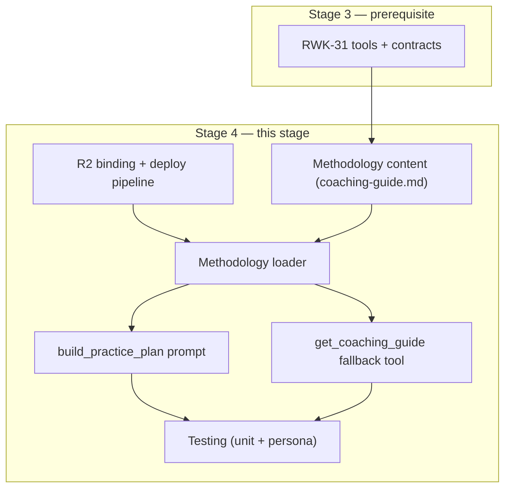

# Stage 4 — Practice Plan Prompt — Implementation Plan

> **Epic:** [RWK-4 — AI Session Creation](https://loganmartlew.atlassian.net/browse/RWK-4)
> **Stage 4 ticket:** [RWK-32 — `build_practice_plan` prompt](https://loganmartlew.atlassian.net/browse/RWK-32)
> **Source documents:** `design-docs/RWK4-ai-integration/roadmap.md` · `design-docs/RWK4-ai-integration/stage4/requirements.md` · `design-docs/RWK4-ai-integration/stage4/requirements-questions.md` (answered) · Stage 3 deliverables (RWK-31 tools + contracts)
> **Status:** Plan ready for implementation

---

## 1. Overview

Stage 4 registers the `build_practice_plan` MCP prompt and ships a `get_coaching_guide` fallback tool. Both deliver the same coaching methodology — a markdown document stored in Cloudflare R2 and fetched at runtime by the Worker.

This is a single-ticket stage (RWK-32). The main deliverables are:

1. **Coaching methodology content** (`coaching-guide.md`) — the gating deliverable.
2. **Methodology loader** — fetches from R2, caches in-memory.
3. **MCP prompt registration** — `build_practice_plan` with one optional `focus` argument.
4. **Fallback tool** — `get_coaching_guide` returns the same text for clients without prompt support.
5. **R2 wiring** — binding, deploy script, local dev seed.

### Key decisions shaping this plan

| Decision | Value | Impact |
|---|---|---|
| Methodology source | R2 bucket `rangework`, key `mcp/coaching-guide.md` | Worker needs R2 binding; deploy script uploads before deploying |
| Content approach (M9) | Principles-only; no named drill archetypes | Methodology is shorter; relies on LLM knowledge for drill specifics |
| Handicap range (M3) | All handicaps — LLM adapts | No handicap-specific branches in the methodology |
| Token budget (P5) | Under 2 000 tokens | Constraints methodology length; guides authoring |
| Confirm before creating (P4) | Required confirmation step | Runbook includes explicit "wait for approval" |
| Fallback strategy (F1) | Always ship `get_coaching_guide` | Both prompt and tool exist unconditionally |

### Plan-level notes on the current codebase

1. **`server.ts`** currently registers tools only. The `McpServer` capabilities include `tools: {}` but not `prompts: {}`. Stage 4 must add prompt capability and register the prompt.
2. **`Env` interface** in `index.ts` has `SUPABASE_URL` and `SUPABASE_ANON_KEY`. Stage 4 adds `METHODOLOGY_BUCKET: R2Bucket`.
3. **`wrangler.jsonc`** has no R2 bindings yet.
4. **No `prompts/` or `methodology/` directories** exist in `apps/mcp/src/`.
5. **The `McpServer` SDK** supports `server.prompt()` for registering prompts (parallel to `server.registerTool()`). The prompt handler returns `GetPromptResult` with `messages: [{ role, content }]`.
6. **R2 in `wrangler dev`**: miniflare emulates R2 locally with file-backed persistence. Objects must be seeded for local testing.

---

## 2. Dependency graph



**Critical path:** Methodology content (MC) is the gating deliverable — prompt and fallback tool are thin wrappers around it. R2 wiring and loader are infrastructure that must be in place before the prompt and tool can function.

---

## 3. File structure

```
apps/mcp/
├── methodology/
│   └── coaching-guide.md                 # NEW: methodology source of truth (committed to git)
├── src/
│   ├── index.ts                          # MODIFIED: add METHODOLOGY_BUCKET to Env, pass to createServer
│   ├── server.ts                         # MODIFIED: add prompts capability, register prompt + fallback tool
│   ├── auth/                             # Unchanged
│   ├── tools/
│   │   ├── ping.ts                       # Unchanged
│   │   ├── get-user-clubs.ts             # Unchanged
│   │   ├── list-units.ts                 # Unchanged
│   │   ├── list-sessions.ts              # Unchanged
│   │   ├── create-unit.ts                # Unchanged
│   │   ├── create-session.ts             # Unchanged
│   │   └── get-coaching-guide.ts         # NEW
│   ├── prompts/
│   │   └── build-practice-plan.ts        # NEW
│   ├── methodology/
│   │   └── loader.ts                     # NEW
│   ├── validation/                       # Unchanged
│   └── tests/
│       ├── ...                           # Existing tests unchanged
│       ├── methodology-loader.test.ts    # NEW
│       ├── build-practice-plan.test.ts   # NEW
│       └── get-coaching-guide.test.ts    # NEW
├── wrangler.jsonc                        # MODIFIED: add R2 binding
├── package.json                          # MODIFIED: update deploy script
└── README.md                             # UPDATED
```

---

## 4. R2 binding and deploy pipeline

### 4.1 Wrangler configuration

Add the R2 binding to `wrangler.jsonc`:

```jsonc
{
  // ... existing config ...
  "r2_buckets": [
    {
      "binding": "METHODOLOGY_BUCKET",
      "bucket_name": "rangework"
    }
  ]
}
```

### 4.2 `Env` interface update

In `src/index.ts`, add the R2 binding:

```ts
export interface Env {
  SUPABASE_URL: string;
  SUPABASE_ANON_KEY: string;
  METHODOLOGY_BUCKET: R2Bucket;
}
```

### 4.3 Deploy script

Update `package.json` `deploy` script to upload the methodology before deploying the Worker:

```json
{
  "scripts": {
    "deploy": "wrangler r2 object put rangework/mcp/coaching-guide.md --file methodology/coaching-guide.md --content-type text/markdown && wrangler deploy",
    "dev:seed": "wrangler r2 object put rangework/mcp/coaching-guide.md --file methodology/coaching-guide.md --content-type text/markdown --local"
  }
}
```

- `deploy` — uploads to production R2, then deploys the Worker.
- `dev:seed` — uploads to miniflare's local R2 emulation for `wrangler dev` testing.

### 4.4 Local development flow

1. `pnpm --filter @rangework/mcp run dev:seed` — seeds the local R2 with the methodology.
2. `pnpm --filter @rangework/mcp run dev` — starts the Worker with local R2 access.
3. Test via MCP Inspector.

---

## 5. Methodology loader (`src/methodology/loader.ts`)

### 5.1 Interface

```ts
const R2_KEY = 'mcp/coaching-guide.md';

let cachedMethodology: string | null = null;

export async function loadMethodology(bucket: R2Bucket): Promise<string | null> {
  if (cachedMethodology !== null) return cachedMethodology;

  const object = await bucket.get(R2_KEY);
  if (!object) return null;

  const text = await object.text();
  if (!text) return null;

  cachedMethodology = text;
  return text;
}
```

### 5.2 Behaviour

| Condition               | Return value | Side effect          |
| ----------------------- | ------------ | -------------------- |
| First call, object exists | Methodology text | Cached in-memory |
| Subsequent calls        | Cached text  | No R2 fetch          |
| Object missing in R2    | `null`       | Not cached           |
| R2 fetch error          | `null` (catch and return) | Not cached |

### 5.3 Cache lifetime

The module-level `cachedMethodology` variable persists for the Worker isolate's lifetime. Workers are short-lived (seconds to minutes), so the cache naturally expires. This is equivalent to "cache until redeploy" for most practical purposes.

**No explicit cache invalidation.** To update the methodology:

1. Push new content to R2 (`wrangler r2 object put ...`).
2. Redeploy the Worker (`wrangler deploy`) to force new isolates.

In practice, isolate turnover on Cloudflare Workers is fast enough that a simple R2 push (without redeploy) will pick up changes within minutes as old isolates are evicted. The deploy script does both anyway.

### 5.4 Thread safety

Workers run a single-threaded V8 isolate. No concurrent mutation of `cachedMethodology` is possible — the module-level variable is safe.

### 5.5 Tests (`src/tests/methodology-loader.test.ts`)

| Test case                     | Assertion                                                              |
|-------------------------------|------------------------------------------------------------------------|
| Object exists in R2           | Returns methodology text string                                        |
| Object missing                | Returns `null`                                                         |
| Second call returns cached    | R2 `get()` called only once; second call returns same string           |
| R2 error                      | Returns `null`; does not throw                                         |

Mock: create a minimal `R2Bucket` fake with a `get()` method returning an `R2ObjectBody` fake or `null`.

Note: because the cache is module-level, each test must reset it. Export a `_resetCache()` function (prefixed with underscore to indicate test-only) or use `vi.resetModules()` between tests.

---

## 6. Prompt: `build_practice_plan` (`src/prompts/build-practice-plan.ts`)

### 6.1 Registration

```ts
export function registerBuildPracticePlanPrompt(
  server: McpServer,
  bucket: R2Bucket,
): void {
  server.prompt(
    'build_practice_plan',
    'Plan a focused, purposeful golf practice session. Guides you through a conversation to understand your game, then creates drills and a session plan in your Rangework account.',
    {
      focus: z.string().optional().describe(
        'Optional primary focus for the session (e.g. "driver distance", "putting")'
      ),
    },
    async ({ focus }): Promise<GetPromptResult> => {
      const methodology = await loadMethodology(bucket);

      if (!methodology) {
        return {
          messages: [{
            role: 'user',
            content: {
              type: 'text',
              text: 'The coaching methodology is temporarily unavailable. Please try again later.',
            },
          }],
        };
      }

      let text = methodology;
      if (focus) {
        text += `\n\nThe user wants to focus on: ${focus}`;
      }

      return {
        messages: [{
          role: 'user',
          content: { type: 'text', text },
        }],
      };
    },
  );
}
```

### 6.2 Server capabilities

Update `createServer` in `server.ts` to declare prompt capability:

```ts
const server = new McpServer(
  { name: 'rangework-mcp', version: '0.0.1' },
  {
    capabilities: {
      tools: {},
      prompts: {},
    },
  },
);
```

### 6.3 `createServer` signature change

`createServer` needs the R2 bucket to pass to the prompt and fallback tool. The bucket comes from the `Env` in the fetch handler.

```ts
export function createServer(userContext: UserContext, bucket: R2Bucket): McpServer {
  // ... existing tool registrations ...
  registerGetCoachingGuideTool(server, bucket);
  registerBuildPracticePlanPrompt(server, bucket);
  return server;
}
```

Update the call site in `index.ts`:

```ts
const server = createServer(userContext, env.METHODOLOGY_BUCKET);
```

### 6.4 Tests (`src/tests/build-practice-plan.test.ts`)

| Test case                          | Assertion                                                              |
|------------------------------------|------------------------------------------------------------------------|
| Prompt listed                      | `prompts/list` includes `build_practice_plan`                          |
| Returns user role message          | Message has `role: 'user'` and `content.type: 'text'`                  |
| Methodology text present           | Message text contains methodology content from the mock R2             |
| `focus` argument appended          | When `focus` = "putting", message text ends with "The user wants to focus on: putting" |
| `focus` argument absent            | Message text does not contain "The user wants to focus on"             |
| R2 failure fallback                | Returns unavailability message when methodology is null                 |

Mock: provide a fake `R2Bucket` returning canned methodology text.

---

## 7. Fallback tool: `get_coaching_guide` (`src/tools/get-coaching-guide.ts`)

### 7.1 Registration

```ts
export function registerGetCoachingGuideTool(
  server: McpServer,
  bucket: R2Bucket,
): void {
  server.registerTool(
    'get_coaching_guide',
    {
      description:
        "Returns the Rangework coaching guide — a methodology for planning golf practice sessions. Call this to learn how to structure a practice plan, then use `get_user_clubs`, `create_unit`, and `create_session` to build one. The guide includes step-by-step instructions for the tool-call sequence.",
      inputSchema: {},
    },
    async (): Promise<CallToolResult> => {
      const methodology = await loadMethodology(bucket);

      if (!methodology) {
        return toolError(
          'CONTENT_UNAVAILABLE',
          'Coaching guide is temporarily unavailable. Please try again.',
        );
      }

      // Extract methodology_version from the preamble
      const versionMatch = methodology.match(/methodology_version:\s*"?([^"\n]+)"?/);
      const version = versionMatch?.[1]?.trim() ?? 'unknown';

      return {
        content: [{
          type: 'text' as const,
          text: JSON.stringify({
            methodology_version: version,
            guide: methodology,
          }),
        }],
      };
    },
  );
}
```

### 7.2 Version extraction

The `methodology_version` is embedded in the methodology text (§4.2.1 of the requirements). The tool extracts it with a simple regex match. If the version string is missing or malformed, fall back to `"unknown"`.

### 7.3 Tests (`src/tests/get-coaching-guide.test.ts`)

| Test case                     | Assertion                                                              |
|-------------------------------|------------------------------------------------------------------------|
| Valid methodology             | Returns `{ methodology_version, guide }` shape                         |
| Version extraction            | `methodology_version` matches the value in the canned methodology      |
| Guide content                 | `guide` field contains the full methodology text                       |
| R2 failure                    | Returns `CONTENT_UNAVAILABLE` error with `isError: true`               |
| Missing version in text       | `methodology_version` is `"unknown"`                                   |

---

## 8. Methodology content (`methodology/coaching-guide.md`)

### 8.1 Authoring approach

This is the gating deliverable. The methodology is authored in the codebase as a markdown file. It must cover all sections defined in the requirements (§4.2.1–§4.2.8) within a 2 000 token budget.

### 8.2 Structure

```markdown
# Rangework Coaching Guide

methodology_version: "1.0.0"
Language: English only.

You are a golf practice coach using the Rangework app. Your job is to plan a
focused, purposeful practice session by gathering information about the player,
designing appropriate drills, and creating them in the user's Rangework account
using the available tools.

## Information to Gather

[§4.2.2 content — what to ask, how to be efficient]

## Ball Allocation

[§4.2.3 heuristic table]

## Session Balance

[§4.2.4 facility-type ratio table]

## Drill Design Principles

[§4.2.5 content — principles for the LLM]

## Tool Sequence

[§4.2.6 numbered runbook]

## Data Format Rules

[§4.2.7 content — tool contract constraints]

## Constraints

[§4.2.8 content — things to avoid]
```

### 8.3 Token budget enforcement

Measure the final document with a tokenizer (e.g. `tiktoken` with `cl100k_base` or the Anthropic tokenizer). If over 2 000 tokens, trim by:

1. Removing redundant phrasing (the LLM doesn't need polite language in system prompts).
2. Compressing tables into terse lists.
3. Prioritising the runbook and data format rules (these are the most failure-prone sections).

### 8.4 Iteration

The methodology will likely require iteration after the first persona test runs. Budget time for 2–3 revision cycles.

---

## 9. `server.ts` modifications

### 9.1 Changes

```ts
import { registerGetCoachingGuideTool } from './tools/get-coaching-guide.js';
import { registerBuildPracticePlanPrompt } from './prompts/build-practice-plan.js';

export function createServer(userContext: UserContext, bucket: R2Bucket): McpServer {
  const server = new McpServer(
    { name: 'rangework-mcp', version: '0.0.1' },
    {
      capabilities: {
        tools: {},
        prompts: {},
      },
    },
  );

  registerPingTool(server);
  registerGetUserClubsTool(server, userContext);
  registerListUnitsTool(server, userContext);
  registerListSessionsTool(server, userContext);
  registerCreateUnitTool(server, userContext);
  registerCreateSessionTool(server, userContext);
  registerGetCoachingGuideTool(server, bucket);
  registerBuildPracticePlanPrompt(server, bucket);

  return server;
}
```

### 9.2 `index.ts` call-site update

```ts
const server = createServer(userContext, env.METHODOLOGY_BUCKET);
```

### 9.3 Test impact

Existing tests that call `createServer(userContext)` must be updated to `createServer(userContext, mockBucket)`. Add a `mockR2Bucket()` test helper alongside the existing `mockUserContext()`:

```ts
function mockR2Bucket(): R2Bucket {
  return {
    get: async () => ({
      text: async () => 'mock methodology content\nmethodology_version: "1.0.0"',
    }),
  } as unknown as R2Bucket;
}
```

Update all existing test files that construct a server to pass the mock bucket.

---

## 10. Implementation order

Steps are listed in dependency order. Within a step, independent files can be worked in parallel.

### Step 1 — R2 wiring

1. Add R2 binding to `wrangler.jsonc`.
2. Add `METHODOLOGY_BUCKET: R2Bucket` to the `Env` interface in `index.ts`.
3. Update `createServer` signature to accept `R2Bucket`.
4. Update the `createServer` call site in `index.ts` to pass `env.METHODOLOGY_BUCKET`.
5. Update `package.json` with `deploy` and `dev:seed` scripts.
6. Update existing test files to pass a mock `R2Bucket` to `createServer`.
7. Verify existing tests still pass.

### Step 2 — Methodology loader

1. Create `src/methodology/loader.ts` with `loadMethodology` and `_resetCache`.
2. Create `src/tests/methodology-loader.test.ts`.
3. Verify tests pass.

### Step 3 — Fallback tool

1. Create `src/tools/get-coaching-guide.ts` with `registerGetCoachingGuideTool`.
2. Register in `server.ts`.
3. Create `src/tests/get-coaching-guide.test.ts`.
4. Verify tests pass.

### Step 4 — Prompt registration

1. Create `src/prompts/build-practice-plan.ts` with `registerBuildPracticePlanPrompt`.
2. Add `prompts: {}` to server capabilities in `server.ts`.
3. Register in `server.ts`.
4. Create `src/tests/build-practice-plan.test.ts`.
5. Verify tests pass.

### Step 5 — Methodology content

1. Author `methodology/coaching-guide.md` covering all required sections.
2. Measure token count — iterate until under 2 000 tokens.
3. Seed local R2: `pnpm --filter @rangework/mcp run dev:seed`.
4. Start local dev: `pnpm --filter @rangework/mcp run dev`.
5. Verify in MCP Inspector: prompt is listed, methodology text is returned.
6. Verify in MCP Inspector: `get_coaching_guide` returns the methodology.

### Step 6 — Persona test runs

1. Run beginner-with-a-slice persona test (manual conversation in Claude.ai or MCP Inspector).
2. Verify created units + session in the Android app.
3. Clean up test data.
4. Run single-digit-wedges persona test.
5. Verify created units + session in the Android app.
6. Clean up test data.
7. Iterate on methodology content if conversations don't meet quality bar.

### Step 7 — Fallback tool validation

1. Run a conversation starting from `get_coaching_guide` (not the prompt) to confirm the fallback path drives writes.
2. Adjust tool description if the LLM doesn't follow the methodology.

### Step 8 — Deploy and final verification

1. Run full test suite: `pnpm --filter @rangework/mcp test`.
2. Run type check: `pnpm --filter @rangework/mcp typecheck`.
3. Run lint: `pnpm --filter @rangework/mcp lint`.
4. Deploy: `pnpm --filter @rangework/mcp run deploy`.
5. Verify against deployed Worker in MCP Inspector.

### Step 9 — Documentation

1. Update `apps/mcp/README.md` — document the prompt, fallback tool, methodology location, R2 setup, deploy pipeline, and local dev workflow.
2. Update `CLAUDE.md` codebase map — add entries for `apps/mcp/src/prompts/`, `apps/mcp/src/methodology/`, `apps/mcp/methodology/`, and `apps/mcp/src/tools/get-coaching-guide.ts`.

---

## 11. Deliverables

1. Coaching methodology: `apps/mcp/methodology/coaching-guide.md`
2. Methodology loader: `apps/mcp/src/methodology/loader.ts`
3. Prompt registration: `apps/mcp/src/prompts/build-practice-plan.ts`
4. Fallback tool: `apps/mcp/src/tools/get-coaching-guide.ts`
5. Updated `apps/mcp/src/server.ts` — register prompt + fallback tool; add `prompts` capability; accept `R2Bucket` parameter.
6. Updated `apps/mcp/src/index.ts` — add `METHODOLOGY_BUCKET` to `Env`; pass bucket to `createServer`.
7. Updated `apps/mcp/wrangler.jsonc` — R2 binding.
8. Updated `apps/mcp/package.json` — `deploy` and `dev:seed` scripts.
9. Three Vitest test files: `methodology-loader.test.ts`, `build-practice-plan.test.ts`, `get-coaching-guide.test.ts`.
10. Updated existing test files to pass mock `R2Bucket`.
11. Persona test run notes (success/failure, iteration log).
12. Updated `apps/mcp/README.md`.
13. Updated `CLAUDE.md` codebase map.

---

## 12. Validation checkpoint

1. `pnpm --filter @rangework/mcp test` passes (all existing + new tests).
2. `pnpm --filter @rangework/mcp typecheck` passes.
3. `pnpm --filter @rangework/mcp lint` passes.
4. `wrangler deploy` succeeds (via the updated `deploy` script that uploads to R2 first).
5. `build_practice_plan` prompt is listed and returns methodology in MCP Inspector against the deployed Worker.
6. `get_coaching_guide` tool returns `{ methodology_version, guide }` in MCP Inspector against the deployed Worker.
7. Beginner persona test run: conversation → units + session created → visible in Android app.
8. Single-digit persona test run: conversation → units + session created → visible in Android app → plan is contextually different.
9. Fallback tool drives a complete conversation ending in writes (at least one test).
10. `apps/mcp/README.md` updated.
11. `CLAUDE.md` codebase map updated.

---

## 13. Risks

| Risk | Impact | Mitigation |
|---|---|---|
| Methodology exceeds 2 000 token budget | Context window competition | Measure with tokenizer during authoring; compress tables to terse lists; prioritise runbook. |
| LLM doesn't follow runbook (creates before confirming) | Junk data in user's account | Explicit "DO NOT create until the user confirms" in the methodology. Test with both personas; iterate wording. |
| R2 fetch latency on cold Worker start | Slow first prompt/tool call | In-memory caching. R2 colocated with Worker. Latency is a one-time cost per isolate (~50ms for R2 GET). |
| `server.prompt()` API differs from expected signature | Prompt registration fails | Verify against `@modelcontextprotocol/sdk` docs and types before implementing. The SDK version is `^1.17.3`. |
| Existing tests break after `createServer` signature change | CI failure | Step 1 updates all existing tests to pass the mock bucket. Run tests before moving to step 2. |
| Methodology quality is subjective | Subpar plans shipped | Logan validates with real conversations (M2). Budget 2–3 revision cycles. Quality improves post-ship with real usage. |
| `wrangler r2 object put` with `--local` flag may behave differently across wrangler versions | Local dev seed fails | Pin wrangler to `^4.24.0` (already in devDependencies). Test the `dev:seed` script before relying on it. |
| MCP SDK prompt handler doesn't receive arguments as expected | `focus` argument ignored | Write a test that verifies the argument is passed to the handler. Check SDK source/types for the exact handler signature. |

---

## 14. Scope boundary

| Item | In Stage 4 | Deferred |
|---|---|---|
| `build_practice_plan` prompt | Yes | — |
| `get_coaching_guide` fallback tool | Yes | — |
| Coaching methodology content | Yes | — |
| R2 storage + loader | Yes | — |
| Deploy pipeline (R2 upload + Worker) | Yes | — |
| Named drill archetypes / drill database | No | Principles-only by design (M9) |
| Rest/recovery guidance | No | Omitted by design (M8) |
| `user_preferences` read tool | No | Prompt asks conversationally (M10) |
| Multiple prompts | No | Future stages |
| Prompt analytics | No | Future stages |
| Edit/delete tools | No | Out of scope for v1 |
| End-to-end client testing | No | Stage 5 (RWK-34) |
| Club catalog caching | No | Stage 4+ optimisation (deferred from Stage 3) |

---

## 15. Acceptance criteria

### Prompt and fallback tool

- [ ] `build_practice_plan` prompt is listed in MCP `prompts/list`
- [ ] Prompt returns a single `user` role message containing the methodology
- [ ] `focus` argument is appended to the message when provided
- [ ] `focus` argument is omitted from the message when not provided
- [ ] `get_coaching_guide` tool is listed in MCP `tools/list`
- [ ] `get_coaching_guide` returns `{ methodology_version, guide }` with the same text as the prompt
- [ ] `get_coaching_guide` returns `CONTENT_UNAVAILABLE` error on R2 failure

### Methodology content

- [ ] Methodology is under 2 000 tokens
- [ ] Methodology includes all required sections (requirements §4.2.1–§4.2.8)
- [ ] `methodology_version` is present in the text
- [ ] English-only statement is present

### R2 and deploy

- [ ] R2 binding is configured in `wrangler.jsonc`
- [ ] `METHODOLOGY_BUCKET` is in the `Env` interface
- [ ] `deploy` script pushes methodology to R2 then deploys Worker
- [ ] `dev:seed` script seeds local R2 for `wrangler dev`
- [ ] Methodology is fetchable from R2 in `wrangler dev` (after local seed)

### Testing

- [ ] Vitest tests pass for methodology loader, prompt, and fallback tool
- [ ] Existing tests updated and passing with mock R2Bucket
- [ ] Beginner-with-a-slice persona: conversation completes, units + session created in app
- [ ] Single-digit-wedges persona: conversation completes, units + session created in app, plan is contextually different
- [ ] `get_coaching_guide` fallback drives a complete planning conversation in at least one test
- [ ] `pnpm --filter @rangework/mcp test` passes
- [ ] `pnpm --filter @rangework/mcp typecheck` passes
- [ ] `pnpm --filter @rangework/mcp lint` passes

### Documentation

- [ ] `apps/mcp/README.md` documents the prompt, fallback tool, methodology location, R2 setup, and deploy pipeline
- [ ] `CLAUDE.md` codebase map updated with new directories and files
