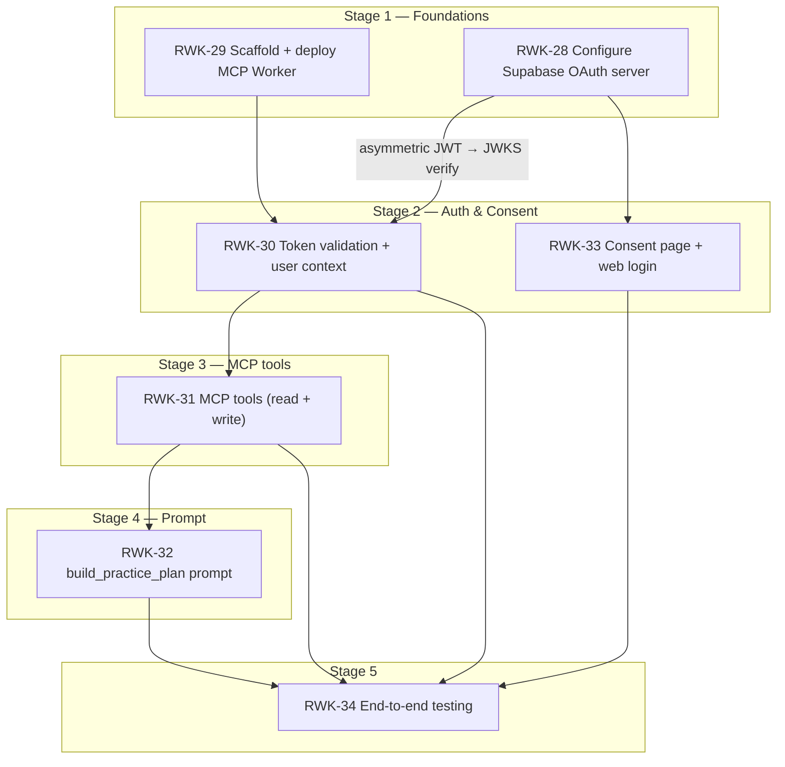

# Stage 4 — Practice Plan Prompt — Requirements

> **Epic:** [RWK-4 — AI Session Creation](https://loganmartlew.atlassian.net/browse/RWK-4)
> **Stage 4 ticket:** [RWK-32 — `build_practice_plan` prompt](https://loganmartlew.atlassian.net/browse/RWK-32)
> **Source documents:** `design-docs/RWK4-ai-integration/roadmap.md` · `design-docs/RWK4-ai-integration/stage4/requirements-questions.md` (answered) · Stage 3 deliverables (RWK-31 tools + contracts)
> **Status:** Requirements defined, ready for implementation planning

---

## 1. Overview

Stage 4 registers the `build_practice_plan` MCP prompt and ships a `get_coaching_guide` fallback tool. Both deliver the same coaching methodology — a markdown document encoding golf practice planning principles that the LLM uses to drive a conversation ending in real `create_unit` / `create_session` tool calls.

The **methodology content** — not the registration mechanism — is the primary deliverable. The prompt encodes:

- Information gathering (handicap, miss patterns, clubs, time, ball budget, tech/facility, distance unit preference)
- Principles-based drill generation (LLM uses its own knowledge; no named archetypes)
- Ball allocation starting heuristics the LLM adapts to stated goals
- Session-type ratios (range vs short-game facility) the LLM adapts
- A numbered tool-call runbook (gather info → `get_user_clubs` → optionally `list_units` → `create_unit`(s) → confirm → `create_session`)
- Explicit confirm-before-writing gate

A `get_coaching_guide` fallback tool ships unconditionally alongside the prompt, returning the same methodology text. Clients that don't support MCP prompts can still access the methodology via a tool call.

The methodology is stored as a markdown file in the codebase. On deploy, it is pushed to a Cloudflare R2 bucket (`rangework`). The Worker fetches it from R2 at runtime, keeping content updates decoupled from code changes.

### Resolved decisions (from `requirements-questions.md`)

| #   | Question                                | Decision                                                                                                                  |
| --- | --------------------------------------- | ------------------------------------------------------------------------------------------------------------------------- |
| M1  | Source of coaching methodology          | **A** — Author from scratch; Logan is the SME.                                                                            |
| M2  | SME and review owner                    | **B** — Logan reviews + validates with a real Claude.ai conversation run.                                                 |
| M3  | Handicap range                          | **C** — All handicaps. Prompt adapts using the LLM based on the user's stated handicap.                                   |
| M4  | Miss pattern input                      | **B** — Free-text. Accept any description; LLM interprets.                                                                |
| M5  | `get_user_clubs` in plan flow           | **A** — Always call first. Required early step in the runbook.                                                            |
| M6  | Ball budget heuristics                  | **C** — Encode default ratios as a starting point the LLM adapts.                                                         |
| M7  | Full-swing / short-game / putting       | **C** — Ratios per session type that the LLM adapts to stated goals.                                                      |
| M8  | Rest / recovery guidance                | **A** — Omit. No rest guidance (no structured field in schema).                                                            |
| M9  | Drill archetypes                        | **B** — Principles-only. Leverage LLM intelligence for drill design.                                                       |
| M10 | Distance units (F9)                     | **A** — Prompt explicitly asks the user for distance unit preference early.                                                |
| M11 | Tech / facility adaptation              | **B** — LLM adapts based on available resources; no explicit rules.                                                        |
| P1  | Prompt arguments                        | **B** — One optional `focus` argument. Rest is conversational.                                                             |
| P2  | Single vs multiple prompts              | Resolved: one prompt — `build_practice_plan`.                                                                              |
| P3  | Tool-call sequencing                    | **A** — Numbered runbook. Units must precede sessions; UUIDs must be captured.                                              |
| P4  | Confirm before creating                 | **B** — Summarise proposed plan and wait for approval before writing.                                                      |
| P5  | Prompt length / token budget            | **B** — Target under 2 000 tokens.                                                                                         |
| P6  | Prompt message structure                | Resolved: single `user` role message.                                                                                      |
| P7  | Prompt name and description             | **A** — `build_practice_plan`. Description matches the app's voice.                                                        |
| F1  | Client prompt support strategy          | **B** — Always ship `get_coaching_guide` fallback regardless of test results.                                               |
| F2  | Fallback tool shape                     | **A** — Returns full methodology text as markdown. Shared with the prompt (DRY).                                            |
| F3  | Fallback tool write-tool instructions   | **B** — Fallback includes tool-call instructions. Must drive writes.                                                        |
| F4  | Runtime detection of prompt support     | Resolved: ship both unconditionally. No runtime detection.                                                                  |
| T1  | Persona list                            | **A** — Two: "beginner with a slice" + "single-digit working on wedges".                                                   |
| T2  | Success criteria for tool calls         | **C** — At least one successful end-to-end run per persona.                                                                 |
| T3  | Test methodology                        | Resolved: manual conversation runs. Record transcripts; verify created data in the Android app.                             |
| T4  | "Coherent conversation" definition      | **A** — Informal; Logan's judgement call.                                                                                   |
| T5  | Test data cleanup                       | **A** — Manual delete of test units/sessions in the Android app.                                                            |
| CC1 | Localization                            | Resolved: English-only for v1.                                                                                              |
| CC2 | Prompt text location                    | Custom: markdown file in codebase → pushed to Cloudflare R2 bucket (`rangework`) on deploy → Worker fetches from R2.       |
| CC3 | Methodology versioning                  | Resolved: `methodology_version` string (e.g. `"1.0.0"`) in the prompt text and returned by `get_coaching_guide`.            |
| CC4 | Review / approval before shipping       | **A** — Logan self-reviews + persona test runs pass.                                                                        |
| CC5 | Dependency on RWK-31 tool contracts     | **A** — Block on finalised Stage 3 contracts. Prompt references specific tool shapes.                                       |

---

## 2. Dependency graph



**Critical dependency:** Stage 4 depends on RWK-31's finalised tool contracts. The prompt's runbook references specific tool names, input shapes, and return values (e.g. `unit_id` from `create_unit`). A tool shape change requires a prompt rewrite.

---

## 3. File structure

```
apps/mcp/
├── src/
│   ├── index.ts                          # MODIFIED: add R2 binding to Env
│   ├── server.ts                         # MODIFIED: register prompt + fallback tool
│   ├── auth/                             # Unchanged
│   ├── tools/
│   │   ├── ping.ts                       # Unchanged
│   │   ├── get-user-clubs.ts             # Unchanged
│   │   ├── list-units.ts                 # Unchanged
│   │   ├── list-sessions.ts              # Unchanged
│   │   ├── create-unit.ts                # Unchanged
│   │   ├── create-session.ts             # Unchanged
│   │   └── get-coaching-guide.ts         # NEW: fallback tool returning methodology
│   ├── prompts/
│   │   └── build-practice-plan.ts        # NEW: prompt registration
│   ├── methodology/
│   │   └── loader.ts                     # NEW: R2 fetch + in-memory cache
│   ├── validation/                       # Unchanged
│   └── tests/
│       ├── ...                           # Existing tests unchanged
│       ├── get-coaching-guide.test.ts    # NEW
│       ├── build-practice-plan.test.ts   # NEW
│       └── methodology-loader.test.ts    # NEW
├── methodology/
│   └── coaching-guide.md                 # NEW: the methodology content (source of truth)
├── wrangler.jsonc                        # MODIFIED: add R2 binding
└── README.md                             # UPDATED: document prompt, fallback tool, R2
```

---

## 4. Methodology content

### 4.1 Purpose

The methodology is a single markdown document that encodes golf practice planning principles. It is the system-level instruction that tells the LLM how to conduct a practice-planning conversation and produce valid Rangework data. It is **not** a drill database — it gives the LLM principles and heuristics, and relies on the LLM's own knowledge to design specific drills.

### 4.2 Content sections

The methodology must cover the following areas. Each section is a required component of the markdown document.

#### 4.2.1 Preamble

- Role definition: the LLM is a golf practice coach building a structured plan in Rangework.
- English-only statement.
- `methodology_version` (e.g. `"1.0.0"`).

#### 4.2.2 Information gathering

The LLM must gather the following from the user before planning. All are conversational (free-text input from the user), except `get_user_clubs` which is a tool call.

| Info                | Gathering method                   | Notes                                                                                 |
| ------------------- | ---------------------------------- | ------------------------------------------------------------------------------------- |
| Handicap            | Ask conversationally               | Adapts plan complexity and drill selection. Serve all handicap levels.                 |
| Miss patterns       | Ask conversationally (free-text)   | LLM interprets and maps to appropriate focus areas.                                   |
| Clubs in bag        | `get_user_clubs` tool call         | Required first tool call. Use codes in all downstream tool calls.                     |
| Available time      | Ask conversationally               | Total range time in minutes.                                                          |
| Ball budget         | Ask conversationally               | Number of balls available. If not known, use a default.                                |
| Distance unit       | Ask conversationally               | Yards or meters. Used in any distance references in generated instruction text.        |
| Tech available      | Ask conversationally               | Launch monitor, alignment aids, etc. LLM adapts accordingly.                          |
| Facility type       | Ask conversationally               | Range, short-game area, putting green, etc. LLM adapts plan composition.              |
| Focus area          | Optional `focus` prompt argument or conversational | Primary thing the user wants to work on.                                 |

The LLM should gather info efficiently — asking multiple related questions in a single message where natural, not one question per turn.

#### 4.2.3 Ball allocation heuristics

Encode a starting-point table the LLM adapts based on stated goals:

| Budget size | Ball count | Suggested split                              |
| ----------- | ---------- | -------------------------------------------- |
| Small       | ~30        | 15 % warm-up · 60 % focus · 25 % finishing   |
| Medium      | ~60        | 15 % warm-up · 60 % focus · 25 % finishing   |
| Large       | 100+       | 10 % warm-up · 65 % focus · 25 % finishing   |

These are defaults. The LLM adapts: a player working exclusively on putting would skip warm-up; a player at a short-game facility would rebalance toward wedges/chipping.

#### 4.2.4 Session-type ratios

Encode starting ratios per facility type:

| Facility                   | Full-swing | Short-game | Putting |
| -------------------------- | ---------- | ---------- | ------- |
| Driving range only         | 75 %       | 20 %       | 5 %     |
| Range + short-game area    | 50 %       | 35 %       | 15 %    |
| Short-game area only       | 0 %        | 65 %       | 35 %    |
| Putting green only         | 0 %        | 0 %        | 100 %   |

These are starting points. The LLM adapts to the user's stated focus and handicap. A high-handicapper may benefit from more short-game even at a range-only facility (using wedge drills within the range).

#### 4.2.5 Drill design principles

The methodology does **not** include named drill archetypes. Instead, it provides principles the LLM uses alongside its own knowledge:

- Each drill (practice unit) should have a clear objective tied to the user's stated focus or miss pattern.
- Instructions should be specific and actionable — not vague ("hit some balls").
- Ball counts per instruction should be realistic for the time available.
- Progression within a drill: start simple, increase difficulty.
- Variation: don't repeat the same club/shot for too many consecutive balls.
- When a launch monitor or data source is available, include measurement-based success criteria in instructions.

#### 4.2.6 Tool-call runbook

A numbered sequence the LLM follows:

1. Gather information conversationally (§4.2.2).
2. Call `get_user_clubs` to retrieve the user's enabled club bag. Use club `code` values (not display names) in all subsequent tool calls.
3. Optionally call `list_units` to check for existing drills that can be reused.
4. Design the practice plan based on gathered information.
5. Present the proposed plan to the user for confirmation — list each unit (title, instructions, ball counts) and the session structure. **Do not create anything until the user approves.**
6. On approval: call `create_unit` for each new drill. Capture the returned `unit_id` from each call.
7. Call `create_session` referencing the `unit_id` values from step 6 (and any reused unit ids from step 3).
8. Confirm completion — tell the user the session is ready in their Rangework app.

#### 4.2.7 Data format instructions

Encode the tool contract constraints the LLM must respect:

- `create_unit` requires `title` (non-empty) and `instructions` (1–10 items with `order`, `text`, optional `ball_count`).
- `create_session` requires `name` (non-empty) and `items` (1+ items with `practice_unit_id`, `order`, `repeat_count`, optional `club_reference`, `notes`, `focus_cue`).
- Club references must use catalog `code` values from `get_user_clubs`.
- Instructions `order` values must be sequential starting at 1 and unique within the array.
- `ball_count` must be a positive integer if provided; omit rather than set to 0.

#### 4.2.8 Constraints

- No rest/recovery guidance (schema has no rest field).
- Do not reference specific distance values without knowing the user's distance unit preference.
- Do not assume equipment the user hasn't mentioned.
- If the user's bag is empty (`get_user_clubs` returns `[]`), inform them they need to enable clubs in the Rangework app before a plan can be created.

### 4.3 Token budget

Target under 2 000 tokens for the complete methodology text. This covers all sections (§4.2.1–§4.2.8) without competing excessively with conversation context. Measure with a tokenizer before finalising.

### 4.4 Methodology versioning

Include `methodology_version: "1.0.0"` in the preamble. Bump on content changes. The version string is present in the prompt text and returned by `get_coaching_guide`.

---

## 5. MCP prompt: `build_practice_plan`

### 5.1 Registration

Register via the MCP SDK's prompt registration API. The prompt appears in clients that support MCP prompts (e.g. Claude.ai's prompt picker).

### 5.2 Name and description

- **Name:** `build_practice_plan`
- **Description:** "Plan a focused, purposeful golf practice session. Guides you through a conversation to understand your game, then creates drills and a session plan in your Rangework account."

### 5.3 Arguments

| Argument | Type   | Required | Description                                                               |
| -------- | ------ | -------- | ------------------------------------------------------------------------- |
| `focus`  | string | No       | Optional primary focus for the session (e.g. "driver distance", "putting") |

### 5.4 Message structure

Returns a single `user` role message containing the full methodology text. If the `focus` argument is provided, append a line to the message: `"The user wants to focus on: {focus}"`.

### 5.5 Methodology source

The prompt handler fetches the methodology text from R2 via the methodology loader (§7). The text is cached in-memory within the Worker instance after the first fetch.

---

## 6. Fallback tool: `get_coaching_guide`

### 6.1 Purpose

Returns the full coaching methodology text for clients that don't support MCP prompts. Ships unconditionally alongside the prompt — no runtime detection of prompt support.

### 6.2 Input schema

No input parameters.

### 6.3 Output schema

```ts
{
  methodology_version: string   // e.g. "1.0.0"
  guide: string                 // full methodology markdown text
}
```

### 6.4 Behaviour

1. Fetch methodology from R2 (or in-memory cache) via the methodology loader.
2. Extract `methodology_version` from the preamble.
3. Return `{ methodology_version, guide }` as a text content block.

### 6.5 Tool description

> Returns the Rangework coaching guide — a methodology for planning golf practice sessions. Call this to learn how to structure a practice plan, then use `get_user_clubs`, `create_unit`, and `create_session` to build one. The guide includes step-by-step instructions for the tool-call sequence.

### 6.6 Error handling

| Condition            | Behaviour                                                         |
| -------------------- | ----------------------------------------------------------------- |
| R2 fetch failure     | Return a structured error: `{ code: "CONTENT_UNAVAILABLE", message: "Coaching guide is temporarily unavailable. Please try again." }` |
| Empty methodology    | Same as fetch failure.                                             |

---

## 7. Methodology loader

### 7.1 Purpose

Fetches the coaching methodology markdown from R2 and caches it in-memory within the Worker instance. Shared by the prompt handler and the `get_coaching_guide` tool.

### 7.2 R2 configuration

| Property       | Value                                    |
| -------------- | ---------------------------------------- |
| Bucket name    | `rangework`                              |
| Object key     | `mcp/coaching-guide.md`                  |
| Binding name   | `METHODOLOGY_BUCKET`                     |
| Wrangler config | `r2_buckets = [{ binding = "METHODOLOGY_BUCKET", bucket_name = "rangework" }]` |

### 7.3 Caching strategy

- **In-memory cache** within the Worker instance. Cloudflare Workers are short-lived, so the cache naturally expires when the isolate is evicted.
- First request to the prompt or fallback tool triggers an R2 fetch. Subsequent requests within the same isolate reuse the cached text.
- No explicit TTL — Worker isolate lifetime is the effective TTL.
- No cache invalidation mechanism. To update the methodology, push a new object to R2 and wait for isolate turnover (typically seconds to minutes on Workers). A forced invalidation (redeploying the Worker) is always available.

### 7.4 Interface

```ts
async function loadMethodology(bucket: R2Bucket): Promise<string | null>
```

Returns the methodology text or `null` if the object doesn't exist or the fetch fails.

---

## 8. Deploy pipeline

### 8.1 Methodology upload

On deploy, the methodology markdown file (`apps/mcp/methodology/coaching-guide.md`) must be pushed to R2 before (or alongside) the Worker deploy. This ensures the Worker can fetch the latest content.

The deploy sequence:

1. Push `coaching-guide.md` to R2: `wrangler r2 object put rangework/mcp/coaching-guide.md --file apps/mcp/methodology/coaching-guide.md`
2. Deploy the Worker: `wrangler deploy`

A `deploy` script in `package.json` wraps both steps.

### 8.2 Local development

For `wrangler dev`, the R2 binding uses local persistence (miniflare's local R2 emulation). The methodology file must be uploaded to the local R2 instance before the prompt or fallback tool can be tested locally.

Add a `dev:seed` script that pushes the methodology to the local R2 emulation.

---

## 9. Cross-cutting requirements

### 9.1 Localization

English-only for v1. State this explicitly in the methodology preamble.

### 9.2 Prompt capabilities declaration

The MCP server's capabilities must include `prompts: {}` in addition to the existing `tools: {}`. Update the `McpServer` constructor in `server.ts`.

### 9.3 No service role

The methodology loader accesses R2 (not Supabase). The prompt and fallback tool do not make any Supabase queries directly — they return text that the LLM then uses to drive tool calls.

### 9.4 Methodology as single source of truth

The same markdown text is used by both the prompt and the `get_coaching_guide` tool. There must be exactly one copy of the methodology content in the codebase (`apps/mcp/methodology/coaching-guide.md`). The prompt handler and fallback tool both read from the same R2 object via the shared loader.

---

## 10. Testing

### 10.1 Automated (Vitest)

| Test file                       | Coverage                                                                                     |
| ------------------------------- | -------------------------------------------------------------------------------------------- |
| `methodology-loader.test.ts`    | `loadMethodology` returns cached text on second call; returns `null` on R2 error; caching works within a single invocation. |
| `build-practice-plan.test.ts`   | Prompt listed in `prompts/list`; returns a `user` role message; `focus` argument appended when provided; omitted when absent. |
| `get-coaching-guide.test.ts`    | Returns `{ methodology_version, guide }` shape; `methodology_version` is a non-empty string; returns error on R2 failure. |

All tests run with mocked R2 bucket — no live R2 connection required.

### 10.2 Manual — persona test runs

The stage is done when at least one successful end-to-end run per persona produces valid data:

| Persona                              | Input profile                                                                 | Pass condition                                                                          |
| ------------------------------------ | ----------------------------------------------------------------------------- | --------------------------------------------------------------------------------------- |
| Beginner with a slice (high-handicap)| ~25 handicap, slices driver and irons, range-only, 60 balls, 45 min, no tech | Conversation gathers info, proposes plan, user confirms, units + session created in app |
| Single-digit working on wedges       | ~7 handicap, inconsistent wedge distances, range + short-game, 100 balls, 60 min, launch monitor | Same — plan is noticeably different (more advanced, wedge-focused, includes data targets) |

**Test method:** Manual conversation in Claude.ai or MCP Inspector. Record transcripts. Verify created data in the Android app.

**Success criteria (per run):**

- Conversation gathers relevant info from the persona profile.
- `get_user_clubs` is called before any write tools.
- Plan is proposed before any units/sessions are created.
- `create_unit` calls produce valid units visible in the app.
- `create_session` call produces a valid session referencing the created units.
- Plan is contextually appropriate for the persona (Logan's judgement).

**Test data cleanup:** Manual delete of test units/sessions in the Android app after each run.

### 10.3 Tool description validation

Run at least one test conversation (MCP Inspector or Claude.ai) where the LLM:

1. Calls `get_coaching_guide` and uses the returned methodology to plan a session.
2. Follows the runbook through to `create_session`.

Adjust the tool description until the LLM reliably selects and uses the tool.

---

## 11. Deliverables

1. Coaching methodology markdown: `apps/mcp/methodology/coaching-guide.md`
2. Methodology loader: `apps/mcp/src/methodology/loader.ts`
3. Prompt registration: `apps/mcp/src/prompts/build-practice-plan.ts`
4. Fallback tool: `apps/mcp/src/tools/get-coaching-guide.ts`
5. Updated `apps/mcp/src/server.ts` — register prompt + fallback tool; add `prompts` capability.
6. Updated `apps/mcp/src/index.ts` — add `METHODOLOGY_BUCKET` to `Env`.
7. Updated `apps/mcp/wrangler.jsonc` — add R2 binding.
8. Updated `apps/mcp/package.json` — deploy script wrapping R2 upload + Worker deploy.
9. Three Vitest test files: methodology loader, prompt, fallback tool.
10. Persona test transcripts (or summary notes) documenting the two test runs.
11. Updated `apps/mcp/README.md` — document the prompt, fallback tool, methodology location, R2 setup, and deploy pipeline.

---

## 12. Scope boundary

| Item                                       | In Stage 4     | Deferred                             |
| ------------------------------------------ | -------------- | ------------------------------------ |
| `build_practice_plan` prompt               | Yes            | —                                    |
| `get_coaching_guide` fallback tool         | Yes            | —                                    |
| Coaching methodology content               | Yes            | —                                    |
| R2 storage + loader                        | Yes            | —                                    |
| Deploy pipeline (R2 upload + Worker)       | Yes            | —                                    |
| Named drill archetypes / drill database    | No             | Principles-only by design (M9)       |
| Rest/recovery guidance                     | No             | Omitted by design (M8)              |
| `user_preferences` read tool               | No             | Prompt asks conversationally (M10)   |
| Multiple prompts (short-game, pre-round)   | No             | Future stages                        |
| Prompt A/B testing or analytics            | No             | Future stages                        |
| Edit/delete tools                          | No             | Out of scope for v1                  |
| End-to-end client testing                  | No             | Stage 5 (RWK-34)                     |

---

## 13. Risks

| Risk                                                              | Impact                                            | Mitigation                                                                                       |
| ----------------------------------------------------------------- | ------------------------------------------------- | ------------------------------------------------------------------------------------------------ |
| Methodology exceeds 2 000 token budget                            | Context window competition in LLM conversations   | Measure with a tokenizer during authoring; trim ruthlessly. Prioritise the runbook and heuristics. |
| LLM doesn't follow the numbered runbook reliably                  | Units created without confirmation; sessions fail  | Test with both personas; iterate on runbook wording. Explicit "do not create until user confirms." |
| R2 fetch latency on cold Worker start                             | First prompt/tool call is slow                     | In-memory caching after first fetch. R2 in same region as Worker minimises latency.              |
| `get_coaching_guide` returns too much text for the LLM to use     | LLM ignores parts of the methodology               | Keep under 2 000 tokens. Fallback is the same text as the prompt — consistent behaviour.         |
| Methodology quality is subjective — no automated quality gate     | Subpar practice plans shipped                       | Logan validates with real conversations (M2). Iterative improvement post-ship.                   |
| Stage 3 tool contracts change after methodology is written        | Prompt references stale tool shapes                 | CC5: block on finalised contracts. If contracts change, update the methodology.                   |
| R2 bucket access from Worker requires correct binding config      | Worker can't fetch methodology                      | Test R2 access in `wrangler dev` before deploying.                                               |

---

## 14. Acceptance criteria

### Prompt and fallback tool

- [ ] `build_practice_plan` prompt is listed in MCP `prompts/list`
- [ ] Prompt returns a single `user` role message containing the methodology
- [ ] `focus` argument is appended to the message when provided
- [ ] `focus` argument is omitted from the message when not provided
- [ ] `get_coaching_guide` tool is listed in MCP `tools/list`
- [ ] `get_coaching_guide` returns `{ methodology_version, guide }` with the same text as the prompt
- [ ] `get_coaching_guide` returns `CONTENT_UNAVAILABLE` error on R2 failure

### Methodology content

- [ ] Methodology is under 2 000 tokens
- [ ] Methodology includes all required sections (§4.2.1–§4.2.8)
- [ ] `methodology_version` is present in the text
- [ ] English-only statement is present

### R2 and deploy

- [ ] R2 binding is configured in `wrangler.jsonc`
- [ ] `METHODOLOGY_BUCKET` is in the `Env` interface
- [ ] Deploy script pushes methodology to R2 then deploys Worker
- [ ] Methodology is fetchable from R2 in `wrangler dev` (after local seed)

### Testing

- [ ] Vitest tests pass for methodology loader, prompt, and fallback tool
- [ ] Beginner-with-a-slice persona test run: conversation completes, units + session created in app
- [ ] Single-digit-wedges persona test run: conversation completes, units + session created in app, plan is noticeably different from the beginner plan
- [ ] `get_coaching_guide` fallback drives a complete planning conversation in at least one test
- [ ] `pnpm --filter @rangework/mcp test` passes
- [ ] `pnpm --filter @rangework/mcp typecheck` passes

### Documentation

- [ ] `apps/mcp/README.md` documents the prompt, fallback tool, methodology location, R2 setup, and deploy pipeline
- [ ] `apps/mcp/methodology/coaching-guide.md` exists and is the single source of truth
