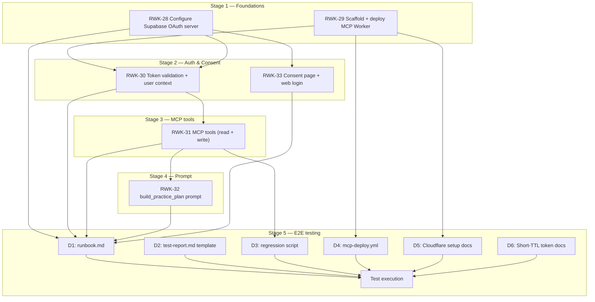

# Stage 5 — End-to-End Integration Testing — Implementation Plan

> **Epic:** [RWK-4 — AI Session Creation](https://loganmartlew.atlassian.net/browse/RWK-4)
> **Stage 5 ticket:** [RWK-34 — End-to-end integration testing](https://loganmartlew.atlassian.net/browse/RWK-34)
> **Source documents:** `design-docs/RWK4-ai-integration/roadmap.md` · `design-docs/RWK4-ai-integration/stage5/requirements.md` · `design-docs/RWK4-ai-integration/stage5/requirements-questions.md` (answered) · Stage 1–4 deliverables
> **Status:** Plan ready for implementation

---

## 1. Overview

Stage 5 is the end-to-end integration gate for the entire RWK-4 epic. Unlike Stages 1–4 which built features, Stage 5 produces **testing artifacts** and **CI infrastructure** — a runbook, a regression script, a deploy workflow, and a test report template. The actual test execution happens after all artifacts are in place and all prior stages are complete.

This is a single-ticket stage (RWK-34) with no parallel tracks. It depends on all four prior stages being complete.

### 1.1 What Stage 5 builds

| #   | Deliverable                        | Type                | Description                                           |
| --- | ---------------------------------- | ------------------- | ----------------------------------------------------- |
| D1  | `stage5/runbook.md`                | Document            | Step-by-step instructions for all 11 scenarios        |
| D2  | `stage5/test-report.md`            | Document (template) | Report template; filled in after test execution       |
| D3  | `apps/mcp/scripts/regression.ts`   | Script              | MCP Inspector regression script for all 5 tools       |
| D4  | `.github/workflows/mcp-deploy.yml` | CI config           | Automated Worker deploy on `apps/mcp/**` changes      |
| D5  | Cloudflare setup docs              | In runbook (D1)     | Custom domain DNS, secret configuration steps         |
| D6  | Short-TTL token config docs        | In runbook (D1)     | How to configure a 5-min JWT TTL for the test account |

### 1.2 What Stage 5 does NOT build

- No new MCP server features (tools, prompts, auth — all in Stages 1–4)
- No Android app changes
- No Supabase schema changes
- No automated CI testing (AU5-B — deferred to future stage)
- No consent page changes

### 1.3 Current codebase state (pre-implementation)

The codebase is in the following state before Stage 5 begins:

- **`server.ts`**: All 6 tools registered (`ping`, `get_user_clubs`, `list_units`, `list_sessions`, `create_unit`, `create_session`, `get_coaching_guide`). `build_practice_plan` prompt registered. `prompts` capability declared. R2 bucket passed through.
- **`wrangler.jsonc`**: R2 binding `METHODOLOGY_BUCKET` → bucket `rangework` configured. Dev port 8787.
- **`src/index.ts`**: `Env` interface has `SUPABASE_URL`, `SUPABASE_ANON_KEY`, `METHODOLOGY_BUCKET`. Auth middleware validates JWTs. `createServer(userContext, env.METHODOLOGY_BUCKET)` called.
- **`apps/mcp/scripts/`**: Does not exist yet.
- **`.github/workflows/mcp-deploy.yml`**: Does not exist yet.
- **`design-docs/RWK4-ai-integration/stage5/`**: Only `requirements-questions.md` and `requirements.md` exist. No `runbook.md` or `test-report.md` yet.
- **Existing CI workflows**: `android.yml`, `release.yml`, `supabase-deploy.yml`. No MCP-specific workflow.

---

## 2. Resolved decisions

All 27 questions from `requirements-questions.md` are resolved. Key decisions shaping this plan:

| Decision | Value                                                 | Impact on plan                                                |
| -------- | ----------------------------------------------------- | ------------------------------------------------------------- |
| E4 / AU6 | `wrangler dev` locally + `mcp-deploy.yml` CI workflow | D4 creates the workflow; D5 documents manual Cloudflare setup |
| AU2      | Committed regression script under `apps/mcp/scripts/` | D3 is a TypeScript script using the MCP SDK                   |
| AU3      | `stage5/runbook.md`                                   | D1 is the primary testing artifact                            |
| XX2      | `stage5/test-report.md`                               | D2 is a template filled after execution                       |
| E1       | Production Supabase project                           | No staging project setup needed                               |
| E2       | Two real Google accounts                              | Account emails documented in runbook (not committed)          |
| E3       | Manual data cleanup                                   | Runbook includes cleanup steps between scenarios              |
| C1       | Claude.ai primary target                              | Runbook prioritizes Claude.ai scenarios                       |
| AS1      | MCP Inspector for auth isolation (S6)                 | D3 regression script covers this                              |
| TS9      | Short-TTL token (5 min) for expiry test (S7)          | D6 documents the Supabase config steps                        |
| AU5      | No CI integration for tests                           | No test automation in the deploy workflow                     |

---

## 3. Dependency graph



**Artifact dependencies:**

- D1 (runbook) depends on all Stage 1–4 deliverables being complete — it references specific tool names, prompt names, consent URL, and OAuth flow steps.
- D2 (test report template) depends on D1 — the report mirrors the runbook's scenario structure.
- D3 (regression script) depends on Stage 3 (RWK-31) — it exercises the five data tools.
- D4 (deploy workflow) depends on Stage 1 (RWK-29) — it deploys the Worker.
- D5 (Cloudflare docs) depends on Stage 1 (RWK-29) — it documents the Worker's Cloudflare configuration.
- D6 (token TTL docs) depends on Stage 2 (RWK-28) — it documents Supabase auth configuration.

**Execution dependency:** Test execution (the actual running of scenarios) requires ALL artifacts (D1–D6) AND all Stage 1–4 deliverables to be complete and deployed.

---

## 4. File structure

```
design-docs/RWK4-ai-integration/stage5/
├── requirements-questions.md     # Already exists (answers finalized)
├── requirements.md               # Already exists (this plan's source)
├── implementation-plan.md        # This file
├── runbook.md                    # NEW (D1)
└── test-report.md                # NEW (D2) — template; filled after execution

apps/mcp/
├── scripts/
│   └── regression.ts             # NEW (D3) — MCP Inspector regression script
├── src/                          # Unchanged (Stage 1–4 deliverables)
├── package.json                  # Unchanged
├── wrangler.jsonc                # Unchanged
└── README.md                     # MAY BE UPDATED — add regression script usage

.github/workflows/
├── android.yml                   # Unchanged
├── release.yml                   # Unchanged
├── supabase-deploy.yml           # Unchanged
└── mcp-deploy.yml                # NEW (D4)
```

---

## 5. Implementation steps

### Step 1 — D5: Document Cloudflare manual setup

**File:** `design-docs/RWK4-ai-integration/stage5/runbook.md` (section: "Environment Setup")

Document the one-time Cloudflare configuration steps needed before the Worker can be deployed:

1. **Custom domain DNS**: If `mcp.rangework.app` is not yet pointing at the Worker, document the CNAME record needed in the Cloudflare dashboard.
2. **Secrets**: Document that `SUPABASE_ANON_KEY` must be set via `wrangler secret put`.
3. **R2 bucket**: Confirm the `rangework` R2 bucket exists and the `coaching-guide.md` object is uploaded.
4. **Verification**: `curl https://mcp.rangework.app/health` returns `{ status: "ok" }`.

**Acceptance:** Section exists in runbook with clear, actionable steps. Each step is verifiable.

---

### Step 2 — D4: Create `mcp-deploy.yml` CI workflow

**File:** `.github/workflows/mcp-deploy.yml`

Create a GitHub Actions workflow that deploys the MCP Worker on pushes to `main` that touch `apps/mcp/**`.

```yaml
name: MCP Deploy

on:
  push:
    branches:
      - main
    paths:
      - 'apps/mcp/**'
  workflow_dispatch:

concurrency:
  group: mcp-deploy-${{ github.workflow }}-${{ github.ref }}
  cancel-in-progress: true

jobs:
  deploy:
    runs-on: ubuntu-latest
    permissions:
      contents: read
      deployments: write

    steps:
      - name: Check out repository
        uses: actions/checkout@v4

      - name: Set up pnpm
        uses: pnpm/action-setup@v4
        with:
          run_install: false

      - name: Set up Node.js
        uses: actions/setup-node@v4
        with:
          node-version: '22'
          cache: 'pnpm'

      - name: Install workspace dependencies
        run: pnpm install --frozen-lockfile

      - name: Typecheck
        run: pnpm --filter @rangework/mcp typecheck

      - name: Lint
        run: pnpm --filter @rangework/mcp lint

      - name: Test
        run: pnpm --filter @rangework/mcp test

      - name: Deploy to Cloudflare Workers
        uses: cloudflare/wrangler-action@v3
        with:
          apiToken: ${{ secrets.CLOUDFLARE_API_TOKEN }}
          accountId: ${{ secrets.CLOUDFLARE_ACCOUNT_ID }}
          workingDirectory: apps/mcp
          command: deploy
```

**Key design decisions:**

- Triggers on `push` to `main` with `apps/mcp/**` path filter — same pattern as `android.yml`.
- Runs `typecheck`, `lint`, and `test` before deploy — catches issues before they reach production.
- Uses `cloudflare/wrangler-action@v3` — the official Cloudflare action.
- Requires `CLOUDFLARE_API_TOKEN` and `CLOUDFLARE_ACCOUNT_ID` secrets (already documented as needed in Stage 1's implementation plan).
- `workingDirectory: apps/mcp` — Wrangler runs in the package directory.
- Concurrency group prevents overlapping deploys.

**Acceptance:** Workflow file exists. On next push to `main` touching `apps/mcp/**`, the workflow triggers and deploys successfully (or fails with a clear error if secrets aren't configured yet — document that as a known prerequisite in the runbook).

---

### Step 3 — D3: Create MCP Inspector regression script

**File:** `apps/mcp/scripts/regression.ts`

A TypeScript script that exercises all five data tools against a live Worker using a test JWT. Designed to be run via `npx tsx apps/mcp/scripts/regression.ts` with environment variables for configuration.

```typescript
// apps/mcp/scripts/regression.ts
//
// MCP Inspector regression script for RWK-34 Stage 5.
// Exercises all five data tools against a live Worker.
//
// Usage:
//   MCP_WORKER_URL=https://localhost:8787/mcp \
//   MCP_TEST_TOKEN=<jwt> \
//   npx tsx apps/mcp/scripts/regression.ts
//
// The test token can be obtained via:
//   supabase auth user --token <user-id>

const WORKER_URL = process.env.MCP_WORKER_URL;
const TEST_TOKEN = process.env.MCP_TEST_TOKEN;

if (!WORKER_URL || !TEST_TOKEN) {
  console.error('MCP_WORKER_URL and MCP_TEST_TOKEN must be set');
  process.exit(1);
}

interface McpRequest {
  jsonrpc: '2.0';
  id: number;
  method: string;
  params?: Record<string, unknown>;
}

async function callTool(toolName: string, args?: Record<string, unknown>) {
  const request: McpRequest = {
    jsonrpc: '2.0',
    id: Date.now(),
    method: 'tools/call',
    params: { name: toolName, arguments: args ?? {} },
  };

  const res = await fetch(WORKER_URL, {
    method: 'POST',
    headers: {
      'Content-Type': 'application/json',
      Authorization: `Bearer ${TEST_TOKEN}`,
    },
    body: JSON.stringify(request),
  });

  const body = (await res.json()) as Record<string, unknown>;
  return { status: res.status, body };
}

function assert(condition: boolean, message: string) {
  if (!condition) {
    console.error(`FAIL: ${message}`);
    process.exitCode = 1;
  } else {
    console.log(`PASS: ${message}`);
  }
}

async function main() {
  console.log(`Testing against: ${WORKER_URL}\n`);

  // --- get_user_clubs ---
  console.log('--- get_user_clubs ---');
  const clubs = await callTool('get_user_clubs');
  assert(clubs.status === 200, 'get_user_clubs returns 200');
  // ... validate response shape

  // --- list_units ---
  console.log('\n--- list_units ---');
  const units = await callTool('list_units');
  assert(units.status === 200, 'list_units returns 200');
  // ... validate response shape

  // --- list_sessions ---
  console.log('\n--- list_sessions ---');
  const sessions = await callTool('list_sessions');
  assert(sessions.status === 200, 'list_sessions returns 200');
  // ... validate response shape

  // --- create_unit ---
  console.log('\n--- create_unit ---');
  const newUnit = await callTool('create_unit', {
    title: `[TEST] Regression unit ${Date.now()}`,
    instructions: [{ order: 1, text: 'Test instruction', ball_count: 10 }],
  });
  assert(newUnit.status === 200, 'create_unit returns 200');
  // ... validate unit_id returned

  // --- create_session ---
  console.log('\n--- create_session ---');
  // ... use the unit_id from above

  // --- Auth isolation (S6) ---
  console.log('\n--- auth isolation ---');
  // ... if SECOND_TEST_TOKEN is set, verify isolation

  console.log('\nDone.');
}

main().catch(console.error);
```

**Key design decisions:**

- Plain TypeScript with zero dependencies beyond Node.js built-ins (`fetch`). No MCP SDK needed — the script sends raw JSON-RPC over HTTP.
- Environment variables for configuration — no hardcoded URLs or tokens.
- Clear PASS/FAIL output per assertion.
- Covers all five tools + optional auth isolation check (S6) when `SECOND_TEST_TOKEN` is set.
- Test data is prefixed with `[TEST]` for easy identification and cleanup.

**Acceptance:** Script runs successfully against a local `wrangler dev` Worker with a valid test token. All assertions pass. Script is committed and documented in `apps/mcp/README.md`.

---

### Step 4 — D6: Document short-TTL token configuration

**File:** `design-docs/RWK4-ai-integration/stage5/runbook.md` (section: "Environment Setup")

Document how to configure a short JWT TTL for the test account in Supabase:

1. Navigate to Supabase Dashboard → Authentication → Settings
2. Under "JWT Settings", note the current "JWT expiry" value (default: 3600 seconds)
3. Temporarily change it to 300 seconds (5 minutes) for the test account
4. **Important:** Document the original value so it can be restored after testing
5. After Stage 5 testing completes, restore the original JWT expiry value

**Acceptance:** Clear steps in the runbook. Includes the restore step.

---

### Step 5 — D1: Write the test runbook

**File:** `design-docs/RWK4-ai-integration/stage5/runbook.md`

The runbook is the primary testing artifact. It contains:

1. **Prerequisites checklist** — everything that must be in place before starting
2. **Environment setup** — Cloudflare config (D5), short-TTL token (D6), test accounts, Android debug build
3. **Per-scenario instructions** — for each of the 11 scenarios (S1–S11):
   - Preconditions
   - Step-by-step actions
   - Expected results
   - Pass/fail criteria
   - Space to record actual results
4. **Cleanup steps** — what to do between scenarios and after all testing
5. **Regression script usage** — how to run D3

**Structure:**

```markdown
# Stage 5 — Test Runbook

## Prerequisites

- [ ] All Stage 1–4 deliverables complete and deployed
- [ ] ...

## Environment Setup

### Cloudflare

...

### Supabase (Short-TTL Token)

...

### Test Accounts

...

### Android App

...

## Scenarios

### S1 — Connect from Claude.ai

**Preconditions:** ...
**Steps:**

1. ...
   **Expected:** ...
   **Pass/Fail:** ...
   **Actual Result:** (fill during execution)

### S2 — Connect from ChatGPT web

...

### S3a — Beginner with a slice

...

### S3b — Single-digit working on wedges

...

### S4 — get_user_clubs informs club selection

...

### S5a — Created data in Android app

...

### S5b — Multi-unit session in app

...

### S6 — Auth isolation

...

### S7 — Token expiry / re-auth

...

### S8 — list_units → reuse existing unit

...

### S9 — Empty account

...

### S10 — Invalid club code error UX

...

### S11 — Service-role key absence

...

## Cleanup

...

## Regression Script

...
```

**Acceptance:** Runbook covers all 11 scenarios with clear, actionable steps. A tester unfamiliar with the codebase could follow it.

---

### Step 6 — D2: Create test report template

**File:** `design-docs/RWK4-ai-integration/stage5/test-report.md`

A template that mirrors the runbook's scenario structure. Filled in after test execution.

**Structure:**

```markdown
# Stage 5 — Test Report

**Date of test run:** YYYY-MM-DD
**Tester:** Logan Martlew
**Client:** Claude.ai (date) / ChatGPT web (date)
**Worker:** wrangler dev (localhost:8787)

## Summary

| #   | Scenario                         | Result                         | Notes |
| --- | -------------------------------- | ------------------------------ | ----- |
| S1  | Connect from Claude.ai           | ⬜ Pass / ⬜ Fail              |       |
| S2  | Connect from ChatGPT web         | ⬜ Pass / ⬜ Fail / ⬜ Partial |       |
| S3a | Beginner with a slice            | ⬜ Pass / ⬜ Fail              |       |
| S3b | Single-digit working on wedges   | ⬜ Pass / ⬜ Fail              |       |
| S4  | get_user_clubs informs selection | ⬜ Pass / ⬜ Fail              |       |
| S5a | Data in Android app              | ⬜ Pass / ⬜ Fail              |       |
| S5b | Multi-unit session in app        | ⬜ Pass / ⬜ Fail              |       |
| S6  | Auth isolation                   | ⬜ Pass / ⬜ Fail              |       |
| S7  | Token expiry / re-auth           | ⬜ Pass / ⬜ Fail              |       |
| S8  | list_units → reuse unit          | ⬜ Pass / ⬜ Fail              |       |
| S9  | Empty account                    | ⬜ Pass / ⬜ Fail              |       |
| S10 | Invalid club code error UX       | ⬜ Pass / ⬜ Fail              |       |
| S11 | Service-role key absence         | ⬜ Pass / ⬜ Fail              |       |

**Overall:** ⬜ All pass / ⬜ Some fail (see below)

## Per-Scenario Details

### S1 — Connect from Claude.ai

**Result:** Pass / Fail
**Observations:**
...

### S2 — Connect from ChatGPT web

...

(Repeat for all scenarios)

## Client Quirks & Observations

- Claude.ai: ...
- ChatGPT web: ...

## Test Gaps (AU4)

Error paths exercised manually but not covered by RWK-31 unit tests:

- ...

## Service-Role Key Absence (S11)

- [ ] Confirmed: no `SUPABASE_SERVICE_KEY` in Cloudflare dashboard

## Token Expiry Behaviour (S7)

**Observed behaviour:** ...
**Pass/fail determination:** ...

## Sign-off

- [ ] All scenarios executed
- [ ] Test data cleaned up
- [ ] Short-TTL token config restored
- [ ] Test report reviewed
```

**Acceptance:** Template exists with all 11 scenarios. Ready to be filled in during test execution.

---

### Step 7 — Update `apps/mcp/README.md`

Add a section documenting the regression script:

````markdown
## Regression Testing

A regression script exercises all five MCP tools against a live Worker:

```bash
MCP_WORKER_URL=http://localhost:8787/mcp \
MCP_TEST_TOKEN=<jwt> \
npx tsx scripts/regression.ts
```
````

To test auth isolation, also set `SECOND_TEST_TOKEN`:

```bash
MCP_WORKER_URL=http://localhost:8787/mcp \
MCP_TEST_TOKEN=<jwt-for-account-a> \
SECOND_TEST_TOKEN=<jwt-for-account-b> \
npx tsx scripts/regression.ts
```

Obtain a test token via the Supabase CLI:

```bash
supabase auth user --token <user-id>
```

```

**Acceptance:** README updated with clear regression script usage instructions.

---

## 6. Execution order

The implementation steps have the following dependency chain:

```

Step 1 (D5: Cloudflare docs)
└─→ Step 2 (D4: mcp-deploy.yml) — needs to know the Cloudflare setup
└─→ Step 5 (D1: runbook.md) — references D4 and D5

Step 3 (D3: regression script) — independent; can run in parallel with Steps 1–2

Step 4 (D6: short-TTL docs) — independent; can run in parallel

Step 5 (D1: runbook.md) — depends on Steps 1, 2, 4 (references all setup docs)

Step 6 (D2: test-report.md) — depends on Step 5 (mirrors runbook structure)

Step 7 (README update) — depends on Step 3 (documents the regression script)

```

**Recommended order:**
1. Steps 1, 3, 4 in parallel (independent)
2. Step 2 (depends on Step 1)
3. Step 5 (depends on Steps 1, 2, 4)
4. Step 6 (depends on Step 5)
5. Step 7 (depends on Step 3)

---

## 7. Verification checklist

Before marking Stage 5 implementation complete:

- [ ] `stage5/runbook.md` exists and covers all 11 scenarios
- [ ] `stage5/test-report.md` template exists
- [ ] `apps/mcp/scripts/regression.ts` exists and runs successfully against local Worker
- [ ] `.github/workflows/mcp-deploy.yml` exists
- [ ] Cloudflare setup steps documented in runbook
- [ ] Short-TTL token configuration steps documented in runbook
- [ ] `apps/mcp/README.md` updated with regression script usage
- [ ] All files pass lint (`pnpm --filter @rangework/mcp lint`)
- [ ] Regression script passes typecheck (`pnpm --filter @rangework/mcp typecheck`)

**Post-implementation (test execution — not part of this plan):**
- [ ] All 11 scenarios executed
- [ ] `stage5/test-report.md` filled in with results
- [ ] Test data cleaned up
- [ ] Short-TTL token config restored
- [ ] RWK-34 marked done in Jira

---

## 8. Risks & mitigations

| Risk | Likelihood | Impact | Mitigation |
|---|---|---|---|
| Stage 4 not complete when Stage 5 implementation finishes | Medium | High — can't execute conversation scenarios | Stage 5 artifacts can be built independently; test execution waits for Stage 4 (XX6-B) |
| `mcp-deploy.yml` fails due to missing secrets | High | Low — documented prerequisite | Runbook calls out that `CLOUDFLARE_API_TOKEN` and `CLOUDFLARE_ACCOUNT_ID` must exist |
| ChatGPT write tools gated outside developer mode | Medium | Medium — reduces test coverage | C2-B: proceed and document. Claude.ai is the primary target |
| Short-TTL token config affects other users | Low | High — could break other auth sessions | Runbook includes explicit restore step. TTL change is project-wide in Supabase; document this risk |
| Regression script token expires during run | Low | Low | Script runs in < 30 seconds; token TTL is 5+ minutes even with short config |
| `mcp.rangework.app` DNS not configured | Medium | Medium — can't test against production URL | D5 documents the DNS setup; `wrangler dev` works without DNS |
```
