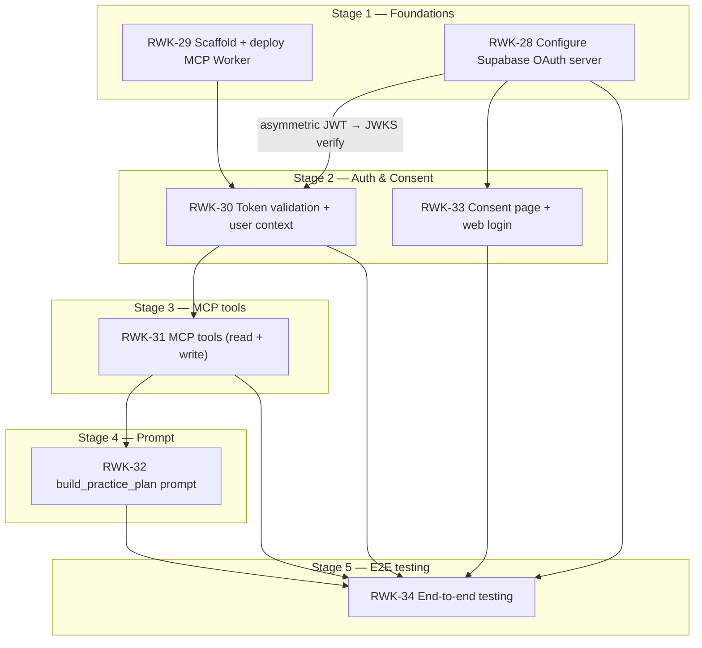

# Stage 5 — End-to-End Integration Testing — Requirements

> **Epic:** [RWK-4 — AI Session Creation](https://loganmartlew.atlassian.net/browse/RWK-4)
> **Stage 5 ticket:** [RWK-34 — End-to-end integration testing](https://loganmartlew.atlassian.net/browse/RWK-34)
> **Source documents:** `design-docs/RWK4-ai-integration/roadmap.md` · `design-docs/RWK4-ai-integration/stage5/requirements-questions.md` (answered) · Stage 1–4 deliverables
> **Status:** Requirements defined, ready for implementation planning

---

## 1. Overview

Stage 5 is the end-to-end integration gate for the entire RWK-4 epic. It validates that all four prior stages work together as a complete system: a user can connect from Claude.ai (or ChatGPT web), authenticate via OAuth, run a planning conversation driven by the `build_practice_plan` prompt, and see the resulting practice units and session appear correctly in the Rangework Android app.

Stage 5 is a **hard gate** — nothing ships until it passes (XX3-B).

### 1.1 Done criteria (from the ticket)

A complete flow — connect server, authenticate, generate a practice plan, see the units and session in the app — works without errors on at least one of Claude.ai or ChatGPT web.

### 1.2 "Without errors" definition (XX1)

A run passes if:

- No tool call returns an error code
- The OAuth flow completes without a redirect failure
- Created data appears in the Android app
- A transient 5xx that succeeds on one retry = pass
- Client UI bugs unrelated to Rangework = noted but not blocking

---

## 2. Resolved decisions

All 27 open questions from `requirements-questions.md` have been resolved. Key decisions:

| #    | Question                        | Decision                                                                |
| ---- | ------------------------------- | ----------------------------------------------------------------------- |
| TS1  | Personas for happy-path runs    | A — "beginner with a slice" + "single-digit working on wedges"          |
| TS2  | Read tool coverage              | A — include `list_units` → `create_session` scenario                    |
| TS3  | Empty-account scenario          | A — include fresh-account scenario                                      |
| TS4  | Large-account scenario          | B — skip; defer until real user hits limit                              |
| TS5  | Multi-unit session              | Include one session with 4–5 units                                      |
| TS6  | Invalid club code error path    | A — include LLM-facing error UX scenario                                |
| TS7  | Bogus `unit_id` injection       | B — skip; RWK-31 unit test concern                                      |
| TS8  | RLS synthetic token test        | B — skip; RWK-30 unit test concern                                      |
| TS9  | Token expiry simulation         | B — configure short-TTL test token (5 min)                              |
| TS10 | Consent flow coverage           | A — re-test full consent flow in scenarios 1–2                          |
| TS11 | Prompt vs fallback tool         | B — test primary path end-to-end; spot-check the other                  |
| E1   | Supabase project                | A — production project                                                  |
| E2   | Test account provisioning       | A — two real Google accounts                                            |
| E3   | Test data cleanup               | A — manual delete in Android app / Supabase dashboard                   |
| E4   | Worker environment              | C — `wrangler dev` locally; `mcp-deploy.yml` CI workflow created        |
| E5   | Android app verification        | A — physical device/emulator with debug build                           |
| E6   | App build variant               | `assembleDebug` with test credentials via `~/.gradle/gradle.properties` |
| E7   | Staging OAuth config            | Not needed (E1 = production project)                                    |
| C1   | Primary success target          | A — Claude.ai primary; ChatGPT web secondary                            |
| C2   | ChatGPT prerequisite check      | B — proceed and document issues if found                                |
| C3   | Other clients                   | None in Stage 5                                                         |
| C4   | Client quirks log               | C — captured in `test-report.md`                                        |
| C5   | Client version recording        | Record test run dates                                                   |
| AS1  | Auth isolation methodology      | B — MCP Inspector with user B's token                                   |
| AS2  | Token expiry client behaviour   | C — test and document                                                   |
| AS3  | Consent denial mid-flight       | B — skip                                                                |
| AS4  | Scope enforcement               | N/A — single broad scope                                                |
| AS5  | JWT algorithm regression        | B — trust RWK-28 gate                                                   |
| AS6  | Service-role key absence        | One-time config inspection check                                        |
| AU1  | Manual vs automated split       | B — manual for conversations; MCP Inspector for auth/error              |
| AU2  | MCP Inspector regression script | A — committed script under `apps/mcp/scripts/`                          |
| AU3  | Test runbook                    | A — `stage5/runbook.md`                                                 |
| AU4  | Unit test coverage audit        | Note gaps in test report                                                |
| AU5  | CI integration                  | B — keep Stage 5 out-of-band manual                                     |
| AU6  | Cloudflare deploy automation    | A — create `mcp-deploy.yml`; document manual Cloudflare setup           |
| XX1  | "Without errors" precision      | See §1.2                                                                |
| XX2  | Test report format              | A — `stage5/test-report.md`                                             |
| XX3  | Ship-gate relationship          | B — hard gate                                                           |
| XX4  | Beta-feature monitoring         | A — Supabase changelog watch; Logan responsible                         |
| XX5  | Privacy / test data             | A — dedicated throwaway test account                                    |
| XX6  | Stage 4 dependency              | B — can start with ad-hoc personas if Stage 4 slips                     |
| XX7  | RWK-5 stub ticket               | Already closed                                                          |

---

## 3. Test scenarios

### 3.1 Scenario map

The seven ticket scenarios are expanded into the following test cases:

| #   | Scenario                                               | Type            | Method                              | Depends on          |
| --- | ------------------------------------------------------ | --------------- | ----------------------------------- | ------------------- |
| S1  | Connect from Claude.ai (full OAuth flow)               | Happy-path      | Manual (Claude.ai UI)               | RWK-28, RWK-33      |
| S2  | Connect from ChatGPT web (developer mode)              | Happy-path      | Manual (ChatGPT UI)                 | RWK-28, RWK-33      |
| S3a | `build_practice_plan` — beginner with a slice          | Happy-path      | Manual (Claude.ai conversation)     | RWK-31, RWK-32      |
| S3b | `build_practice_plan` — single-digit working on wedges | Happy-path      | Manual (Claude.ai conversation)     | RWK-31, RWK-32      |
| S4  | `get_user_clubs` informs club selection                | Happy-path      | Manual (embedded in S3a/S3b)        | RWK-31              |
| S5a | Created units + session appear in Android app          | Happy-path      | Manual (Android debug build)        | RWK-31, Android app |
| S5b | Multi-unit session (4–5 units) appears in app          | Happy-path      | Manual (Android debug build)        | RWK-31, Android app |
| S6  | Auth isolation — second user's data inaccessible       | Security        | MCP Inspector script                | RWK-30, RWK-31      |
| S7  | Token expiry / re-auth behaviour                       | Security        | Manual (Claude.ai, short-TTL token) | RWK-30              |
| S8  | `list_units` → reuse existing unit in `create_session` | Read-then-write | Manual (Claude.ai conversation)     | RWK-31              |
| S9  | Empty account — no clubs, no units                     | Edge case       | Manual (Claude.ai conversation)     | RWK-31              |
| S10 | Invalid club code — LLM-facing error UX                | Error path      | Manual (Claude.ai conversation)     | RWK-31              |
| S11 | Service-role key absence check                         | Config audit    | Manual (Cloudflare dashboard)       | RWK-29              |

### 3.2 Scenario details

#### S1 — Connect from Claude.ai

**Precondition:** Claude.ai account with MCP connector support. Rangework MCP server deployed and reachable.

**Steps:**

1. Open Claude.ai → Settings → MCP Connectors → Add connector
2. Enter the Rangework MCP server URL
3. Claude discovers the OAuth authorization server
4. User is redirected to `rangework.app/oauth/consent?authorization_id=...`
5. User signs in with Google (test account A)
6. Consent page shows "Rangework MCP" requesting "Manage your practice data"
7. User clicks Approve
8. User is redirected back to Claude.ai
9. Claude.ai shows "Connected" status

**Pass:** Steps 1–9 complete without errors. Claude.ai shows connected state.

#### S2 — Connect from ChatGPT web

**Precondition:** ChatGPT Plus/Team account with developer mode enabled.

**Steps:** Same as S1 but in ChatGPT's MCP connector UI.

**Pass:** Same as S1. If write tools are gated in ChatGPT, document the limitation and mark S2 as "partial — read tools only."

#### S3a — Beginner with a slice (persona 1)

**Precondition:** Connected to Claude.ai. Test account A has clubs enabled (at minimum: driver, 7-iron, pitching wedge, putter).

**Persona script:**

- "I'm a beginner golfer, I've been playing about 6 months. My biggest problem is slicing my driver and long irons. I have an hour at the range today and about 80 balls. Can you help me build a practice plan?"

**Expected LLM behaviour:**

1. Calls `get_user_clubs` to learn available clubs
2. Asks clarifying questions (handicap, miss pattern details, distance unit preference)
3. Proposes a plan with specific drills
4. Calls `create_unit` for each drill (likely 3–5 units)
5. Summarizes the proposed session and asks for confirmation
6. Calls `create_session` with the unit IDs
7. Returns the session ID

**Pass:** All tool calls succeed. The conversation is coherent. The LLM adapts drills to the stated slice problem.

#### S3b — Single-digit working on wedges (persona 2)

**Precondition:** Connected to Claude.ai. Test account A has clubs enabled.

**Persona script:**

- "I'm a 4 handicap. My full swing is solid but my wedge game inside 100 yards is costing me strokes. I have 90 minutes and about 120 balls. I want to focus on distance control with my gap wedge and sand wedge."

**Expected LLM behaviour:** Similar to S3a but with wedge-focused drills and distance-control methodology.

**Pass:** All tool calls succeed. The LLM proposes wedge-specific drills. Created units reference gap wedge / sand wedge club codes.

#### S4 — `get_user_clubs` informs club selection

**Method:** Embedded in S3a and S3b. Verify that:

- The LLM calls `get_user_clubs` before proposing any club-specific drills
- The LLM uses club `code` values (not display names) in `create_unit` and `create_session` calls
- The LLM does not suggest clubs the user doesn't have enabled

**Pass:** All three conditions met in both persona runs.

#### S5a — Created data appears in Android app

**Precondition:** Android debug build installed on device/emulator with test Supabase credentials. S3a or S3b completed.

**Steps:**

1. Open the Rangework Android app (signed in as test account A)
2. Navigate to Units list → pull to refresh
3. Verify all units created by the LLM appear with correct titles, instructions, ball counts
4. Navigate to Sessions list → pull to refresh
5. Open the session created by the LLM
6. Verify the session shows correct unit lineup, repeat counts, club assignments

**Pass:** All created data appears correctly. No missing fields or display issues.

#### S5b — Multi-unit session in app

**Precondition:** A session with 4–5 units created via the LLM.

**Steps:** Same as S5a but specifically verify the multi-unit session renders all items correctly in the session detail screen.

**Pass:** All 4–5 items display with correct order, unit titles, and metadata.

#### S6 — Auth isolation

**Precondition:** Test account A has units/sessions. Test account B has no data (or different data).

**Method:** MCP Inspector script.

1. Obtain a valid JWT for test account B (via `supabase auth user` CLI or browser dev tools)
2. Connect MCP Inspector to the Worker with account B's token
3. Call `list_units`
4. Assert the result is `{ units: [] }` (or only account B's own units, not account A's)
5. Call `list_sessions` — same assertion
6. Call `create_unit` with account B's token — assert it succeeds (creates under B's ownership)
7. Call `list_units` again with account A's token — assert account B's new unit is NOT visible

**Pass:** Account B cannot see account A's data. Each account's data is fully isolated.

#### S7 — Token expiry / re-auth

**Precondition:** Test account configured with a short JWT TTL (5 minutes) in Supabase. Connected to Claude.ai.

**Steps:**

1. Start a planning conversation in Claude.ai
2. Wait for the token to expire (5+ minutes of inactivity)
3. Send a follow-up message that would trigger a tool call
4. Observe Claude.ai's behaviour

**Pass/fail definition:** Document what actually happens. If Claude.ai automatically re-triggers OAuth → pass. If it surfaces a clear error and the user can manually reconnect → pass with note. If it fails silently or with an unhelpful error → fail (investigate).

#### S8 — `list_units` → reuse existing unit

**Precondition:** Test account A has at least 3 existing practice units from prior runs.

**Persona script:**

- "I want to create a new practice session. First, show me what units I already have, then build a session that reuses two of them and adds one new unit."

**Expected LLM behaviour:**

1. Calls `list_units`
2. Identifies existing units by title
3. Proposes a session reusing 2 existing units + 1 new unit
4. Calls `create_unit` for the new unit only
5. Calls `create_session` referencing both existing and new unit IDs

**Pass:** The LLM correctly reuses existing unit IDs. No duplicate units created. Session references mix of old and new unit IDs.

#### S9 — Empty account

**Precondition:** Fresh test account with no enabled clubs and no units.

**Persona script:**

- "I'm new to Rangework. Help me set up a practice plan."

**Expected LLM behaviour:**

1. Calls `get_user_clubs` → receives `{ clubs: [] }`
2. Informs the user they have no clubs enabled and should set up their bag in the Rangework app first
3. Does NOT attempt to call `create_unit` or `create_session` without clubs

**Pass:** The LLM handles the empty state gracefully. No errors. Clear guidance to the user.

#### S10 — Invalid club code error UX

**Precondition:** Connected to Claude.ai. Test account A has clubs enabled.

**Persona script:**

- "Create a practice unit for my 'super driver' club." (There is no club code `super_driver` in the catalog.)

**Expected LLM behaviour:**

1. Attempts to call `create_unit` with `default_club_reference: "super_driver"`
2. Receives `UNKNOWN_CLUB_CODE` error with `valid_codes` in the data
3. Surfaces the error to the user in plain language
4. Offers to use one of the valid club codes instead

**Pass:** The error is surfaced clearly. The LLM recovers and offers valid alternatives.

#### S11 — Service-role key absence

**Steps:**

1. Open Cloudflare Dashboard → Workers & Pages → `rangework-mcp` → Settings → Variables
2. Confirm no `SUPABASE_SERVICE_KEY` secret exists
3. Confirm only `SUPABASE_URL` and `SUPABASE_ANON_KEY` are bound

**Pass:** No service-role key present. Document the result in the test report.

---

## 4. Test environments & accounts

### 4.1 Supabase project

**Production project** (E1-A). The same Supabase project used by the Android app. RLS isolation testing (S6) uses MCP Inspector with separate tokens — no destructive operations against real user data.

### 4.2 Test accounts

Two real Google accounts (E2-A):

| Role                         | Purpose                                                                  |
| ---------------------------- | ------------------------------------------------------------------------ |
| Account A (primary tester)   | Main test account. Clubs enabled, units/sessions created during testing. |
| Account B (isolation target) | Second account for RLS isolation testing. No shared data with Account A. |

Account email addresses are documented in the runbook (not committed to the repo).

### 4.3 Data cleanup

Manual delete in the Android app or Supabase dashboard after each run (E3-A). No automated cleanup script.

### 4.4 Worker environment

`wrangler dev` for local development and testing (E4-C). The Worker runs on `localhost:8787`. For Claude.ai/ChatGPT connectivity, use a Cloudflare Tunnel or `wrangler dev --remote` if needed.

A `mcp-deploy.yml` CI workflow will be created for future automated deployments. Any manual Cloudflare setup (e.g. custom domain DNS for `mcp.rangework.app`) will be documented in the runbook.

### 4.5 Android app

Debug build (`assembleDebug`) with test Supabase credentials via `~/.gradle/gradle.properties` (E6). Physical device or emulator (E5-A).

---

## 5. Target clients

### 5.1 Primary: Claude.ai (C1-A)

Claude.ai is the primary success target. All scenarios S1–S11 must pass on Claude.ai.

### 5.2 Secondary: ChatGPT web (C1-A, C2-B)

ChatGPT web (developer mode) is a secondary target. S2 (connect) and S3a (planning conversation) should be attempted. If write tools are gated, document the limitation and mark ChatGPT scenarios as "partial."

### 5.3 Client version recording (C5)

Record the date of each test run. SaaS clients don't expose build versions; the date is sufficient to correlate with changelog changes.

### 5.4 Client quirks (C4)

Per-client observations are captured in `stage5/test-report.md`. No separate quirks log file.

---

## 6. Auth & security testing

### 6.1 Auth isolation (S6)

MCP Inspector script using Account B's token. See §3.2 S6 for detailed steps.

### 6.2 Token expiry (S7)

Short-TTL test token (5 min) configured in Supabase for the test account (TS9-B). See §3.2 S7 for detailed steps. The observed client behaviour becomes the pass/fail definition (AS2-C).

### 6.3 Service-role key absence (S11)

One-time Cloudflare dashboard inspection. See §3.2 S11.

### 6.4 Out of scope

- Consent denial mid-flight (AS3-B)
- Scope enforcement testing (AS4 — N/A, single broad scope)
- JWT algorithm regression (AS5-B — RWK-28 owns this)
- RLS synthetic token test (TS8-B — RWK-30 owns this)

---

## 7. Automation vs manual

### 7.1 Split (AU1-B)

| Method                          | Scenarios                             |
| ------------------------------- | ------------------------------------- |
| Manual (Claude.ai / ChatGPT UI) | S1, S2, S3a, S3b, S4, S7, S8, S9, S10 |
| Manual (Android app)            | S5a, S5b                              |
| MCP Inspector script            | S6                                    |
| Manual (Cloudflare dashboard)   | S11                                   |

### 7.2 MCP Inspector regression script (AU2-A)

A committed script under `apps/mcp/scripts/` exercises all five tools with a test token. This makes future regressions (after a migration or Worker deploy) re-runnable without a full manual client flow.

### 7.3 Test runbook (AU3-A)

`stage5/runbook.md` with step-by-step instructions for each scenario. Reusable for future regression checks.

### 7.4 Unit test coverage audit (AU4)

After manual runs, note any error paths exercised manually but not covered by RWK-31 unit tests. Add them to a "test gaps" section of the Stage 5 report.

### 7.5 CI integration (AU5-B)

No CI integration in Stage 5. Kept entirely out-of-band manual.

### 7.6 Cloudflare deploy automation (AU6-A)

Create a `.github/workflows/mcp-deploy.yml` workflow. Document any manual Cloudflare setup steps (custom domain DNS, etc.) in the runbook.

---

## 8. Cross-cutting

### 8.1 Ship gate (XX3-B)

Stage 5 is a hard gate. Stages 1–4 do not go live until Stage 5 passes.

### 8.2 Test report (XX2-A)

`stage5/test-report.md` in the repo. Contains:

- Per-scenario pass/fail results
- Client quirks and observations
- Test gaps identified (AU4)
- Service-role key absence confirmation (S11)
- Token expiry behaviour documentation (S7)

### 8.3 Beta-feature monitoring (XX4-A)

Subscribe to the Supabase changelog. Check manually once a month. Logan is responsible.

### 8.4 Privacy (XX5-A)

Use a dedicated throwaway test account. Delete it after Stage 5 completes.

### 8.5 Stage 4 dependency (XX6-B)

Stage 5 can start environment setup and auth scenarios (S1, S2, S6, S7, S11) before Stage 4 completes. The two roadmap-named personas ("beginner with a slice" + "single-digit working on wedges") are sufficient to start the conversation scenarios if Stage 4's formal personas artifact isn't ready.

---

## 9. Dependency graph

Stage 5 depends on **all** prior stages. Every arrow into RWK-34 must be green before the full test suite can run. However, individual scenarios can be executed as their dependencies complete:

- S1, S2, S11: available after Stage 2
- S6: available after Stage 3 (MCP Inspector path, no prompt needed)
- S3a, S3b, S4, S5a, S5b, S8, S9, S10: require Stage 4
- S7: requires Stage 4 + short-TTL token config

---

## 10. Deliverables

| #   | Deliverable                          | Location                                                | Type                              |
| --- | ------------------------------------ | ------------------------------------------------------- | --------------------------------- |
| D1  | Test runbook                         | `design-docs/RWK4-ai-integration/stage5/runbook.md`     | Document                          |
| D2  | Test report                          | `design-docs/RWK4-ai-integration/stage5/test-report.md` | Document (filled after execution) |
| D3  | MCP Inspector regression script      | `apps/mcp/scripts/regression.ts` (or `.sh`)             | Script                            |
| D4  | `mcp-deploy.yml` CI workflow         | `.github/workflows/mcp-deploy.yml`                      | CI config                         |
| D5  | Cloudflare setup documentation       | In runbook (D1)                                         | Document                          |
| D6  | Short-TTL token config documentation | In runbook (D1)                                         | Document                          |
