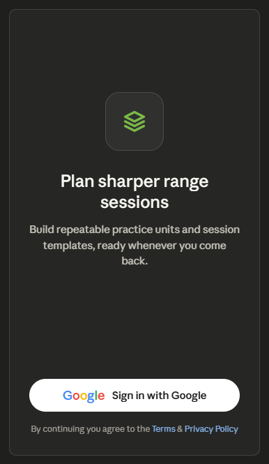

The Login screen has its own cluster of backlog items: B24 (remove nested "What you'll do here" sub-card), B22 (merge the two cards into one), B23 (Google Identity-compliant sign-in button), B52 (remove "Signed out." label), B53 (remove "Google sign-in" chip), B54 (resolve dual-headline competition), and B55 (centre/resize app icon).

## Login Redesign

### 1. Layout specification

The current screen fights itself: two stacked cards each with their own chip and headline ("Plan sharper range sessions" vs "Pick up where you left off"), a redundant nested sub-card repeating the value prop, a "Signed out." status label stating the obvious, and a non-standard outlined Google button. The redesign collapses all of it onto a single centred, vertically-balanced screen with one message and one action (B22, B24, B54).

**No app bar / no bottom nav** — this is a pre-auth screen, so chrome is removed; the layout is a single full-height `Column`.

Top to bottom, centred:

- **App icon**, centred and sized to a proper launcher-icon presence (~72–96dp), with breathing room above (B55) — currently it's small and left-aligned inside a card.
- **Headline** — one only: "Plan sharper range sessions" (`headlineMedium`). The competing second headline is dropped (B54).
- **Supporting paragraph** — the value prop, trimmed to two lines and centred (`bodyLarge`, `onSurfaceVariant`). The duplicate nested "What you'll do here" card is removed entirely since it restated this (B24).
- **Spacer** pushing the action to the lower third.
- **Sign in with Google button** — the official Google Identity-compliant button: filled white container, the multicolor G logo, "Sign in with Google" in the correct typeface/padding (B23), replacing the custom outlined pill. This is the single primary action.
- The "Google sign-in" chip and "Signed out." label are both gone — the button itself communicates both (B52, B53).
- **Footer** — small `bodySmall` legal line ("By continuing you agree to the Terms & Privacy Policy") with inline links, anchored at the bottom.

Here's the wireframe. 

### 2. Component hierarchy

```
Scaffold (no TopAppBar, no NavigationBar — pre-auth)
└─ Column (fillMaxSize, centered horizontally, 28dp horizontal padding)
    ├─ Spacer (weight 1.2)
    ├─ App icon (Image/Surface, ~84dp, rounded, centered)
    ├─ Text (headline — "Plan sharper range sessions", headlineMedium)
    ├─ Text (value prop, bodyLarge, onSurfaceVariant, centered, ≤2 lines)
    ├─ Spacer (weight 1.6 — pushes action to lower third)
    ├─ Sign in with Google button (Google Identity standard, full width)
    ├─ Text (legal line, bodySmall, inline Terms / Privacy links)
    └─ Spacer (bottom inset)
```

### 3. Interaction changes

The screen goes from two cards with two competing calls-to-attention down to one focal action. The "Signed out." status line and the "Google sign-in" chip are removed because the button itself already says both (B52, B53), and the nested "What you'll do here" sub-card is deleted since it merely restated the paragraph above it (B24). The sign-in control switches from a custom outlined pill to the official Google Identity button (B23) — this matters beyond aesthetics: Google's branding guidelines require the compliant button for "Sign in with Google", so this is also a correctness fix. A legal/consent line is added beneath the button, which is the conventional place to surface Terms and Privacy on an auth screen. The single primary action is now unmissable in the lower third where the thumb rests.

### 4. Material 3 components used

A full-height `Column` with weighted `Spacer`s for vertical centring, `Image`/`Surface` for the app icon, `Text` on the `MaterialTheme.typography` scale (`headlineMedium` headline, `bodyLarge` value prop, `bodySmall` legal line), the Google Identity-compliant sign-in button (a `Button` styled to Google's spec — white container, multicolor G, prescribed padding and type), and inline `Text` links (`ClickableText`/`AnnotatedString`) for Terms and Privacy. No `TopAppBar` or `NavigationBar`, since this is a pre-authentication screen.

### 5. Reasoning

This was the most over-built screen in the app: a sign-in screen carrying four headline-level elements (two chips, two headlines), a card nested inside a card, and a redundant status label — none of which moved the user closer to the one thing the screen exists for, which is signing in. The roadmap's Login items all point the same direction, so the redesign consolidates rather than decorates. Merging the two cards and dropping the second headline (B22, B54) removes the visual competition; deleting the nested sub-card and the "Signed out."/"Google sign-in" labels (B24, B52, B53) strips everything that wasn't pulling weight. What remains is the canonical Android pre-auth pattern: centred brand, one-line promise, one short supporting sentence, and a single primary action anchored low.

The most consequential single change is the Google Identity-compliant button (B23). The original outlined custom pill isn't just visually off-pattern — using a non-compliant "Sign in with Google" control is contrary to Google's branding requirements, so adopting the standard button improves recognizability, tap-confidence, and compliance at once. Centring and enlarging the app icon (B55) gives the screen a proper brand anchor instead of a small left-aligned mark buried in a card. The added Terms/Privacy line follows the standard consent convention for auth screens. Everything uses Material 3 primitives, the existing green accent, and the existing type scale; the only intentionally non-themed element is the Google button, which must follow Google's own spec rather than the app's.
