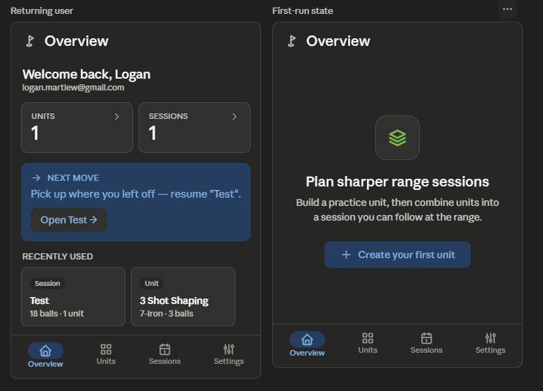

Overview has a focused cluster of backlog items: B28 (trim the welcome card for returning users), B25 (stat cards tappable → navigate), B51 (stat sections → proper Card structure), B26 (make "Next move" contextual and actionable), B27 ("Recently used" row on Overview), and B34 (Small TopAppBar, title only).

A note on the trade-offs here. Three of these — B26, B27, and B25 — overlap and pull the screen in slightly different directions. The current Overview is essentially a worded restatement of the bottom-nav tabs ("Units" and "Sessions") with a welcome paragraph and a generic tip. The roadmap's intent is to turn it from a passive dashboard into a launchpad: counts that _go somewhere_, a "Next move" card that knows what the user actually did last, and a Recently used strip so the most common workflow — open and tweak a recent session before heading to the range — is one tap from app launch.

## Overview Redesign

### 1. Layout specification

**TopAppBar (M3 Small, pinned).** Title "Overview" only (B34) — drop the "Rangework / Overview" double-title to match the other top-level screens.

**Content** (`LazyColumn`, 16dp horizontal, 12dp inter-section):

- **Greeting strip.** A single compact line — "Welcome back, Logan" — with the email as small `bodySmall` caption beneath. For returning users (anyone past first session), the multi-line workspace blurb and the two "New unit / New session" buttons in the current card are removed (B28); creating new things is what the FABs on the Units and Sessions screens are for, and duplicating them here adds noise without value. First-time users still get the full welcome treatment (see "Empty state" below).
- **At-a-glance row.** Two compact, **tappable** stat cards side-by-side: _Units · 1_ and _Sessions · 1_ (B25, B51). Each is a proper `Card` with a large numeral, label, and trailing chevron — tap routes to the corresponding tab. This recovers most of the space the giant "1" blocks currently consume and turns the numbers into navigation.
- **Next move card.** Becomes contextual (B26). Instead of static advice, it reads the user's actual state:
  - _No units_ → "Build your first practice unit" + a primary tonal button.
  - _Units but no sessions_ → "Combine your units into a session" + button.
  - _Both exist_ → "Pick a session to run at the range" + button that opens the most recent session, or a session picker.
  - _Just edited something_ → "Resume editing 'Test'" + button.
- **Recently used.** A horizontal `LazyRow` of small cards (B27): the 3–5 most recently opened or edited units and sessions, each card showing the name, type chip (Unit / Session), and headline metadata (ball count, club). Tap opens detail. This is the screen's load-bearing feature for repeat use: the typical "open the app on the way to the range" trip becomes a single tap.

**Empty / first-run state.** When the user has zero units _and_ zero sessions, the screen collapses to the original welcome treatment — large icon, headline ("Plan sharper range sessions"), short value prop, and a single primary "Create your first unit" button. The stat row, Next move, and Recently used all hide, since there's nothing to surface. This makes the first-run case purposeful and the returning-user case dense — the current design splits the difference and serves neither well.

Here's the wireframe — returning-user state on the left, first-run state on the right. 

### 2. Component hierarchy

```
Scaffold
├─ SmallTopAppBar (brand icon + "Overview")
├─ Content (LazyColumn)
│   ├─ [returning user]
│   │   ├─ Greeting strip (Text headline + Text caption)
│   │   ├─ Row of 2 StatCards (clickable Card → navigate)
│   │   │   ├─ "UNITS" label + count + chevron
│   │   │   └─ "SESSIONS" label + count + chevron
│   │   ├─ NextMoveCard (Card, primaryContainer / tonal)
│   │   │   ├─ Row: Icon + "NEXT MOVE" eyebrow
│   │   │   ├─ Text (contextual message)
│   │   │   └─ FilledTonalButton (contextual action)
│   │   ├─ Text ("RECENTLY USED" subheader)
│   │   └─ LazyRow → RecentCard (clickable)
│   │       ├─ AssistChip (Unit / Session)
│   │       ├─ Text (name)
│   │       └─ Text (metadata)
│   └─ [first-run]
│       └─ Centered Column: Icon · headline · body · FilledTonalButton
└─ NavigationBar (Overview selected)
```

### 3. Interaction changes

The stat numbers stop being decorative — each tile is a tappable card that routes to its tab, so the Overview can act as a launchpad rather than a restatement of the bottom nav (B25). The Next move card becomes contextual (B26): it reads what the user actually has and did last, and offers a single concrete action rather than a generic two-sentence tip. Recently used (B27) introduces the screen's load-bearing new capability — the typical "open the app on the way to the range" workflow becomes one tap on a recent session, which is the dominant repeat-use case the app exists for. The duplicate "New unit / New session" buttons disappear (B28); creation lives on each tab's FAB, which the bottom nav makes immediately reachable. First-run users get a focused single-action empty state instead of a half-populated dashboard with placeholder numbers.

### 4. Material 3 components used

`SmallTopAppBar`, `LazyColumn`, clickable `OutlinedCard` for stat tiles, a tonal `Card` (`primaryContainer`) for Next move with a `FilledTonalButton` action, `LazyRow` for Recently used with clickable `OutlinedCard` items, `AssistChip` for the Unit/Session type tag, `Text` on the `MaterialTheme.typography` scale (`headlineSmall` greeting, `displaySmall` stat numerals, `labelMedium` section eyebrows, `bodyMedium` metadata), `Icon`, `FilledTonalButton` for the first-run CTA, and `NavigationBar`. No new primitives.

### 5. Reasoning

The current Overview has a clarity problem: it's a passive dashboard that mostly restates information already present in the bottom nav and the welcome flow. The welcome card carries a multi-line paragraph plus two creation buttons that duplicate the FABs one tab away; the stat sections are two giant numerals with no destination; and the Next move card gives generic advice independent of the user's actual state. The redesign targets each of those directly: trim the welcome for returning users (B28), make the stats tappable so they earn their space (B25, B51), and rewire Next move so it responds to the user's situation rather than restating a tutorial (B26).

The single biggest user-felt addition is Recently used (B27). The dominant Overview workflow for a returning user is "open the app, get to my plan, head to the range" — currently that takes a tab tap, a scan, and another tap; with a recents strip it becomes one tap from app launch. Pair that with the contextual Next move and the screen turns from a dashboard into a launchpad. Splitting the empty case off into a proper first-run state (a relative of B02 for this surface) also fixes the muddled middle: the current design tries to serve both a first-time user and a returning one with the same card and serves neither well; the redesign makes both cases purposeful. Everything uses Material 3 primitives, the existing green primary and tonal surfaces, and the existing type scale — no new components or colors.
