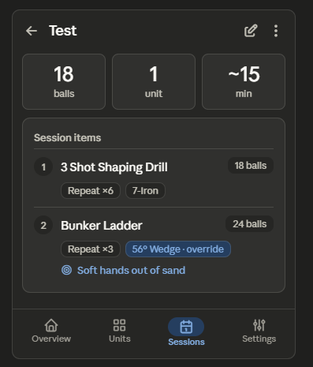

This is the Session Detail — the twin of the Unit Detail, so it inherits the same fixes plus session-specific items. Relevant backlog: B35 (Edit/Delete → TopAppBar trailing icons), B06 (Delete out of co-equal button → overflow + confirm), B34 (Small TopAppBar, title only), B13 (raise ball-count prominence), B16 (surface focus cue), B60 (stronger tonal contrast on section cards), B14 (reframe detail as a "briefing"), B15 (estimated duration alongside ball tally), and the duplicate action from B30. Worth noting the roadmap also flags B11 — removing the standalone session-detail waypoint entirely — but that's a navigation-architecture decision beyond a single-screen redesign, so I'll improve the screen as it stands and call that trade-off out at the end.

## Session Detail Redesign

### 1. Layout specification

**TopAppBar (M3 Small, pinned).** Back arrow + title "Test" (the session name), trailing Edit icon + overflow ⋮ holding Duplicate and Delete (B35, B06, B30). This removes the two co-equal pill buttons — including the destructive "Delete session" given equal weight to Edit — and reclaims the band above the fold. The duplicate large "Test" H1 is dropped since the name now lives in the bar (B34).

**Content** (`LazyColumn`, 16dp horizontal, 8dp inter-card, 96dp bottom):

- **Summary strip — the briefing.** Replaces the prose "1 item · 18 balls" with a row of stat blocks framing what the golfer is signing up for: total **balls** (largest numeral, the headline fact — B13), **units** count, and an **estimated duration** derived from ball count (B14, B15). This turns a passive label into a pre-range briefing.
- **Session items card.** Each item is a structured row rather than a run-on:
  - _Unit name_ as the primary line (`bodyLarge`).
  - A metadata line rendered as small chips/inline facts: **repeat ×N**, **club override** (only shown when it differs from the unit default, and visually marked as an override), and the item's **ball subtotal** as a right-aligned pill so subtotals form a scannable column down to the total (B13).
  - A focus-cue line when the slot or unit carries one, tinted to stand apart (B16, B60).
  - Thin dividers between items; a number/index badge if useful for ordering.

**Empty / sparse state.** A session with no items yet (possible mid-build or after removing all items) shows an inline placeholder inside the items card — outlined icon + "No units in this session yet" + a "Add units" text action routing to Edit — rather than an empty grey card, so the screen never reads as broken (B02 analogue).

Here's the wireframe. 

### 2. Component hierarchy

```
Scaffold
├─ SmallTopAppBar
│   ├─ Leading: IconButton (back)
│   ├─ Title: Text (session name, truncating)
│   └─ Actions: IconButton (Edit) + IconButton (⋮) → DropdownMenu [Duplicate, Delete]
├─ Content (LazyColumn, bottom padding 96dp)
│   ├─ BriefingRow (Row of 3 stat blocks)
│   │   ├─ StatBlock (balls — largest numeral)
│   │   ├─ StatBlock (units)
│   │   └─ StatBlock (est. duration)
│   └─ SessionItemsCard (Card)
│       ├─ Text (section label)
│       └─ SessionItemRow ×N (Divider-separated)
│           ├─ Row: index badge + unit name (weight 1f) + ball-subtotal pill
│           ├─ chip row: Repeat ×N, club (marked "override" when differing)
│           └─ focus line (Icon + text, tinted) — conditional
│              └─ [empty state] inline placeholder + "Add units" TextButton
└─ NavigationBar (Sessions selected)
```

### 3. Interaction changes

Edit and Delete leave the content area: Edit becomes a trailing pencil in the app bar, Delete moves into the overflow with a confirmation dialog and undo snackbar, and Duplicate joins it there (B35, B06, B30). This removes the equal-weight destructive button and the accidental-delete risk. The summary becomes an at-a-glance briefing — balls, units, and an estimated duration — so the screen answers "what am I committing to?" before the range trip rather than restating a label (B14, B15). Within each session item, the club override is shown only when it actually differs from the unit's default and is visually tagged as an override, so the golfer instantly sees where a slot deviates from the base unit instead of reading "Club: 7-Iron" on every row regardless. Ball subtotals right-align into a column the eye can total. Empty sessions show an inline placeholder with a route to Edit rather than a blank card.

### 4. Material 3 components used

`SmallTopAppBar` with leading/trailing `IconButton`s, `DropdownMenu` + `DropdownMenuItem`, `AlertDialog` (delete confirm), `Snackbar` (undo), `Card`/`ElevatedCard` for sections, tonal `Surface` stat blocks for the briefing, `AssistChip`/`InputChip` and tonal `Surface` pills for repeat-count, club override, and ball subtotals, an `Icon`+`Text` focus line on `secondaryContainer` tint, `HorizontalDivider`, `TextButton` (empty-state "Add units"), `Text` on the `MaterialTheme.typography` scale (`headlineSmall` for the ball total, `titleSmall` for labels, `bodyLarge` for unit names, `labelMedium` for captions), and `NavigationBar`.

### 5. Reasoning

The Session Detail had the same two structural faults as the Unit Detail — co-equal Edit/Delete pills eating the space above the fold, with Delete dangerously equal in weight to Edit, and a duplicate H1 — so it gets the same fix: actions to the app bar, Delete gated behind confirmation (B35, B06). That's the largest scanning and safety win on the screen.

The session-specific opportunity is the summary. "1 item · 18 balls" is a passive restatement of the list; a golfer opening this screen before heading out wants to know what they're signing up for. Reframing it as a briefing strip — balls, units, and an estimated duration (B14, B15) — converts the screen from a data echo into a useful pre-range glance, which the roadmap rates as the change that moves the session experience from "data manager" to "practice companion." Within the items, surfacing the club only when it's a genuine override (and tagging it as such) plus showing slot-level focus cues (B16) makes the per-item detail meaningful rather than boilerplate, and right-aligned subtotals (B13) let the ball math read as a column.

One architectural caveat worth flagging: the roadmap's B11 proposes removing this standalone detail screen altogether as a navigational dead-end (list → detail → edit, where detail adds little over an expandable list row). The redesign above assumes the screen stays; if you act on B11 instead, the briefing strip and structured item rows should migrate into the Edit screen's read state or an expandable list card rather than being rebuilt here. I'd treat that as the higher-order decision and this redesign as the right answer if the screen remains.
