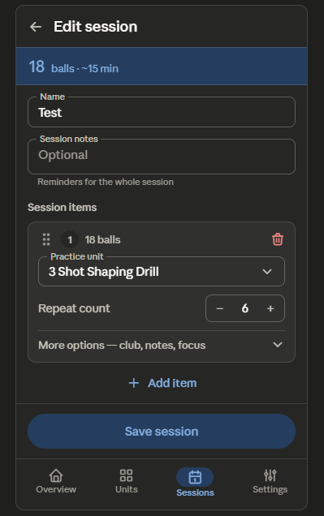

This is the Session Edit/Create — the structural twin of the Unit Edit, plus the session-specific items the roadmap flags as among the most important in the app. Relevant backlog: B09 (Save → FilledButton primary green), B41 (save-confirmation snackbar), B03 (reorder item form: repeat count + live ball count up top), B12 (pin/sticky ball total at top), B01 (drag-to-reorder replacing ↑/↓), B38 (48dp icon targets), B36 (restore field rest border), B05 (steppers for repeat counts), B40 (progressive disclosure for optional item fields), B21 (remove "Session item N" labels), B34 (drop duplicate title), B19 (surface unit dependency / empty state), and B57's relatives for the empty case.

## Session Edit / Create Redesign

### 1. Layout specification

**TopAppBar (M3 Small).** Back + "Edit session" (or "New session"). The duplicate large H1 is removed (B34).

**Sticky ball total.** A slim pinned bar directly under the app bar shows the live session total — "**18 balls** · ~15 min" — that updates as repeat counts and items change (B12, B15). This is the number the whole screen exists to produce, so it stays visible while scrolling rather than being buried in a "Balls" card at the very bottom (where it currently sits, below every item and the save button).

**Details section** (top of `LazyColumn`, no outer mega-card — the current card-wrapping-cards adds contrast noise):

- **Name** — `OutlinedTextField`, restored rest border (B36).
- **Session notes** — `OutlinedTextField`, multi-line, with `supportingText` ("Reminders for the whole session"). In create mode this folds behind an "Add notes" expander so a new session opens straight to its items (B40).

**Session items section.** A subheader, then one card per item in a **reorderable** `LazyColumn`. Each item card is restructured so the two facts that drive the ball total sit at the top (B03):

- Header row: drag handle (replacing ↑/↓ — B01), a number badge replacing "Session item N" (B21), the item's **live ball subtotal** as a right-aligned figure, and a single 48dp delete icon (B38).
- **Practice unit** dropdown (`ExposedDropdownMenuBox`).
- **Repeat count** as a − / + stepper, immediately under the unit, since repeat × unit-balls is what produces the subtotal (B03, B05).
- Optional **Session club override**, **Item notes**, and **Focus cue** fold behind a "More options" expander, since most items use unit defaults (B40) — this collapses each item card from ~5 always-open fields to 2.

**Add item.** A full-width `TextButton` with leading + icon beneath the item list, replacing the tonal pill currently floating in the details card (B50 analogue). The picker it opens should surface that units must exist; if the user has none, it routes them to create a unit first (B19).

**Save.** Green `FilledButton`, docked to the bottom, with a confirmation snackbar (B09, B41) — replacing the neutral pill buried under the Balls card.

Here's the wireframe. 

### 2. Component hierarchy

```
Scaffold
├─ SmallTopAppBar  (back + "Edit session" / "New session")
├─ StickyTotalBar (pinned)  — live "N balls · ~M min"
├─ Content (LazyColumn)
│   ├─ OutlinedTextField (Name)
│   ├─ OutlinedTextField (Session notes, supportingText) — expander in create mode
│   ├─ Text (Session items subheader)
│   ├─ reorderable items → SessionItemCard
│   │   ├─ header Row: drag handle + number badge + live subtotal + delete (48dp)
│   │   ├─ ExposedDropdownMenuBox (Practice unit)
│   │   ├─ Stepper (Repeat count: − value +)
│   │   └─ "More options" expander
│   │       ├─ ExposedDropdownMenuBox (Session club override)
│   │       ├─ OutlinedTextField (Item notes)
│   │       └─ OutlinedTextField (Focus cue)
│   └─ TextButton (+ Add item, full width)  → unit picker (dependency-aware)
└─ Bottom bar (docked)
    └─ FilledButton (Save session — primary green, full width)
NavigationBar (Sessions selected)
```

### 3. Interaction changes

The live ball total moves from the very bottom of the scroll to a pinned bar at the top, updating as repeat counts and items change — so the consequence of every edit is always visible (B12). Within each item card, the order of fields is inverted so the unit and its repeat-count stepper — the two inputs that produce the subtotal — sit at the top, with the item's live subtotal shown in the header (B03). Repeat count becomes a − / + stepper instead of a numeric keyboard field (B05). The ↑/↓/trash trio collapses to a left drag handle plus one 48dp delete (B01, B38), and reordering becomes long-press-drag. Club override, item notes, and focus cue fold behind a "More options" expander, so a typical item shows two fields instead of five (B40). Add item becomes a full-width text button, and its picker is dependency-aware: with no units, it routes to unit creation rather than opening empty (B19). Save becomes a docked green filled button with a confirmation snackbar (B09, B41).

### 4. Material 3 components used

`SmallTopAppBar`, a pinned `Surface`/`TopAppBar`-style total bar, `OutlinedTextField` (restored borders, `supportingText`), `ExposedDropdownMenuBox` + `ExposedDropdownMenu` (unit and club), a stepper built from `OutlinedIconButton`s for repeat count, reorderable `LazyColumn` items with a drag handle, `IconButton` (delete, 48dp), an expandable "More options" row (animated `Column` / `ListItem` with trailing chevron), `TextButton` with leading `Icon` (Add item), `FilledButton` (Save — `primary`/`onPrimary`), `BottomAppBar`/docked action container, `Snackbar` (save + delete-undo), `AlertDialog` or routing for the no-units case, `Text` on the `MaterialTheme.typography` scale, and `NavigationBar`.

### 5. Reasoning

This screen's whole purpose is to produce a session with a known ball total, yet the total sat in a card at the very bottom — below every item and even below the save button — so the user couldn't see the number they were tuning while they tuned it. Pinning a live total to the top (B12) is the single highest-value change here and directly serves better hierarchy: the output of the form is always in view. Pairing it with the reordered item card (B03), where the unit and repeat-count stepper lead and the subtotal shows in the header, means the cause (repeat ×6) and effect (18 balls) are adjacent and both live.

The item cards were the densest, most repetitive surface in the app: five always-open fields each, "Session item N" headlines, and the same cramped ↑/↓/trash cluster as the unit editor. Collapsing optional fields behind "More options" (B40) cuts a five-field card to two for the common case, number badges replace the redundant headlines (B21), and the drag-handle-plus-single-delete pattern (B01, B38) fixes both reordering and the sub-44dp tap targets. Restoring field borders (B36) makes the form legible before focus. The two top-of-backlog wins live here too — green Save button and save snackbar (B09, B41). And the create/empty path is handled honestly: optional fields fold away for a clean start (B40), and because a session is meaningless without units, the add-item flow routes a unit-less user to build a unit first rather than into an empty picker (B19). Everything stays within Material 3 primitives, the existing green primary and coral error colors, and the existing type scale.
