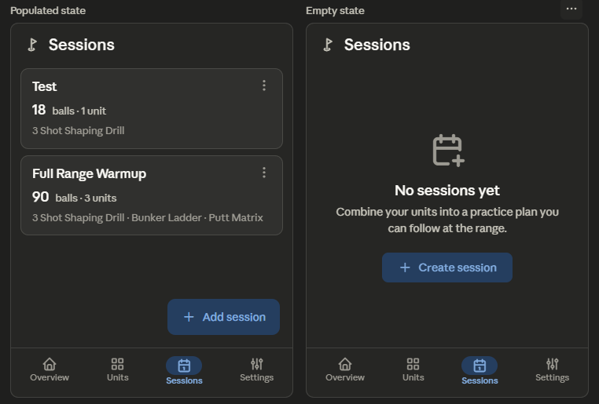

This is the Session List — the structural twin of the Units List, so it inherits the same backlog items plus session-specific ones: B07 (FAB → primaryContainer), B37 (96dp bottom padding), B02 (empty states), B04 (tappable cards, demote overflow), B34 (Small TopAppBar, title only), B30 (make Duplicate session discoverable), B57 (extended FAB on sparse lists), and the session analogue of B20/B13 (surface ball count and unit lineup as structured metadata rather than run-on text).

## Session List Redesign

### 1. Layout specification

**TopAppBar (M3 Small, pinned).** Title "Sessions" only — drop the "Rangework / Sessions" double-title to match the Units redesign and recover a line (B34).

**Content** (`LazyColumn`, 16dp horizontal, 8dp inter-card, 96dp bottom padding so the FAB never sits on the last card — B37):

Each session card uses the same three-tier hierarchy as the redesigned Unit card, so the two list screens scan identically:

- _Tier 1 — Title_ (`titleMedium`): "Test"
- _Tier 2 — Metadata row_: the **total ball count** raised to a prominent figure (it's the number a golfer plans the trip around), plus a unit-count caption — e.g. a "18 balls" emphasis with "1 unit" alongside (B13). Ball count gets weight here because it's the session's headline fact.
- _Tier 3 — Unit lineup preview_ (`bodyMedium`, `onSurfaceVariant`, max 2 lines, ellipsized): "3 Shot Shaping Drill" — and for multi-unit sessions, "3 Shot Shaping Drill · Bunker Ladder · Putt Matrix", so the card communicates the session's _contents_ at a glance.

The whole card is **tappable** (opens detail); the trailing overflow ⋮ is demoted to a shortcut menu holding **Edit, Duplicate, Delete** — Duplicate is a flagship session action that's currently buried, so it gets first-class placement in the menu (B30, B04).

**Empty state** (zero sessions): centered column — outlined calendar/clipboard icon (48dp), `headlineSmall` "No sessions yet", `bodyMedium` "Combine your units into a practice plan you can follow at the range", and a **FilledTonal "Create session" button** as the single CTA. If the user also has no units yet, the supporting line and CTA adapt to point them to build a unit first (the session builder depends on units existing — B19), avoiding a dead end where "Create session" leads to an empty picker. FAB hides in the empty state.

**FAB.** Color → `primaryContainer` green fill (B07); Extended FAB ("Add session") while the list is sparse, collapsing to a standard FAB as it grows (B57).

**Bottom NavigationBar.** Unchanged; "Sessions" active with its M3 indicator pill.

Here's the wireframe — populated and empty states. 

### 2. Component hierarchy

```
Scaffold
├─ SmallTopAppBar
│   ├─ Leading: brand icon
│   └─ Title: "Sessions"
├─ Content
│   ├─ [populated] LazyColumn (contentPadding: top 8dp, horizontal 16dp, bottom 96dp)
│   │   └─ items → SessionCard (OutlinedCard, onClick → detail)
│   │       ├─ Row: Text (title, titleMedium) + IconButton (⋮)
│   │       │       └─ DropdownMenu [Edit, Duplicate, Delete]
│   │       ├─ Row (metadata): ball total (emphasis) + "balls · N units" caption
│   │       └─ Text (unit lineup preview, bodyMedium, maxLines 2)
│   └─ [empty] Column (centered)
│       ├─ Icon (48dp)
│       ├─ Text (headlineSmall)
│       ├─ Text (bodyMedium — adapts if no units exist)
│       └─ FilledTonalButton ("Create session" / "Create your first unit")
├─ FloatingActionButton / ExtendedFAB (primaryContainer; hidden when empty)
└─ NavigationBar (Sessions selected)
```

### 3. Interaction changes

The card becomes the tap target (opens detail), and the overflow ⋮ demotes to a shortcut menu — but here it carries Duplicate as a first-class item, since cloning a session and tweaking it is one of the most valuable session workflows and was previously hard to find (B30, B04). The FAB gains the green `primaryContainer` fill so "create" reads as the affirmative action rather than a neutral grey square, and extends to a labelled "Add session" while the list is short (B07, B57). The empty state replaces a blank screen with a single clear CTA — and crucially, it's dependency-aware: because a session can't be built without units, when the user has no units the empty state routes them to create a unit first instead of into an empty session picker (B19), closing what would otherwise be a confusing dead end.

### 4. Material 3 components used

`SmallTopAppBar`, `LazyColumn`, `OutlinedCard` (clickable variant), `Text` on the `MaterialTheme.typography` scale (`titleMedium`, `titleSmall` for the ball figure, `bodyMedium`, `labelMedium`), `IconButton` + `DropdownMenu`/`DropdownMenuItem` (Edit / Duplicate / Delete), `FloatingActionButton` / `ExtendedFloatingActionButton` (`containerColor = primaryContainer`), `FilledTonalButton` (empty-state CTA), `Icon`, `Snackbar` (delete undo), and `NavigationBar` / `NavigationBarItem`.

### 5. Reasoning

The Session List shares the Unit List's core problems — a run-on grey card with no scan anchor, a low-affordance grey FAB, an overflow menu as the only visible control, and a barren empty state — so it gets the same structural fixes, which has the bonus that both list screens now scan identically and the app feels more coherent. The one meaningful divergence is what the card should emphasise: for a session, the total ball count is the single fact a golfer plans around ("can I get through 90 balls before the range closes?"), so it's raised to a prominent figure in the metadata row (B13), with the unit lineup shown as the preview line so the card answers "what's actually in this session?" at a glance.

Two session-specific behaviours round it out. Duplicate is promoted to a first-class overflow item (B30) because building a new session by cloning and editing an existing one is a primary workflow that the current UI hides. And the empty state is made dependency-aware (B19): since the session builder is meaningless without units, an empty-of-everything user is routed to create a unit first rather than dropped into an empty picker. All changes use stock Material 3 components, the existing green primary and the existing type scale — no new primitives or colors.
