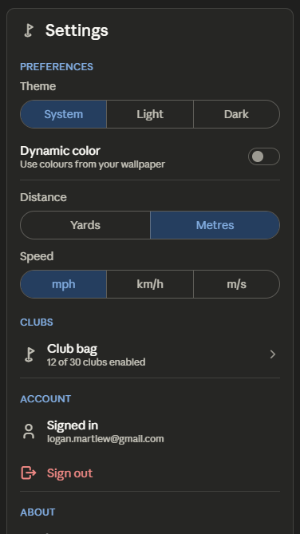
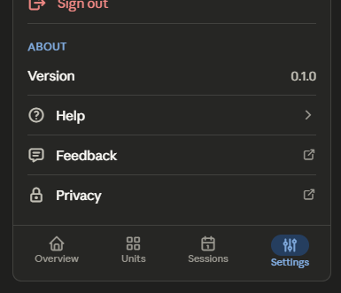
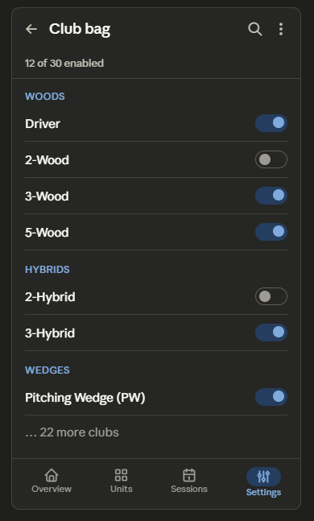

Settings has the most backlog items of any area. Relevant: B17 (reorder sections), B10 (move 30-club bag to its own "Manage clubs" screen + badge), B44 (club-bag subtitle summary "12 clubs enabled"), B46 (club section headers → M3 List Subheaders), B47 (Sign out → M3 list item with logout icon + error label), B34 (Small TopAppBar, title only), B43 (dynamic color toggle supporting text), B39 (content descriptions on club switches), B59 (search/filter or common-bag default for club list), B58 (group Appearance + Units under "Preferences"), and B45 (speed units context line or defer).

The biggest structural move is B10: the 30-club bag currently lives inline, pushing the entire screen into a long scroll and burying the About section three screens down. Pulling it into its own "Manage clubs" screen turns Settings into a single-screen, fully scannable list. So this redesign produces two screens — the main Settings list and the new Manage clubs screen.

## Settings Redesign

### 1. Layout specification

**Section ordering** (B17). Reordered to the conventional priority: Preferences (Appearance + Units grouped — B58) → Clubs (now a single entry row) → Account → About. This puts the things people change often near the top and demotes Account, which is rarely touched after sign-in.

**TopAppBar (M3 Small, pinned).** Title "Settings" only — drop the "Rangework / Settings" double-title (B34).

**Main Settings screen** (`LazyColumn` of M3 list items grouped under `ListSubheader`s, no heavy card wrappers):

- **Preferences**
  - _Theme_ — `SingleChoiceSegmentedButtonRow` (System / Light / Dark), kept as-is.
  - _Dynamic color_ — `ListItem` with a trailing `Switch` and a one-line `supportingText`: "Use colours from your wallpaper" (B43), so the toggle's effect is legible.
  - _Distance_ — segmented Yards / Metres.
  - _Speed_ — segmented mph / km/h / m/s, with a one-line caption clarifying where speed is used, or deferred entirely if it has no surface yet (B45).
- **Clubs** — a single `ListItem`: leading golf icon, headline "Club bag", `supportingText` summary "**12 of 30 clubs enabled**" (B44), trailing chevron → opens Manage clubs (B10).
- **Account** — `ListItem`: "Signed in as logan.martlew@gmail.com" (email as supportingText), then a **Sign out** `ListItem` with a leading logout icon and error-colored label (B47), replacing the bare coral text link.
- **About** — `ListItem`s: Version 0.1.0 (trailing value), Help, Feedback, Privacy, each with a leading icon and chevron/external-link affordance.

**Manage clubs screen** (new, pushed destination):

- **TopAppBar** with back arrow, title "Club bag", and a trailing **search** icon to filter the 30-club list (B59).
- A live count caption under the bar: "12 of 30 enabled", with an overflow holding "Enable common bag" / "Disable all" as quick presets (B59).
- The catalogue grouped under proper M3 `ListSubheader`s — Woods, Hybrids, Irons, Wedges, Putter (B46) — each club a `ListItem` with a trailing `Switch` carrying a TalkBack content description ("Enable Driver" — B39).

Here are the wireframes — main Settings, then Manage clubs.  

And the new Manage clubs screen that the Club bag row opens into. 

### 2. Component hierarchy

```
— Main Settings —
Scaffold
├─ SmallTopAppBar (brand icon + "Settings")
├─ Content (LazyColumn)
│   ├─ ListSubheader ("Preferences")
│   │   ├─ Theme: Text label + SingleChoiceSegmentedButtonRow
│   │   ├─ ListItem (Dynamic color, supportingText) + trailing Switch
│   │   ├─ Distance: Text label + SegmentedButtonRow
│   │   └─ Speed: Text label + SegmentedButtonRow (+ caption / deferred)
│   ├─ ListSubheader ("Clubs")
│   │   └─ ListItem (golf icon · "Club bag" · "12 of 30 enabled" · chevron) → Manage clubs
│   ├─ ListSubheader ("Account")
│   │   ├─ ListItem (user icon · "Signed in" · email)
│   │   └─ ListItem (logout icon · "Sign out", error color)
│   └─ ListSubheader ("About")
│       └─ ListItem ×4 (Version value, Help, Feedback, Privacy)
└─ NavigationBar (Settings selected)

— Manage clubs (pushed) —
Scaffold
├─ SmallTopAppBar (back · "Club bag" · search · overflow [Enable common bag / Disable all])
├─ count caption ("12 of 30 enabled")
├─ Content (LazyColumn)
│   └─ for each group: ListSubheader + ListItem ×N (club name + trailing Switch w/ contentDescription)
│       Woods · Hybrids · Irons · Wedges · Putter
└─ NavigationBar (Settings selected)
```

### 3. Interaction changes

The 30-club catalogue stops living inline; the Club bag becomes a single row showing an at-a-glance enabled count and pushing to a dedicated Manage clubs screen (B10, B44). That alone turns Settings from a three-screen scroll into one fully scannable page where About is reachable without hunting. Sections are reordered so frequently-changed preferences sit at the top and Account demotes below them (B17). Sign out moves from a bare coral text link into a proper list item with a logout icon and error-colored label, so it reads as a deliberate, recognizable action rather than stray text (B47). On the Manage clubs screen, search and an overflow with "Enable common bag" / "Disable all" presets make a 30-item toggle list manageable instead of requiring 30 individual taps (B59), and every switch carries a TalkBack content description (B39). The Dynamic color toggle gains supporting text explaining what it does (B43).

### 4. Material 3 components used

`SmallTopAppBar` (both screens; search + overflow `IconButton`/`DropdownMenu` on Manage clubs), `LazyColumn`, `ListItem` (with leading `Icon`, `supportingText`, trailing `Switch`/chevron/value), `ListSubheader` for all section and club-group headers, `SingleChoiceSegmentedButtonRow` + `SegmentedButton` (Theme, Distance, Speed), `Switch` (Dynamic color, per-club, with `contentDescription`), `HorizontalDivider` between list items, `SearchBar`/`DockedSearchBar` (club filter), `Text` on the `MaterialTheme.typography` scale with `MaterialTheme.colorScheme.error` for Sign out, and `NavigationBar`.

### 5. Reasoning

Settings was the app's longest screen by far, and the cause was structural: 30 club toggles rendered inline shoved Account and About so far down that the screen needed three full scrolls, and the heavy card wrappers around each section added contrast noise without aiding navigation. The roadmap's highest-leverage Settings item is B10 — extracting the club bag to its own screen — because it fixes both problems at once: the main screen collapses to a single scannable page, and the club list gets room to be properly grouped, searchable, and preset-driven on its own surface. Pairing it with the enabled-count summary (B44) means the collapsed row still communicates state, so nothing is hidden by the extraction.

The remaining changes are about making a settings list read like a native Android settings list. Reordering sections (B17) follows the platform convention of frequent-first, with Account — touched once at sign-in — demoted. Converting section and club-group titles to `ListSubheader`s (B46) and rows to `ListItem`s replaces the bespoke card-and-label treatment with stock components, which is both faster to scan and more consistent. Sign out as an icon-led error-colored list item (B47) gives the one destructive action here proper affordance and recognizability. The Dynamic color caption (B43) and per-switch content descriptions (B39) close legibility and accessibility gaps. Speed units get a clarifying caption or are deferred if they have no surface yet (B45), avoiding a control whose effect the user can't locate. Everything uses Material 3 primitives, the existing green accent and coral/error color, and the existing type scale — the new Manage clubs screen introduces no new patterns, just the standard list-detail push that the club bag always warranted.
