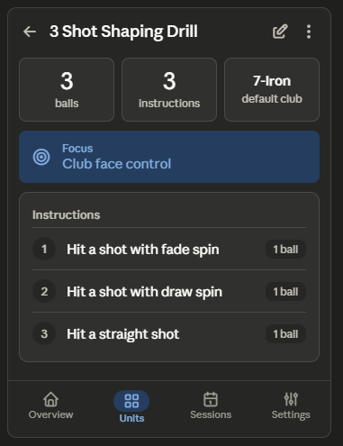

This screen maps to several backlog items: B35 (Edit/Delete → TopAppBar trailing icons), B06 (Delete out of co-equal button → overflow + confirm), B21 (remove "Instruction N" labels), B13 (raise ball-count prominence), B34 (Small TopAppBar, title only), B16 (surface focus cue), B42 (visual chunking in instructions), and B60 (stronger tonal contrast on section cards).

## Unit Detail Redesign

### 1. Layout specification

**TopAppBar (M3 Small, pinned).** Back arrow leading, title "3 Shot Shaping Drill" (truncating), and trailing actions: an Edit icon button plus an overflow ⋮ holding Duplicate and Delete (B35, B06). This reclaims the entire band currently occupied by the two co-equal pill buttons — roughly a fifth of the screen above the fold — and resolves the hierarchy problem where "Delete unit" sat with the same visual weight as "Edit unit." The unit title moves into the bar, so the large standalone H1 is dropped.

**Content** (`LazyColumn`, 16dp horizontal, 8dp inter-card, 96dp bottom):

- **Summary strip.** Instead of a prose run-on, the three facts become a horizontal row of inline stat blocks: a prominent total ball count (`headlineSmall`/`displaySmall` numeral + `labelMedium` "balls" caption), instruction count, and the default club as a chip (B13). Ball count is the number a golfer actually plans around, so it gets the largest type on the screen.
- **Focus card** (rendered only when a focus cue exists). Tonal `secondaryContainer` surface with a target/center-focus icon, label "Focus", value "Club face control". Tinting it apart from the neutral instruction card surfaces it as the mental cue it is rather than just another grey block (B16, B60).
- **Instructions card.** Each instruction is a numbered row — a leading circular number badge replaces the redundant "Instruction 1/2/3" headline text (B21). The instruction text is the primary line; the per-instruction ball count becomes a small trailing pill rather than a "Balls: 1" caption, so counts align down the right edge and scan as a column (B13, B42). Thin dividers between rows.

The empty case (a unit with no focus cue and/or no instructions yet) shows a small inline placeholder inside the relevant card — e.g. an outlined icon + "No instructions yet — tap Edit to add some" — instead of an empty or absent card, so the screen never looks broken or finished-when-it-isn't.

Here's the wireframe. 

### 2. Component hierarchy

```
Scaffold
├─ SmallTopAppBar
│   ├─ Leading: IconButton (back)
│   ├─ Title: Text (unit name, truncating)
│   └─ Actions: IconButton (Edit) + IconButton (⋮) → DropdownMenu [Duplicate, Delete]
├─ Content (LazyColumn, bottom padding 96dp)
│   ├─ SummaryRow (Row of 3)
│   │   ├─ StatBlock (balls — largest numeral)
│   │   ├─ StatBlock (instructions)
│   │   └─ StatBlock (default club)
│   ├─ FocusCard (Card, secondaryContainer) — conditional
│   │   ├─ Icon (target)
│   │   └─ Column: label + value
│   └─ InstructionsCard (Card)
│       ├─ Text (section label)
│       └─ InstructionRow ×N (Divider-separated)
│           ├─ number badge (Surface circle)
│           ├─ Text (instruction, weight 1f)
│           └─ ball-count pill (Surface)
└─ NavigationBar (Units selected)
```

### 3. Interaction changes

Edit and Delete leave the content area entirely. Edit becomes a single trailing pencil icon in the app bar; Delete moves into the overflow menu and now fires a confirmation dialog plus undo snackbar instead of acting from a co-equal destructive button (B06). This removes the persistent risk of a mis-tap deleting the unit, and it stops Delete from competing visually with Edit. The Focus card only renders when a cue exists, and the Instructions card shows an inline placeholder rather than disappearing when empty, so the screen communicates state honestly. Per-instruction counts move to right-aligned pills, giving a vertical column the eye can total at a glance.

### 4. Material 3 components used

`SmallTopAppBar` with leading/trailing `IconButton`s, `DropdownMenu` + `DropdownMenuItem`, `AlertDialog` (delete confirmation), `Snackbar` (undo), `Card` / `ElevatedCard` for sections, tonal `Surface` (`secondaryContainer`) for the Focus card and the number badges, `AssistChip`/`Surface` pills for club and ball counts, `Text` on the `MaterialTheme.typography` scale (`headlineSmall` for the ball total, `titleSmall` for section labels, `bodyLarge` for instruction text, `labelMedium` for captions), `HorizontalDivider`, `Icon`, and `NavigationBar`.

### 5. Reasoning

The original screen spent its most valuable real estate — everything above the first card — on two large pill buttons, one of them destructive and given equal weight to the safe action. Promoting both to app-bar affordances (B35) is the standard Android detail-screen pattern and recovers a full band of vertical space for actual content, which is the largest single contributor to faster scanning here. Demoting and gating Delete behind confirmation (B06) fixes the hierarchy error and the accidental-deletion risk in one move.

Within the content, the prose summary and the repeated "Instruction N / Balls: 1" scaffolding were the two biggest scanning taxes. Converting the summary to stat blocks puts the ball total — the number a golfer plans the trip around — in the largest type on the screen (B13), and replacing the instruction headlines with number badges plus right-aligned ball pills (B21, B42) turns a stack of three near-identical text blocks into a clean numbered list with a totalable count column. Tinting the Focus card with `secondaryContainer` (B16, B60) separates the mental cue from the neutral instruction surface so it reads as guidance, not data. Inline placeholders for the empty cases keep the screen legible when a unit is sparse. Everything stays within Material 3 primitives, the existing green/coral accents, and the existing type scale — no new components or colors introduced.
