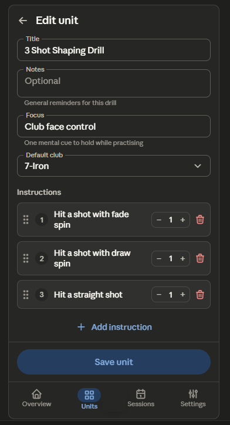

This screen maps to a dense cluster of backlog items: B09 (Save → FilledButton primary green), B41 (save-confirmation snackbar), B21 (remove "Instruction N" labels), B32 (helper text for Notes vs Focus), B01 (drag-to-reorder handles replacing ↑/↓ arrows), B38 (48dp icon-button targets), B36 (restore OutlinedTextField rest border), B05 (steppers for ball counts), B50 ("Add instruction" → full-width TextButton + icon), B48 (standardise field spacing), B34 (drop duplicate title), and B40 (progressive disclosure for optional fields).

## Unit Edit / Create Redesign

### 1. Layout specification

**TopAppBar (M3 Small).** Back arrow + title "Edit unit" (or "New unit" in create mode). The duplicate large "Edit unit" H1 below the bar is removed — it repeated the bar title and cost a whole band of space (B34).

**Details section** (top of a single `LazyColumn`, no outer mega-card — the nested card-within-card in the current design adds contrast noise without structure):

- **Title** — `OutlinedTextField`, restored rest border so the field is visible before focus (B36).
- **Notes** and **Focus** — each `OutlinedTextField` with a one-line `supportingText` clarifying the distinction: Notes = "General reminders for this drill"; Focus = "One mental cue to hold while practising" (B32). Focus is single-line; Notes multi-line.
- **Default club** — `ExposedDropdownMenuBox`.

Optional fields (Notes, Focus) can sit behind a "Add notes & focus" expandable if empty in create mode, so a first-time user sees Title → Club → Instructions without scrolling past three empty boxes (B40).

**Instructions section.** A `subheader` label, then one row per instruction in a `LazyColumn` with reorderable items:

- A leading **drag handle** (`ti-grip-vertical`) replaces the ↑/↓ arrow pair — long-press-and-drag is the native M3 reorder gesture and removes two of the three cramped trailing icons (B01).
- A number badge (1, 2, 3…) replaces the "Instruction N" headline (B21).
- Instruction `OutlinedTextField` (primary, multi-line).
- Ball count as a compact **stepper** (− / value / +) instead of a free text field — counts are small integers, and steppers remove the keyboard round-trip (B05).
- A single trailing **delete** icon, sized to a 48dp target with an undo snackbar (B38).

**Bottom action area.** "Add instruction" becomes a full-width `TextButton` with a leading + icon directly under the list (B50). The primary **"Save unit"** becomes a green `FilledButton` (B09) — currently it's a light neutral pill that doesn't read as primary — and on phones it pins to the bottom as a docked action so it's always reachable; saving fires a confirmation snackbar (B41).

Here's the wireframe. 

### 2. Component hierarchy

```
Scaffold
├─ SmallTopAppBar  (back + "Edit unit" / "New unit")
├─ Content (LazyColumn)
│   ├─ OutlinedTextField (Title)
│   ├─ [Optional fields — expandable in create mode]
│   │   ├─ OutlinedTextField (Notes, multi-line, supportingText)
│   │   └─ OutlinedTextField (Focus, single-line, supportingText)
│   ├─ ExposedDropdownMenuBox (Default club)
│   ├─ Text (Instructions subheader)
│   ├─ reorderable items → InstructionRow
│   │   ├─ drag handle (Icon, ti-grip-vertical)
│   │   ├─ number badge (Surface circle)
│   │   ├─ OutlinedTextField (instruction text, weight 1f)
│   │   ├─ Stepper (− value + — SegmentedButton-style)
│   │   └─ IconButton (delete, 48dp)
│   └─ TextButton (+ Add instruction, full width)
└─ Bottom bar (docked)
    └─ FilledButton (Save unit — primary green, full width)
NavigationBar (Units selected)
```

### 3. Interaction changes

The ↑/↓/trash trio at the bottom-right of each instruction card — three small, cramped, hard-to-hit targets — collapses to a single drag handle on the left plus one delete icon at a proper 48dp tap size (B01, B38). Reordering is now long-press-drag, the native Material gesture, instead of repeated arrow taps. Ball count moves from a full keyboard-driven text field to a − / + stepper, removing the keyboard for a value that's almost always 1–20 (B05). "Add instruction" relocates from a tonal pill mid-layout to a clear full-width text button directly beneath the list, where the "append" action belongs (B50). Save changes from a passive neutral pill to a green filled button, docks to the bottom so it's reachable without scrolling, and confirms with a snackbar (B09, B41). Notes and Focus gain helper text so the two free-text fields stop being interchangeable (B32), and in create mode they can stay collapsed until needed (B40).

### 4. Material 3 components used

`SmallTopAppBar`, `OutlinedTextField` (with `label`, `supportingText`, restored container border), `ExposedDropdownMenuBox` + `ExposedDropdownMenu`, reorderable `LazyColumn` items with a drag handle, a `SingleChoiceSegmentedButtonRow` or custom stepper using `OutlinedIconButton`s for ball count, `IconButton` (delete), `TextButton` with leading `Icon` (Add instruction), `FilledButton` (Save — `primary`/`onPrimary`), `BottomAppBar`/docked action container, `Snackbar` (save + delete-undo), `Text` on the `MaterialTheme.typography` scale, and `NavigationBar`.

### 5. Reasoning

This screen carried the heaviest interaction debt in the app, and the reviews converge on it. The instruction card's control cluster was the worst offender: three sub-44dp targets jammed into a corner, with reordering done by arrow-tapping rather than the native drag gesture. Replacing that with a left-edge drag handle and a single right-sized delete (B01, B38) is both the biggest accessibility fix and a large scanning win, because each instruction collapses from a tall card-with-toolbar into a single tidy row. Removing the "Instruction N" headlines in favour of number badges (B21) reinforces that compression.

The form's hierarchy was flat and slightly broken: every field rendered borderless until focused (B36), so the screen read as floating text rather than inputs, and Notes vs Focus gave no guidance on what each was for (B32). Restoring borders and adding helper text makes the form legible at a glance. The two highest-ROI items in the whole backlog also live here — Save → green FilledButton (B09) and the save snackbar (B41) — fixing the single most important "what's the primary action and did it work?" question on the screen. Steppers (B05) suit the small-integer ball counts better than a numeric keyboard. The empty/create state improves because optional fields fold away (B40), so a new unit starts as Title → Club → first instruction rather than a wall of empty boxes. Everything uses stock Material 3 components, the existing green primary and coral error colors, and the existing type scale.
