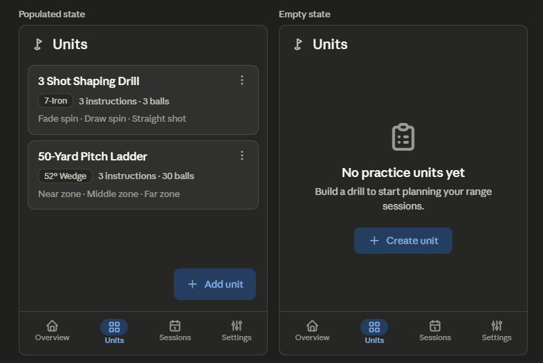

I'll read the roadmap file first, then provide the redesign.Let me see the truncated middle section for any remaining Units List items.The redesign incorporates the relevant backlog items for this screen: B07 (FAB → primaryContainer), B37 (96dp bottom padding), B02 (empty state), B20 (differentiate club vs instruction text), B04 (tappable cards, demoted overflow), B49 (tappable cue), B29 (duplicate in overflow), and B57 (extended FAB on sparse lists).

## Unit List Redesign

### 1. Layout specification

Screen scaffold top to bottom:

**TopAppBar (M3 Small, pinned).** Title "Units" only — drop the "Rangework / Units" double-title. Leading app icon stays as brand mark. This frees a full line of vertical space and removes the ambiguity of two competing titles.

**Content region.** A `LazyColumn` of unit cards with 16dp horizontal padding, 8dp inter-card spacing, 8dp top padding, and critically **96dp bottom contentPadding** so the FAB never occludes the last card (B37).

Each card is restructured into a clear three-tier hierarchy:

- _Tier 1 — Title_ (`titleMedium`, `onSurface`): "3 Shot Shaping Drill"
- _Tier 2 — Metadata row_ (`labelLarge`/`bodyMedium`, `onSurfaceVariant`): an AssistChip-styled club pill ("7-Iron") + "3 instructions · 3 balls". The club is visually separated from instruction prose so it reads as structured metadata, not as the first instruction (B20).
- _Tier 3 — Instruction preview_ (`bodyMedium`, `onSurfaceVariant`, max 2 lines, ellipsized): "Fade spin · Draw spin · Straight shot"

The whole card is **tappable** (navigates to detail, with ripple) and carries a trailing overflow only as a shortcut (B04, B49).

**Empty state** (when zero units): centered column with an outlined `SportsGolf`/`List` icon (48dp, `onSurfaceVariant`), `headlineSmall` "No practice units yet", `bodyMedium` supporting line "Build a drill to start planning your range sessions", and a **FilledTonal "Create unit" button** as the primary CTA. The FAB hides in this state to avoid two competing affordances; the inline button is the single clear action (B02).

**FAB.** Color → `primaryContainer` with `onPrimaryContainer` icon (B07), replacing the current grey low-affordance fill. On sparse lists (1–2 items) it becomes an **Extended FAB** ("Add unit" + icon) for stronger discoverability, collapsing to a standard FAB once the list grows (B57).

**Bottom NavigationBar.** Unchanged structurally; "Units" remains the active destination with its M3 active-indicator pill.

Here's the wireframe — populated and empty states side by side. 

### 2. Component hierarchy

```
Scaffold
├─ TopAppBar (SmallTopAppBar)
│   ├─ Leading: brand icon
│   └─ Title: "Units"
├─ Content
│   ├─ [populated] LazyColumn (contentPadding: top 8dp, horizontal 16dp, bottom 96dp)
│   │   └─ items → UnitCard (OutlinedCard, onClick → detail)
│   │       ├─ Row
│   │       │   ├─ Text  (title, titleMedium)
│   │       │   └─ IconButton (overflow ⋮)
│   │       ├─ Row (metadata)
│   │       │   ├─ club pill (AssistChip-style Surface)
│   │       │   └─ Text ("N instructions · N balls", labelLarge)
│   │       └─ Text (instruction preview, bodyMedium, maxLines 2)
│   └─ [empty] Column (centered)
│       ├─ Icon (48dp)
│       ├─ Text (headlineSmall)
│       ├─ Text (bodyMedium)
│       └─ FilledTonalButton ("Create unit")
├─ FloatingActionButton / ExtendedFAB (hidden when empty)
└─ NavigationBar
    └─ NavigationBarItem ×4 (Units selected)
```

### 3. Interaction changes

The card body becomes the primary tap target — tapping anywhere opens detail (previously you had to know the card was tappable; the ⋮ menu was the only visible affordance). The overflow ⋮ is demoted to a shortcut menu holding Edit, Duplicate (new — B29), and Delete, with Delete triggering a confirmation/undo snackbar rather than firing immediately. The FAB gains a green `primaryContainer` fill so it reads as the affirmative primary action instead of a neutral grey square, and it carries a label as an Extended FAB while the list is sparse. The empty state replaces a blank canvas with a single, obvious CTA, and suppresses the FAB so there's exactly one "create" affordance on screen.

### 4. Material 3 components used

`SmallTopAppBar`, `LazyColumn`, `OutlinedCard` (clickable variant), `Text` with `MaterialTheme.typography` (`titleMedium`, `labelLarge`, `bodyMedium`), an `AssistChip` or tonal `Surface` for the club pill, `IconButton` + `DropdownMenu`/`DropdownMenuItem` for overflow, `FloatingActionButton` / `ExtendedFloatingActionButton` (`containerColor = primaryContainer`), `FilledTonalButton` for the empty-state CTA, `Icon`, `Snackbar` (delete undo), and `NavigationBar` / `NavigationBarItem`.

### 5. Reasoning

The current card flattens three different kinds of information — club, instruction summary, ball/instruction counts — into one undifferentiated grey run-on, so the eye has nothing to anchor to and "7-Iron" reads as if it were the first instruction. Splitting into title → metadata row → preview gives a consistent scan path down the list (B20), which is the single biggest win for "faster scanning." Hierarchy improves because the title now owns the top line alone and counts move into a labelled metadata row instead of competing with prose.

Discoverability was the screen's quietest failure: the only visible control was the ⋮ menu, and the grey FAB didn't signal "create" with any urgency. Making the whole card tappable plus recoloring the FAB (B07) and adding bottom padding so it can't sit on top of the last card (B37) directly serve "better action discoverability." Finally, the original empty state is just an empty dark screen — a dead end for a first-time user. A first-run empty state with an icon, a one-line value proposition, and a single tonal CTA (B02) turns that into an obvious next step, which the roadmap rates as one of the highest user-felt changes on the board.

All changes stay within Material 3 primitives, reuse the existing green accent and typography scale, and follow native Android list/FAB/empty-state conventions — no custom components introduced.
